# Gallery

The gallery is the fastest way to learn JuFitter. It is organized by scientific
workflow, not by API feature. Start with the example closest to your data, read
the statistical assumptions, run the complete script, and then inspect the
diagnostics before trusting the reported numbers.

Every finished gallery page follows the same pattern:

1. a concrete question,
2. measured quantities with units and uncertainties,
3. the model and its assumptions,
4. complete executable code,
5. a plot with visible uncertainty semantics,
6. fit diagnostics,
7. interpretation and realistic failure modes.

If you only want the shortest path from two arrays to a polished fit, start with
[Quickstart](@ref). If the fit looks suspicious, continue with
[Fitting for Practitioners](@ref). If you need to justify the method in a
report, read [Statistical Foundations](@ref).

Run repository examples from the project root:

```bash
julia --project=. examples/gallery/01_quickstart_linear.jl
```

Generated figures are written to `examples/output/`. Documentation figures are
generated intentionally under `docs/src/assets/gallery/`; ad-hoc output should
not be committed.

## Recommended Path

```@raw html
<div class="jufitter-flow">
  <div class="jufitter-flow-step"><strong>First fit</strong><span>Linear calibration teaches the default data-model-diagnosis loop.</span></div>
  <div class="jufitter-flow-step"><strong>Real experiment</strong><span>Damped oscillation shows nonlinear parameters, units, and imperfect residuals.</span></div>
  <div class="jufitter-flow-step"><strong>Uncertainty structure</strong><span>XY errors and full covariance explain when error bars are not independent decoration.</span></div>
  <div class="jufitter-flow-step"><strong>Likelihoods</strong><span>Poisson and histogram examples switch from least squares to count statistics.</span></div>
  <div class="jufitter-flow-step"><strong>Trust check</strong><span>Profiles, contours, and diagnostics test whether local symmetric errors are credible.</span></div>
</div>
```

## Current Gallery

```@raw html
<div class="jufitter-gallery-grid">
<div class="jufitter-gallery-item">
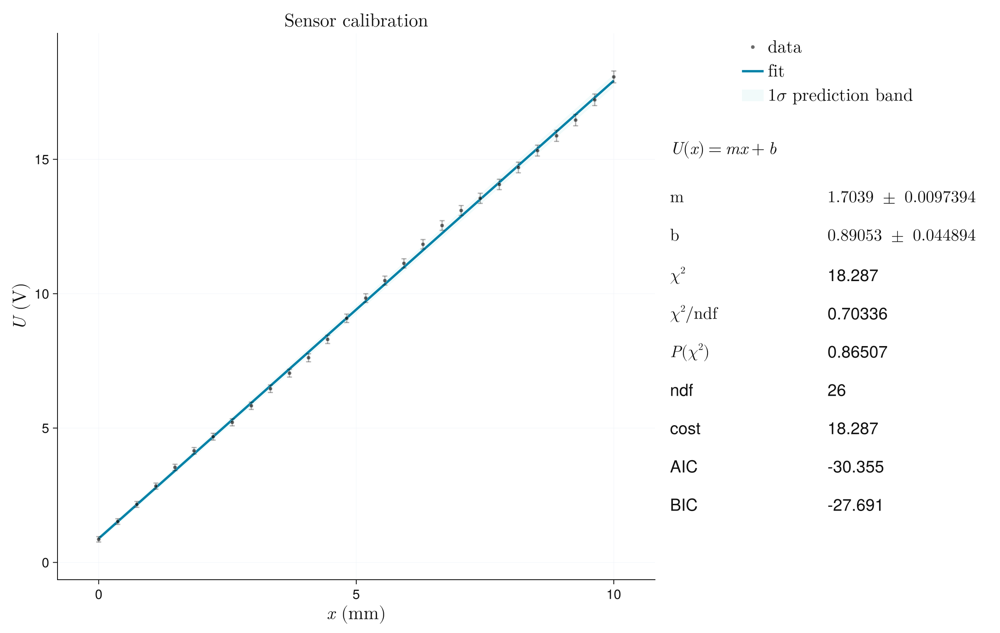
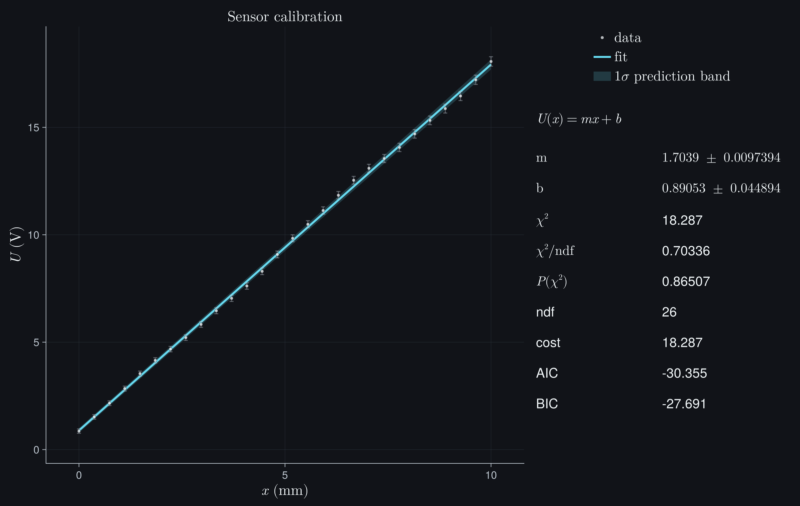
<div>
<span class="jufitter-tag">first fit</span>
<span class="jufitter-tag">prediction band</span>
<h3><a href="gallery/linear_calibration.html">Linear calibration</a></h3>
<p>Estimate a calibration law from heteroscedastic measurements. This page is the controlled baseline for reading parameters, bands, residuals, and goodness of fit.</p>
</div>
</div>
<div class="jufitter-gallery-item">
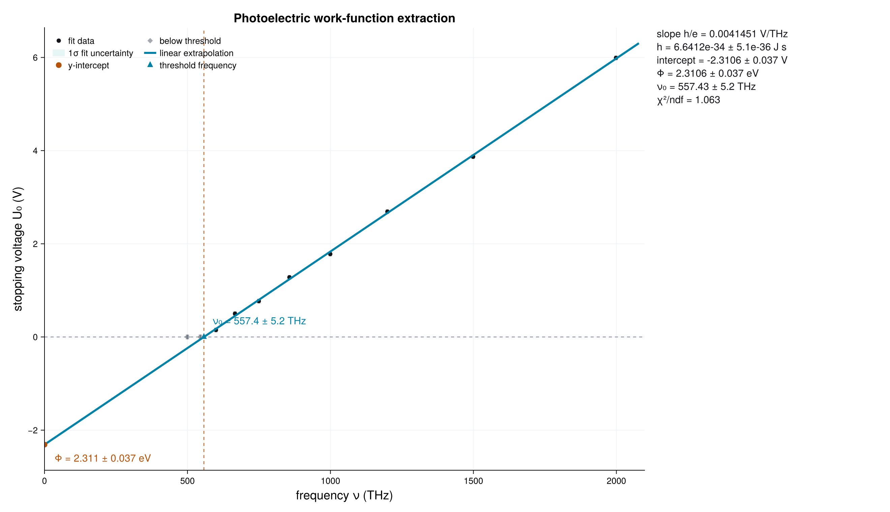
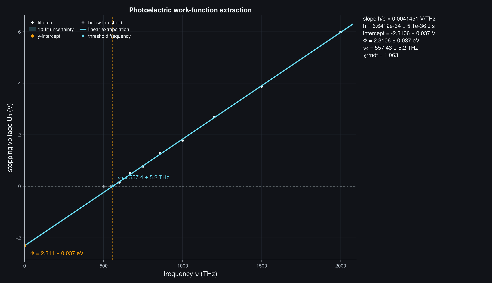
<div>
<span class="jufitter-tag">x/y errors</span>
<span class="jufitter-tag">line intersection</span>
<h3><a href="gallery/photoelectric_threshold.html">Photoelectric work function</a></h3>
<p>Fit baseline and emission regimes separately, then propagate both covariance matrices into the threshold intersection and work function.</p>
</div>
</div>
<div class="jufitter-gallery-item">
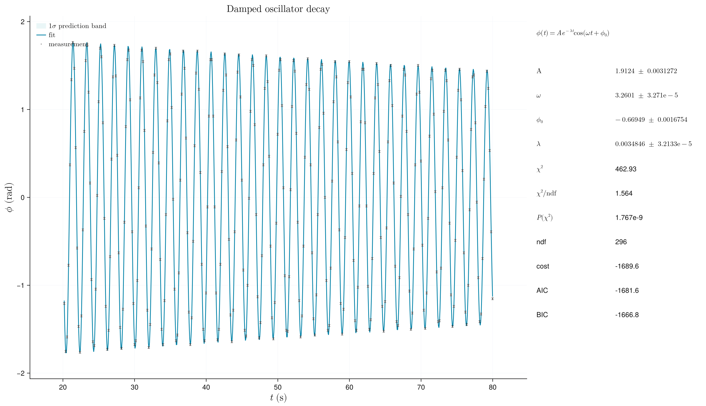
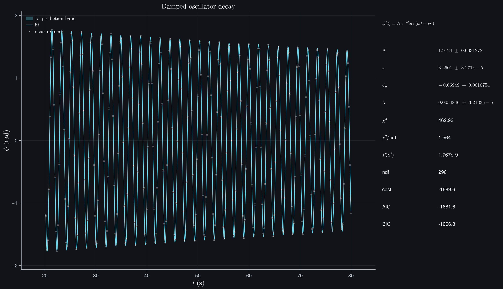
<div>
<span class="jufitter-tag">real data</span>
<span class="jufitter-tag">nonlinear</span>
<span class="jufitter-tag">model criticism</span>
<h3><a href="gallery/resonance_decay.html">Damped oscillator</a></h3>
<p>Discover why a visually convincing constant-frequency fit is statistically rejected, test a frequency-drift extension, and use pull structure to decide what must be investigated next.</p>
</div>
</div>
<div class="jufitter-gallery-item">
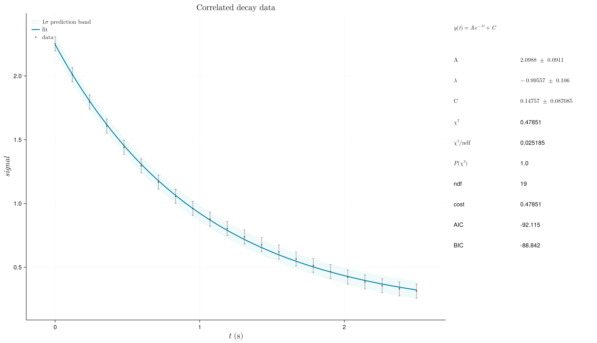
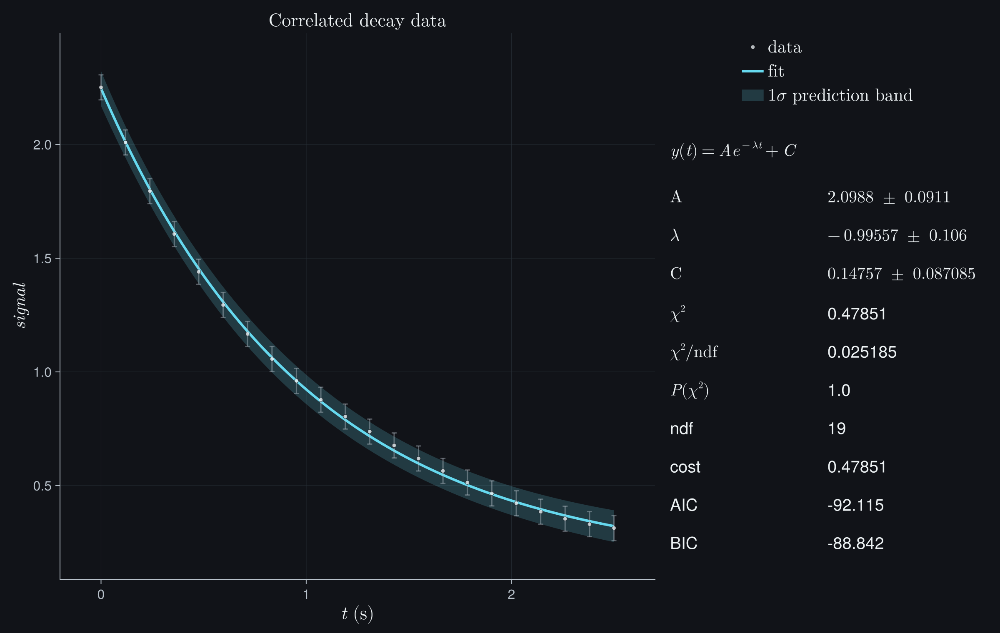
<div>
<span class="jufitter-tag">covariance</span>
<span class="jufitter-tag">correlations</span>
<h3><a href="gallery/full_covariance.html">Full covariance</a></h3>
<p>Use a dense covariance matrix when measurements share readout noise. The point is not syntax; it is how correlations change parameter uncertainty and goodness-of-fit interpretation.</p>
</div>
</div>
<div class="jufitter-gallery-item">
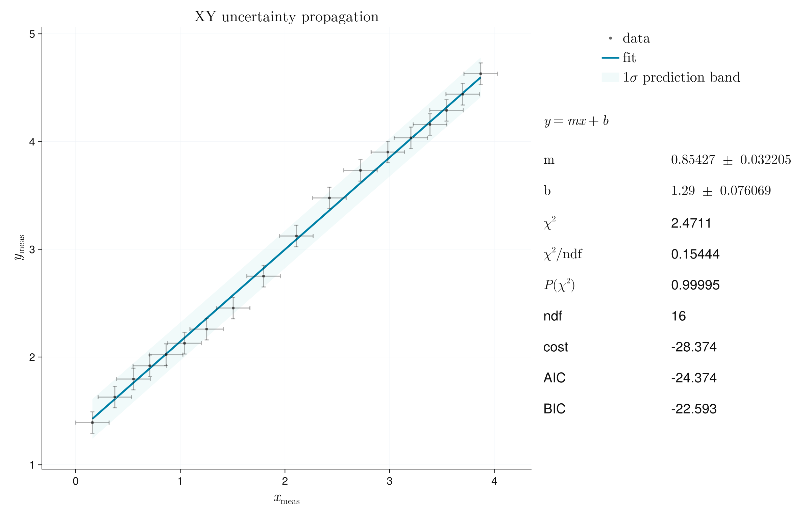
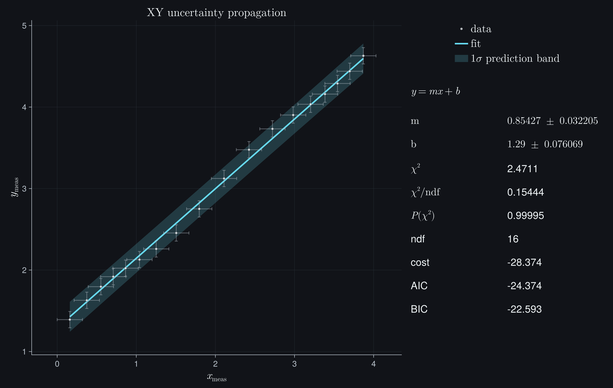
<div>
<span class="jufitter-tag">effective variance</span>
<span class="jufitter-tag">x errors</span>
<h3><a href="gallery/xy_uncertainties.html">XY uncertainties</a></h3>
<p>Include uncertainty in the independent variable through the local model slope. This example is useful when calibration, frequency, voltage, or position errors are not negligible.</p>
</div>
</div>
<div class="jufitter-gallery-item">
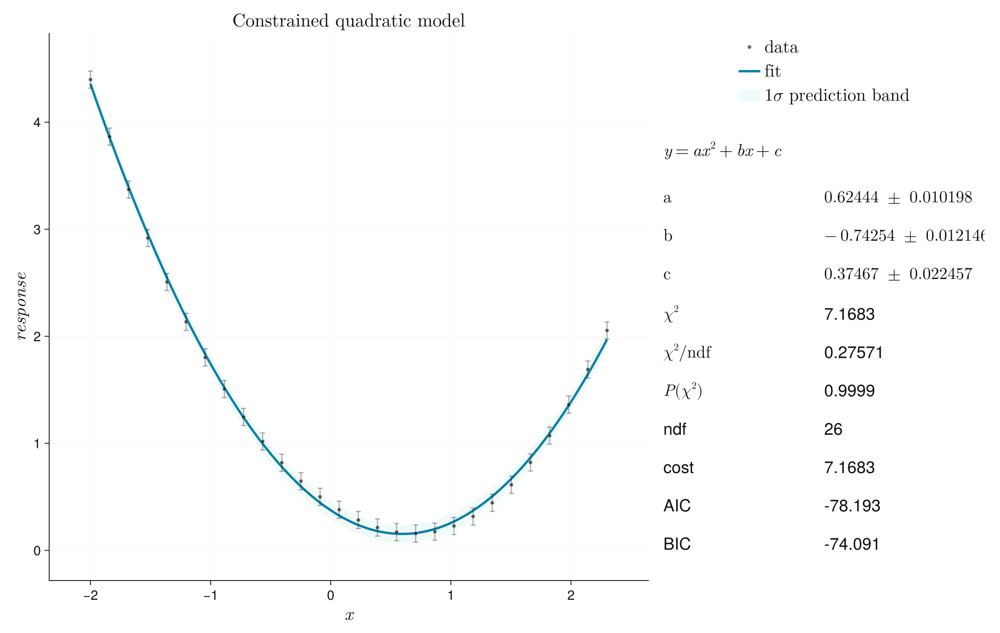
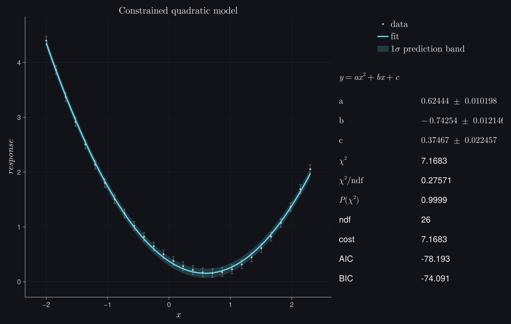
<div>
<span class="jufitter-tag">constraints</span>
<span class="jufitter-tag">profiles</span>
<h3><a href="gallery/constraints_profiles.html">Constraints and profiles</a></h3>
<p>An early saturation measurement leaves amplitude and time constant nonlinearly coupled. Profiles and two-parameter regions show exactly why the local covariance summary fails.</p>
</div>
</div>
<div class="jufitter-gallery-item">


<div>
<span class="jufitter-tag">likelihood</span>
<span class="jufitter-tag">counts</span>
<h3><a href="gallery/poisson_histogram.html">Poisson and histograms</a></h3>
<p>Extract a radioactive half-life and a detector peak from sparse counts. Exact count semantics, integrated unequal bins, empty bins, and deviance residuals replace invented Gaussian error bars.</p>
</div>
</div>
<div class="jufitter-gallery-item">


<div>
<span class="jufitter-tag">multi-fit</span>
<span class="jufitter-tag">shared parameters</span>
<span class="jufitter-tag">model comparison</span>
<h3><a href="gallery/multi_dataset.html">Multi-dataset fit</a></h3>
<p>Test whether three calibration channels may share one gain, identify the incompatible channel from its pulls, and propagate the gain difference from the joint covariance.</p>
</div>
</div>
</div>
```

## What Each Example Teaches

| Page | Scientific use case | Statistical focus | Diagnosis to inspect |
| --- | --- | --- | --- |
| Linear calibration | sensor or scale calibration | weighted Gaussian least squares | residual structure, prediction band, chi-square per degree of freedom |
| Photoelectric work function | intersection of baseline and emission regimes | x/y uncertainty and derived quantity propagation | regime choice, intersection uncertainty, model range |
| Damped oscillator | mechanical decay or resonance envelope | nonlinear least squares with correlated parameters | phase/frequency coupling, residual periodicity, profile asymmetry |
| Full covariance | repeated readout with shared noise | whitening with dense covariance | correlation effect on uncertainty and p-value |
| XY uncertainties | calibration with uncertain abscissa | effective-variance approximation | slope-dependent variance and approximation validity |
| Constraints and profiles | early saturation measurement | bounds, prior information, profile intervals, non-elliptic contours | unseen plateau and amplitude-timescale degeneracy |
| Poisson and histograms | counts, rates, binned events | Poisson deviance and likelihood fits | low-count bins, deviance residuals, empty-bin behavior |
| Multi-dataset fit | shared physics across runs | parameter mapping and joint costs | per-dataset residuals and shared-parameter tension |

## Repository Scripts

The scripts under `examples/gallery/` are executable examples and asset
generators. They are allowed to be more compact than the documentation pages,
but they should still read like serious scientific examples.

- `01_quickstart_linear.jl`: minimal weighted Gaussian fit with visible
  uncertainty semantics.
- `02_xy_uncertainties_photoelectric.jl`: photoelectric threshold fit with x/y
  uncertainties, two fitted regimes, and propagated intersection uncertainty.
- `03_plot_customization.jl`: themes, units, reports, sigma bands, export, and
  Makie keyword passthrough.
- `04_covariance_and_effective_variance.jl`: dense y covariance and
  effective-variance x uncertainty.
- `05_constraints_priors_profiles.jl`: bounds, inequality constraints, Gaussian
  priors, profile intervals, and contours.
- `06_likelihood_workflows.jl`: radioactive decay counts, an integrated
  detector spectrum, unbinned, extended-unbinned, indexed, custom, and
  multi-dataset likelihood fits.
- `07_plot_styles.jl`: controlled comparison of every public plot style using
  identical data, labels, bands, reports, and dimensions.
- `08_damped_oscillator_decay.jl`: real mechanical oscillator decay with x/y
  uncertainties and light/dark documentation exports.
- `09_docs_gallery_suite.jl`: reproducible documentation asset generator.
- `10_multi_dataset_calibration.jl`: full versus partial parameter sharing,
  per-dataset pulls, and joint-covariance propagation.

## Completion Status

The gallery is being rewritten page by page. The current pages are useful, but
not all of them are finished scientific tutorials yet. A page is considered
release-ready only when a reader can copy the full code, reproduce the plot,
understand the statistical assumptions, and decide whether the fit should be
trusted.

The next documentation passes should prioritize:

- adding a genuinely non-parabolic profile/contour workflow where the visual
  difference from local covariance is scientifically meaningful,
- expanding the remaining short gallery pages into complete scientific
  workflows with diagnostics and interpretation,
- replacing any remaining toy-like synthetic examples with realistic data or
  clearly labeled controlled demonstrations,
- checking every light and dark gallery asset visually after regeneration.
