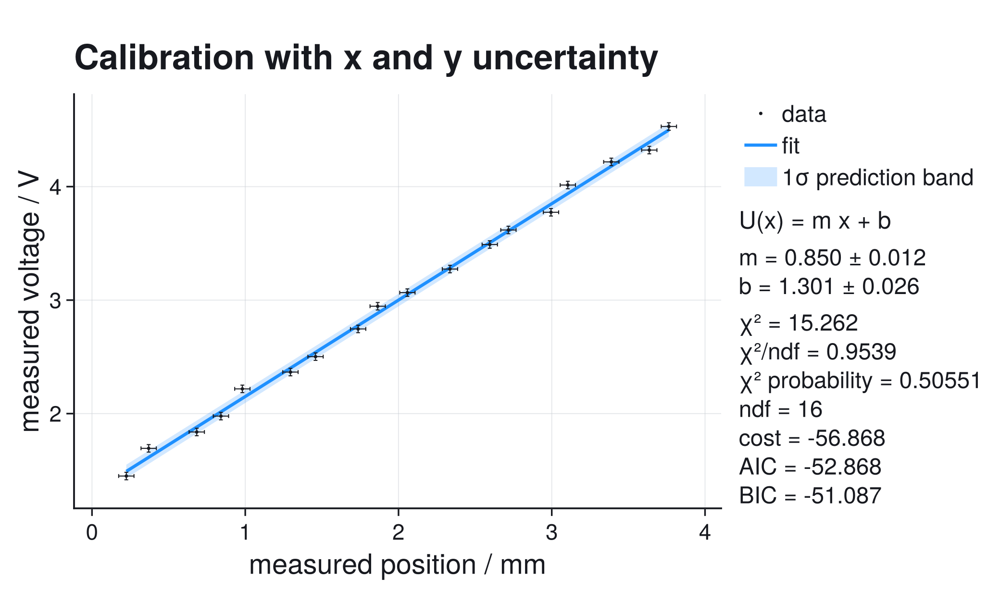
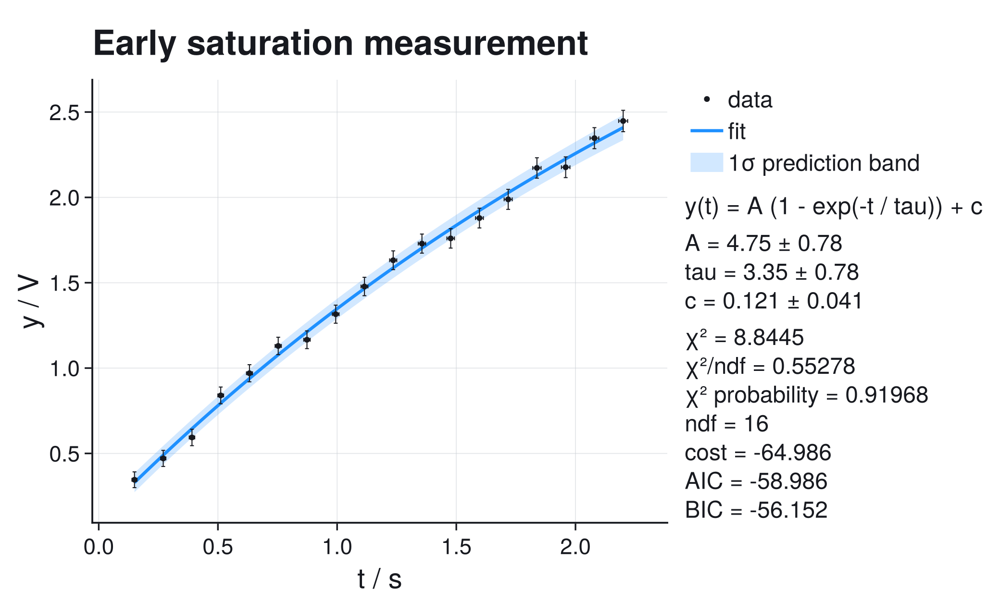
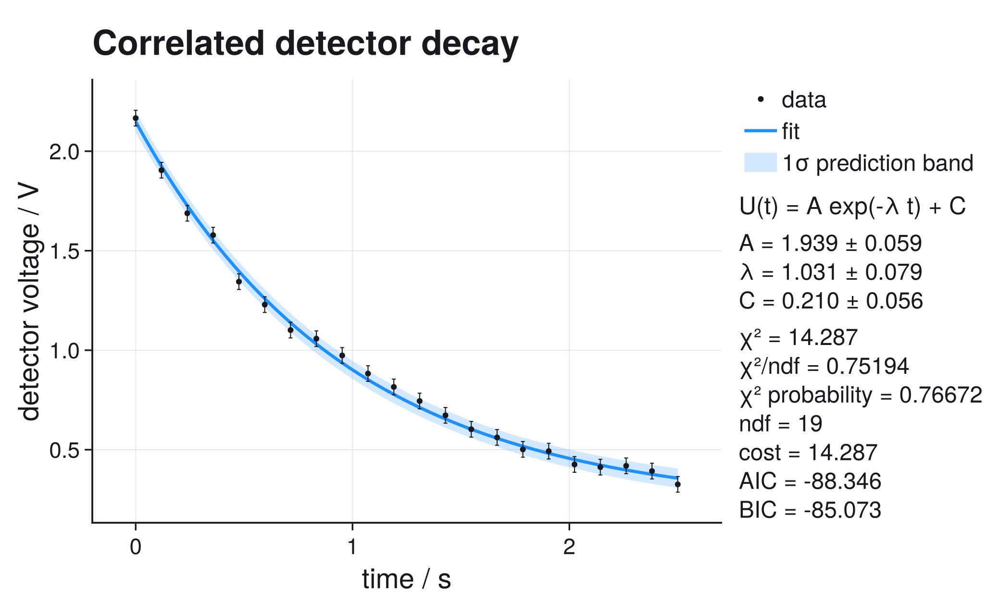
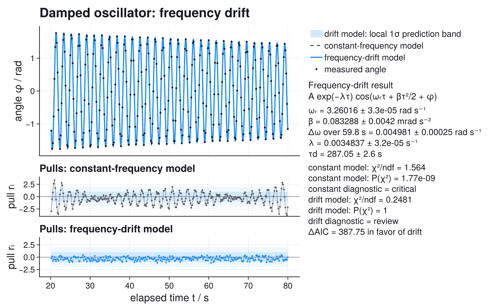
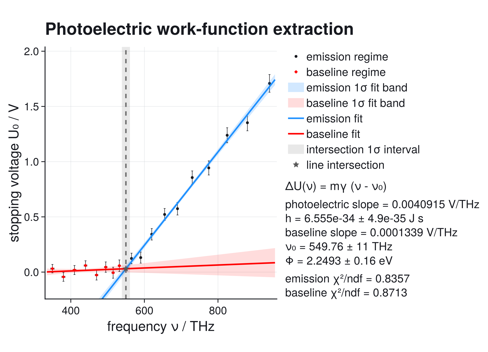
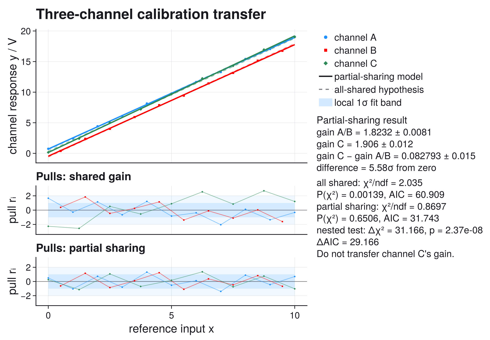
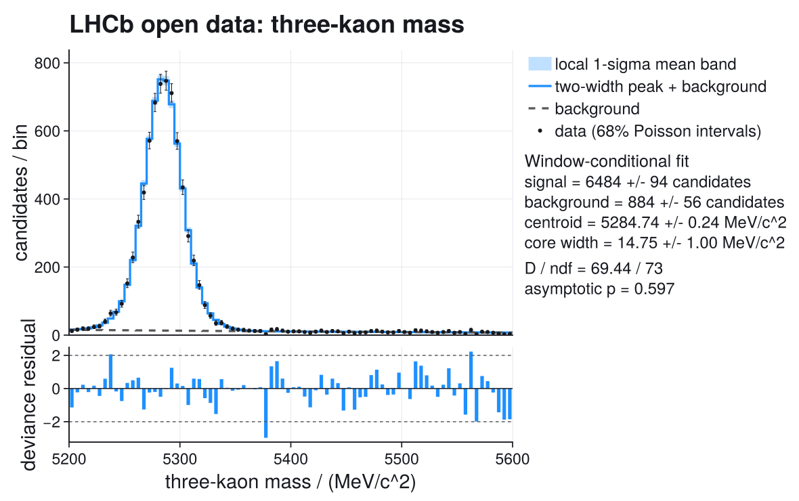

# Worked Examples

**What do the uncertainties mean?** Measurement errors describe the assumed
observation distribution. Reported parameter errors come from a quadratic
approximation of the cost function around the best fit; profile-likelihood
scans show where that approximation breaks down. A confidence band for the
fitted model shows the uncertainty of the curve, not the scatter of future
measurements; request `band=:prediction` when that scatter is wanted.
ScientificFitting uses optimization, not posterior sampling. The
[Statistics Reference](statistics.md) explains these distinctions and the
assumptions behind interval coverage (how often such intervals contain the
true value).

Start with the [Quickstart](quickstart.md), a linear calibration, for the
shortest complete analysis, or choose the example closest to your data below.
Every page contains the measurements, assumptions, executable code, actual
program output, diagnostics, and scientific interpretation.

```@raw html
<div class="scientificfitting-gallery-grid">
<div class="scientificfitting-gallery-item">

<div>
<span class="scientificfitting-tag">effective variance</span>
<span class="scientificfitting-tag">x errors</span>
<h3><a href="gallery/xy_uncertainties.html">XY uncertainties</a></h3>
<p>Include uncertainty in the independent variable through the local model slope, when calibration, frequency, voltage, or position errors are not negligible.</p>
</div>
<div class="scientificfitting-gallery-item">

<div>
<span class="scientificfitting-tag">likelihood</span>
<span class="scientificfitting-tag">counts</span>
<h3><a href="gallery/poisson_histogram.html">Poisson and histograms</a></h3>
<p>Extract a radioactive half-life and a detector peak from sparse counts. Exact count semantics, integrated unequal bins, empty bins, and deviance residuals replace invented Gaussian error bars.</p>
</div>
<div class="scientificfitting-gallery-item">

<div>
<span class="scientificfitting-tag">constraints</span>
<span class="scientificfitting-tag">profiles</span>
<h3><a href="gallery/constraints_profiles.html">Constraints and profiles</a></h3>
<p>A saturation measurement stopped before the plateau leaves amplitude and time constant nonlinearly coupled. Profiles and two-parameter regions show why the local covariance summary fails.</p>
</div>
<div class="scientificfitting-gallery-item">

<div>
<span class="scientificfitting-tag">covariance</span>
<span class="scientificfitting-tag">correlations</span>
<h3><a href="gallery/full_covariance.html">Full covariance</a></h3>
<p>Use a dense covariance matrix when measurements share readout noise, and see how correlations change parameter uncertainty and goodness-of-fit interpretation.</p>
</div>
<div class="scientificfitting-gallery-item">

<div>
<span class="scientificfitting-tag">real data</span>
<span class="scientificfitting-tag">nonlinear</span>
<span class="scientificfitting-tag">model criticism</span>
<h3><a href="gallery/resonance_decay.html">Damped oscillator</a></h3>
<p>Discover why a visually convincing constant-frequency fit is statistically rejected, test a frequency-drift extension, and use pull structure to decide what must be investigated next.</p>
</div>
<div class="scientificfitting-gallery-item">

<div>
<span class="scientificfitting-tag">x/y errors</span>
<span class="scientificfitting-tag">line intersection</span>
<h3><a href="gallery/photoelectric_threshold.html">Photoelectric work function</a></h3>
<p>Fit baseline and emission regimes separately, then propagate both covariance matrices into the threshold intersection and work function.</p>
</div>
<div class="scientificfitting-gallery-item">

<div>
<span class="scientificfitting-tag">multi-fit</span>
<span class="scientificfitting-tag">shared parameters</span>
<span class="scientificfitting-tag">model comparison</span>
<h3><a href="gallery/multi_dataset.html">Multi-dataset fit</a></h3>
<p>Test whether three calibration channels may share one gain, identify the incompatible channel from its pulls, and propagate the gain difference from the joint covariance.</p>
</div>
<div class="scientificfitting-gallery-item">

<div>
<span class="scientificfitting-tag">extended likelihood</span>
<span class="scientificfitting-tag">open data</span>
<span class="scientificfitting-tag">composed model</span>
<h3><a href="gallery/lhcb_mass_spectrum.html">LHCb mass spectrum</a></h3>
<p>Compose a named signal/background model, fit with NativeMinuit, and check yield sensitivity to the peak shape. Includes source DOI and reproducible ROOT selection.</p>
</div>
</div>
```

Need help judging a result? Continue with [Fitting for Practitioners](@ref).
For derivations, use the [Statistics Reference](statistics.md); for exact signatures
and defaults, use the [API Reference](@ref).
