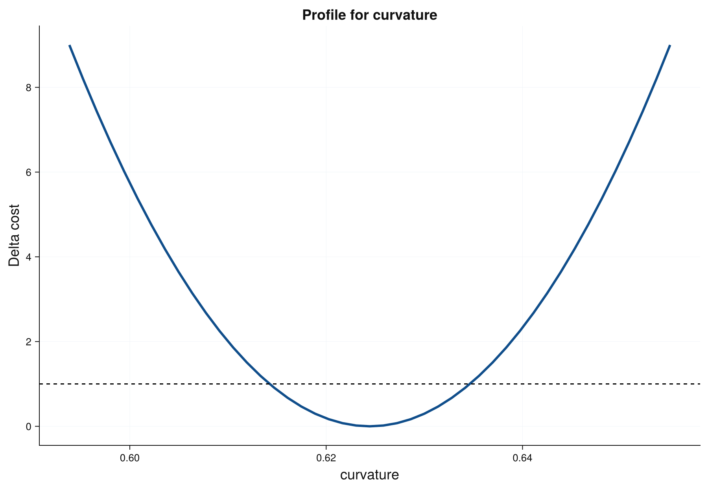
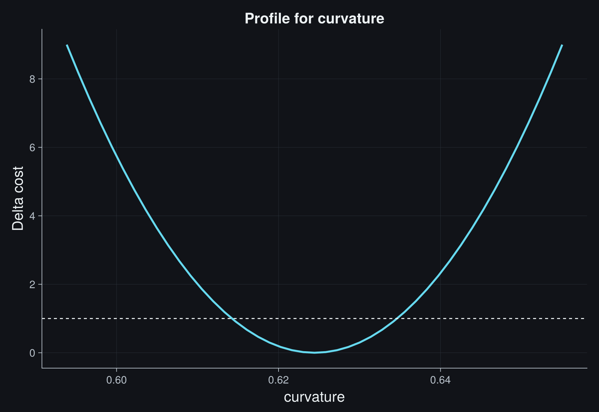
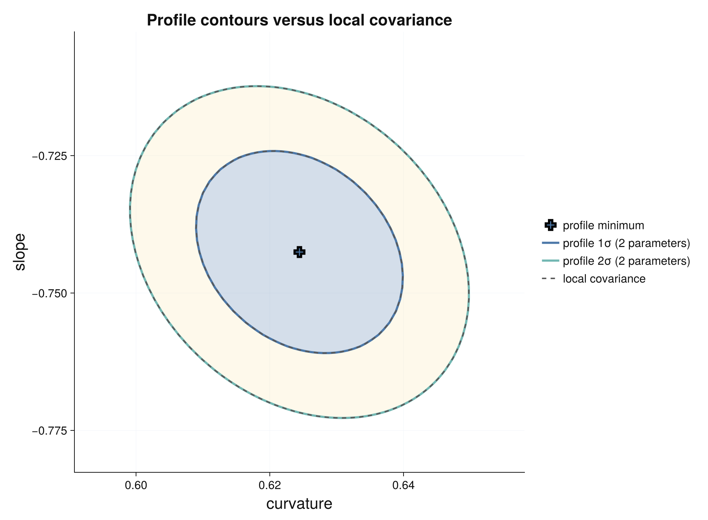
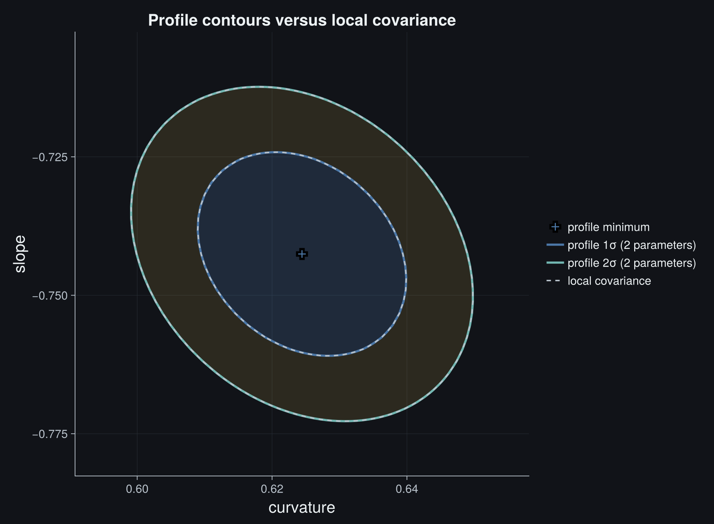

# Constraints And Profiles

This workflow fits a quadratic response with a physical curvature constraint,
an external offset calibration, and nonlocal uncertainty diagnostics. It is the
first gallery page to read when a fit returns parameter errors but you are not
sure whether the local covariance approximation is trustworthy.

```@raw html


```

## Question

A measured response is expected to be locally parabolic:

```math
y(x) = a x^2 + b x + c.
```

The curvature ``a`` should be non-negative for physical reasons, and an
independent calibration constrains the offset ``c`` near ``0.3``. The analysis
asks:

- What curvature, slope, and offset best describe the data?
- Is the curvature uncertainty symmetric enough for a standard ``\pm\sigma``
  report?
- How strongly are curvature and slope coupled?
- Did the constraints affect the uncertainty statement?

## Data And Prior Information

The example is controlled, not perfect. The data follow a quadratic trend with
structured residuals so that the diagnostic tools have something meaningful to
inspect. Each point has the same y uncertainty:

```math
\sigma_y = 0.08.
```

The offset prior is external information, for example from a zero-point
calibration:

```math
c = 0.30 \pm 0.20.
```

The prior is not a hard constraint. It contributes a Gaussian penalty to the
cost, so the data can still move ``c`` away from ``0.30`` when the measurement
supports it.

## Model, Bounds, And Cost

The fit combines three kinds of information:

- `sigma_y` for the measurement uncertainty,
- `bounds` for hard parameter ranges,
- `parameter_priors` for external Gaussian information.

The curvature bound is

```math
a \ge 0.
```

The full cost is the measurement contribution plus the prior penalty:

```math
C(p) =
\sum_i \left(\frac{y_i - f(x_i,p)}{\sigma_y}\right)^2
+ \left(\frac{c - 0.30}{0.20}\right)^2.
```

When a bound or prior is important, the Hessian near the minimum may no longer
tell the full story. That is why the workflow computes a profile and a contour
after the fit.

## Fit

This is the complete code for the documentation example:

```julia
using JuFitter

x = collect(range(-2.0, 2.3; length=28))
quadratic_model(x, p) = @. p[1] * x^2 + p[2] * x + p[3]

sigma_y = fill(0.08, length(x))
y = quadratic_model(x, [0.65, -0.75, 0.35]) .+
    sigma_y .* cos.(2.0 .* x)

constraints = (
    ineq = p -> [-p[1]],  # p[1] >= 0: convex parabola
)

result = fit_model(
    quadratic_model,
    x,
    y;
    p0=[0.25, -0.2, 0.0],
    sigma_y=sigma_y,
    bounds=([0.0, -2.0, -1.0], [2.0, 2.0, 2.0]),
    constraints=constraints,
    parameter_priors=(index=3, mean=0.3, sigma=0.2),
)

curvature, slope, offset = result.params
sigma_curvature, sigma_slope, sigma_offset = result.param_stderr

profile_curvature = profile(result, 1; npoints=45, nsigma=3)
interval_curvature = profile_interval(result, 1; npoints=81, nsigma=4)
curvature_slope = contour(result, 1, 2; npoints=31, nsigma=2)

println("a = ", curvature, " +/- ", sigma_curvature)
println("b = ", slope, " +/- ", sigma_slope)
println("c = ", offset, " +/- ", sigma_offset)
println("profile interval for a: -",
        interval_curvature.uncertainty_minus,
        " +",
        interval_curvature.uncertainty_plus)
println(diagnostic_dashboard_text(result))
```

The gallery asset generator uses the same fit result to render the fit plot,
the curvature profile, and the curvature-slope contour.

## Profile Diagnostic

```@raw html


```

A local covariance error assumes that the cost is parabolic near the minimum:

```math
\Delta C(a) \approx \left(\frac{a-\hat a}{\sigma_a}\right)^2.
```

A profile scan tests this assumption directly. For each fixed value of
curvature ``a``, JuFitter refits the remaining parameters and records the
increase in cost. If the profile is parabolic, symmetric ``\pm\sigma`` errors
are usually adequate. If the profile is skewed, clipped by a bound, or has a
flat shoulder, report profile intervals instead.

In the ``\chi^2`` convention, the common one-parameter thresholds are
``\Delta C = 1`` for 1 sigma and ``\Delta C = 4`` for 2 sigma. The profile plot
is therefore a diagnostic of the actual fitted cost, not an aesthetic extra.

## Contour Diagnostic

```@raw html


```

The contour shows the joint uncertainty of curvature and slope after the offset
and other parameters are refitted. This answers a different question from a
profile:

- The profile asks, "How far can one parameter move?"
- The contour asks, "Which combinations of two parameters remain plausible?"

An elongated contour means the two parameters compensate each other. A tilted
ellipse is usually fine; a bent, clipped, or disconnected contour means the
local covariance matrix is not enough evidence for a careful report.

For two parameters, the common Gaussian thresholds are approximately
``\Delta C = 2.30`` for 1 sigma and ``\Delta C = 6.18`` for 2 sigma. These
thresholds are different from the one-parameter profile thresholds because the
probability content is two-dimensional.

The colored regions and solid boundaries are the actual profiled 1-sigma and
2-sigma regions. The dashed curves are the local covariance approximation. In
this controlled example they nearly overlap, so the local covariance is an
adequate summary. A visible mismatch, clipping, or banana shape is the warning
that the local symmetric errors should not be the final uncertainty statement.

## Interpretation

For the controlled dataset, the fitted curvature is positive and well inside
the hard lower bound. That means the bound expresses physical knowledge but does
not dominate the best fit. The offset prior contributes information without
locking the offset to exactly ``0.30``.

The fitted values are approximately

```math
a = 0.6244 \pm 0.0102,\qquad
b = -0.7425 \pm 0.0121,\qquad
c = 0.3747 \pm 0.0225.
```

The profile interval for ``a`` is nearly symmetric in this controlled case,
about ``-0.0102`` and ``+0.0102``. That agreement is useful: it says the local
curvature error is a good summary for this parameter. The diagnostic dashboard
still reports `status = review`, because the residuals contain smooth structure.
That warning concerns model adequacy, not a failed profile calculation.

The useful conclusion is not only the parameter table. The profile and contour
tell whether the reported local errors are a fair summary. If they agree with
the local covariance approximation, the standard report is compact. If they do
not, the profile interval and contour should be shown or cited explicitly.

## What Can Go Wrong

Do not treat a hard bound as harmless. If the minimum sits on a bound, symmetric
Gaussian errors are usually misleading. Use profile intervals and state that the
parameter is constrained.

Do not confuse priors with measurements. A prior should represent external
information with a defensible uncertainty, not a way to force a preferred
answer.

Do not read a contour as a decorative confidence blob. Its shape tells you
whether parameters are correlated, whether the cost is locally quadratic, and
whether a two-number covariance summary is enough.

Do not overclaim profile reliability when scans fail or do not bracket the
requested threshold. JuFitter exposes those cases through profile diagnostics;
increase the scan range or inspect the model before reporting the interval.

Next useful pages: [Fitting for Practitioners](@ref),
[Statistical Foundations](@ref), and [Poisson And Histogram Fits](@ref).
