# Constraints and Profiles

Local covariance errors answer a local question: how curved is the cost
function immediately around the optimum? This workflow shows a case where that
answer is not enough. The fitted curve looks well determined over the measured
interval, but two physical parameters remain strongly and nonlinearly coupled.

```@raw html
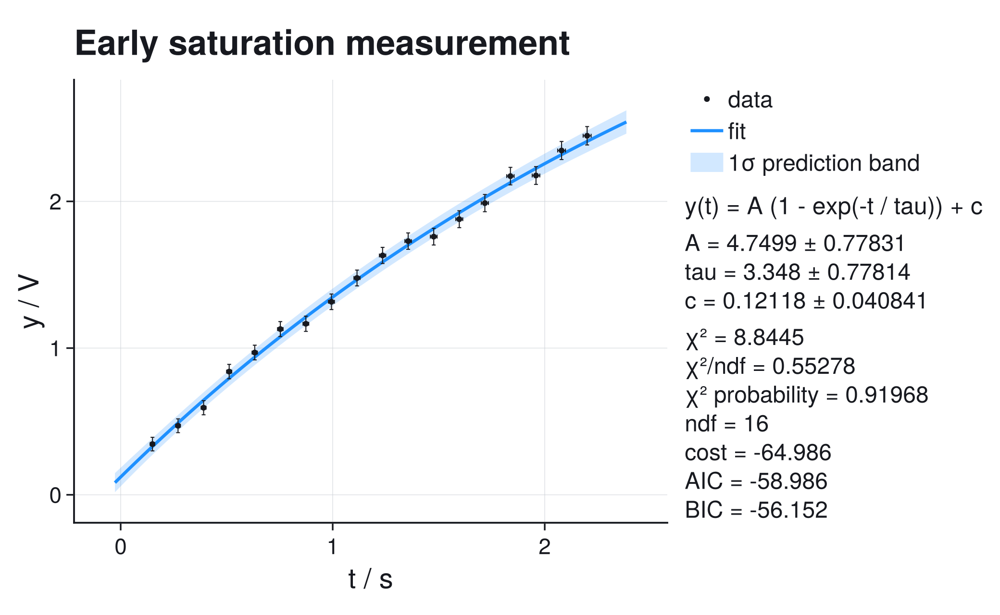
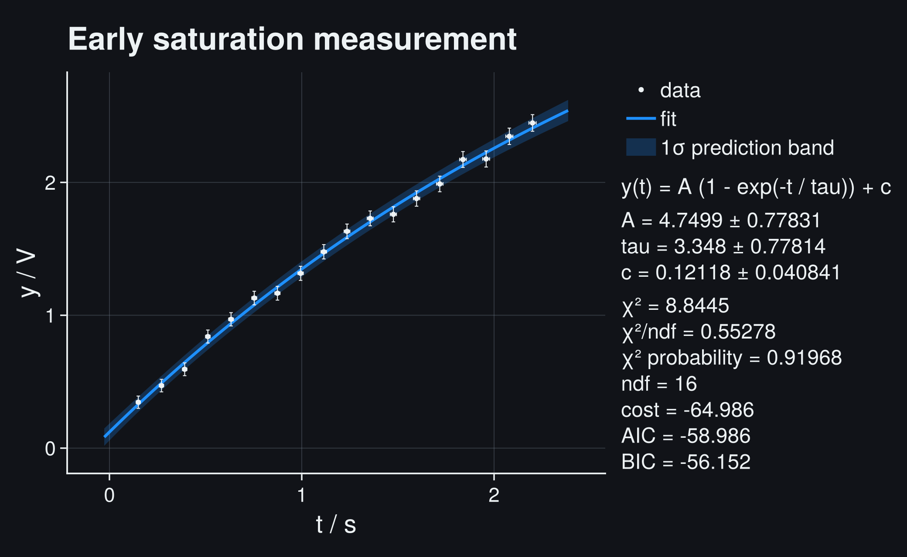
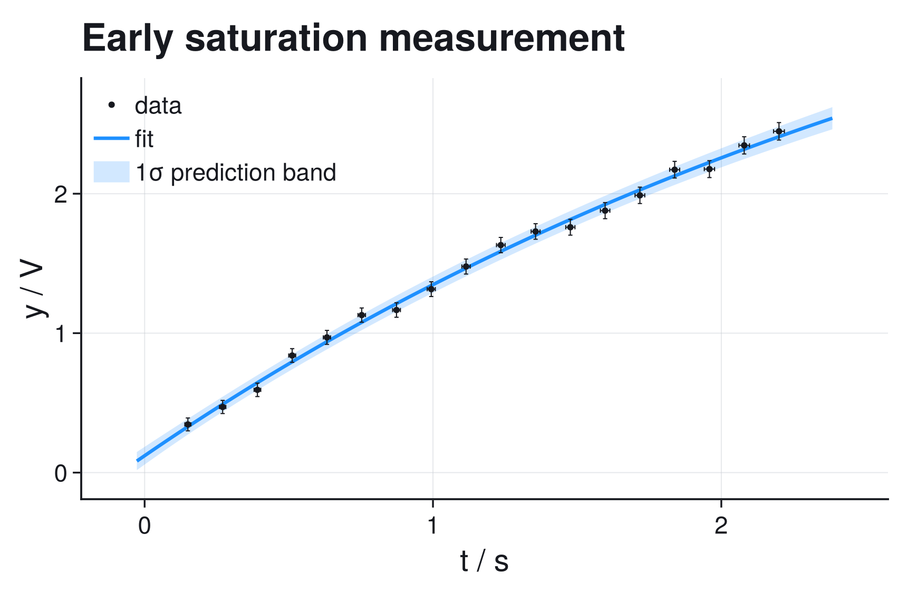
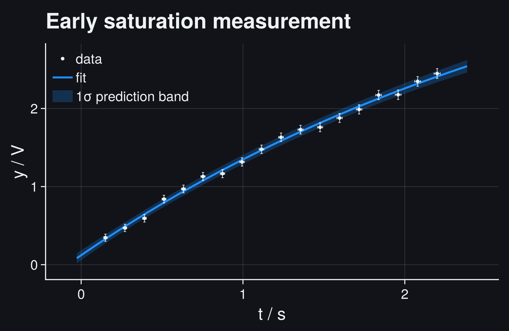
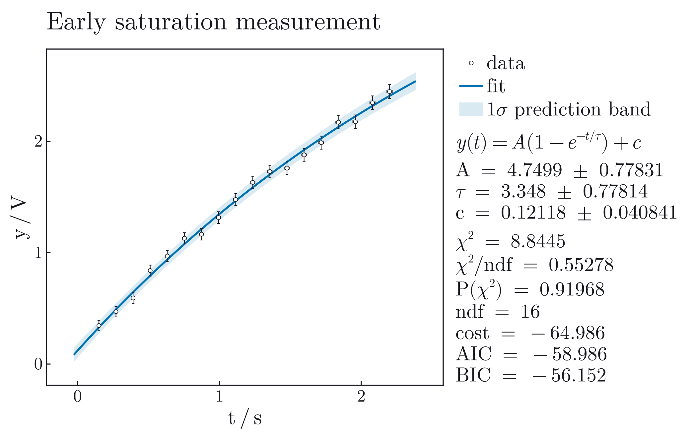
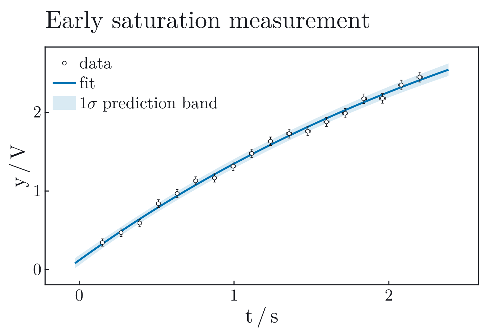
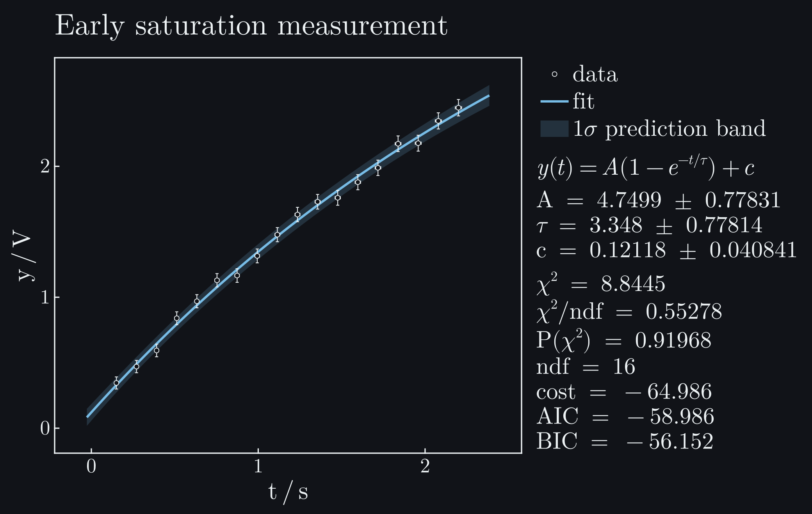
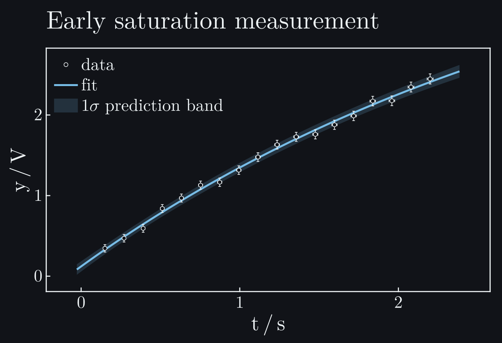
```

## Scientific Question

A sensor approaches a steady response after a step input. Its expected response
is

```math
y(t) = A\left(1-e^{-t/\tau}\right) + c,
```

where ``A`` is the response above baseline, ``\tau`` is the time constant, and
``c`` is the baseline. The measurement stops before the response reaches its
plateau.

The analysis must answer more than "does the curve pass through the points?"

- Can the available time window determine ``A`` and ``\tau`` separately?
- Is a symmetric covariance error a defensible uncertainty statement?
- How much does an independent baseline calibration help?
- What measurement should be added if the parameters remain degenerate?

## Data

The controlled dataset below mimics an early-time step-response measurement:
the plateau is not reached, each time point has its own uncertainty, and an
independent baseline calibration supplies external information. It is a
teaching record rather than a measurement attributed to a particular sensor.
All four input arrays are printed in the fit cell; no hidden random generator or
unknown true parameter enters the analysis.

## Why The Parameters Become Degenerate

For times much shorter than the time constant,

```math
1-e^{-t/\tau} \approx \frac{t}{\tau},
```

so the measured response is approximately

```math
y(t) \approx \frac{A}{\tau}t + c.
```

Early data therefore determine the ratio ``A/\tau`` much better than ``A`` or
``\tau`` individually. A larger amplitude can be compensated by a longer time
constant. This is a property of the experiment, not an optimizer defect.

The controlled dataset includes individual absolute uncertainties in both time
and response:

```math
\sigma_{t,i} = 0.010 + 0.004t_i\ \mathrm{s},
\qquad
\sigma_{y,i} = 0.045 + 0.008t_i\ \mathrm{V}.
```

The observations contain visible scatter and do not sit on a perfect
model-generated curve. An independent zero measurement supplies the Gaussian
prior

```math
c = 0.10 \pm 0.08\ \mathrm{V}.
```

## Bounds, Prior, And Cost

Amplitude and time constant must be positive. Those statements are hard bounds:

```math
0.1 \le A \le 20,
\qquad
0.1\ \mathrm{s} \le \tau \le 20\ \mathrm{s}.
```

The baseline calibration is different. It is uncertain external information,
so it enters as a Gaussian term rather than a fixed value. Define

```math
s_i^2(p)
=
\sigma_{y,i}^2
+
\left(\frac{\partial f(t_i,p)}{\partial t}\sigma_{t,i}\right)^2.
```

Because this effective variance depends on the fitted parameters, `cost=:auto`
selects the full Gaussian likelihood cost on the ``-2\log L`` scale:

```math
C(p) =
\sum_i
\left[
\log\!\left(2\pi s_i^2(p)\right)
+
\frac{\left[y_i-f(t_i,p)\right]^2}{s_i^2(p)}
\right]
+
\log\!\left(2\pi\,0.08^2\right)
+
\left(\frac{c-0.10}{0.08}\right)^2.
```

The effective-variance term propagates time uncertainty through the local model
slope. It is appropriate when the time uncertainties are small enough for this
first-order approximation. The log-variance term is essential because it
prevents the optimizer from improving the residual term merely by inflating a
parameter-dependent variance. A latent-variable or orthogonal-distance model
is needed when the first-order approximation is not adequate.

## Complete Fit

```julia
using CairoMakie
using JuFitter
using Printf

t = [
    0.150000, 0.270588, 0.391176, 0.511765, 0.632353, 0.752941,
    0.873529, 0.994118, 1.114706, 1.235294, 1.355882, 1.476471,
    1.597059, 1.717647, 1.838235, 1.958824, 2.079412, 2.200000,
]
response = [
    0.345641, 0.470693, 0.593535, 0.839840, 0.969673, 1.129630,
    1.165946, 1.315719, 1.477930, 1.631653, 1.729280, 1.759687,
    1.878716, 1.988480, 2.172411, 2.176549, 2.346881, 2.447489,
]
sigma_t = [
    0.010600, 0.011082, 0.011565, 0.012047, 0.012529, 0.013012,
    0.013494, 0.013976, 0.014459, 0.014941, 0.015424, 0.015906,
    0.016388, 0.016871, 0.017353, 0.017835, 0.018318, 0.018800,
]
sigma_response = [
    0.046200, 0.047165, 0.048129, 0.049094, 0.050059, 0.051024,
    0.051988, 0.052953, 0.053918, 0.054882, 0.055847, 0.056812,
    0.057776, 0.058741, 0.059706, 0.060671, 0.061635, 0.062600,
]

model(t, p) = @. p[1] * (1 - exp(-t / p[2])) + p[3]

result = fit_model(
    model,
    t,
    response;
    p0=[4.5, 3.0, 0.1],
    sigma_y=sigma_response,
    sigma_x=sigma_t,
    bounds=([0.1, 0.1, -0.5], [20.0, 20.0, 1.0]),
    parameter_priors=(index=3, mean=0.10, sigma=0.08),
    initial_guesses=[
        [6.0, 5.0, 0.1],
        [3.0, 2.0, 0.1],
    ],
    maxiters=2000,
)

amplitude_interval = profile_interval(result, 1; npoints=81, nsigma=4)
amplitude_profile = amplitude_interval.profile_result
amplitude_timescale = JuFitter.contour(
    result,
    1,
    2;
    npoints=121,
    nsigma=4,
)
profile_overview = profile_matrix(
    result;
    parameters=[1, 2, 3],
    parameter_names=["A", "tau", "c"],
    npoints_profile=41,
    npoints_contour=21,
    nsigma=3,
    adaptive=true,
    max_refinements=1,
)

plot_profile(
    amplitude_profile;
    local_sigma=result.param_stderr[1],
    xlabel="amplitude A",
    title="Profile cost versus local parabola",
    delta_max=8,
)
plot_contour(
    amplitude_timescale;
    local_covariance=result.param_covariance,
    local_center=result.params[[1, 2]],
    xlabel="amplitude A",
    ylabel="time constant tau",
    title="Profile versus local covariance",
)
plot_profile_matrix(profile_overview)

@printf("amplitude = %.3f -%.3f +%.3f V\n",
        result.params[1],
        amplitude_interval.uncertainty_minus,
        amplitude_interval.uncertainty_plus)
@printf("profile interval = [%.3f, %.3f] V\n",
        amplitude_interval.lower,
        amplitude_interval.upper)
@printf("corr(A, tau) = %.4f\n", result.param_correlation[1, 2])
println(diagnostic_dashboard_text(result))
```

```@raw html
<div class="jufitter-cell-output">
<div class="jufitter-cell-output-label">Real output (abridged)</div>
<pre>amplitude = 4.750 -0.629 +1.018 V
profile interval = [4.121, 5.768] V
corr(A, tau) = 0.9928

Fit diagnostic dashboard
status = review - inspect diagnostics
critical = 0, warning = 2, info = 0
2 warning(s). Inspect before trusting uncertainties or conclusions.

Next actions:
  1. Use profile or contour intervals before treating symmetric covariance errors as final uncertainties.
  2. Inspect a contour/profile plot. Re-center or rescale the independent variable, reparameterize the model, or add data that breaks the degeneracy.</pre>
</div>
```

Multiple starting points are deliberate. They do not cure an under-informative
experiment, but they make it less likely that a local optimizer accident is
mistaken for the physical minimum.

The fit returns approximately

```math
A = 4.75 \pm 0.78\ \mathrm{V},
\qquad
\tau = 3.35 \pm 0.78\ \mathrm{s},
\qquad
c = 0.121 \pm 0.041\ \mathrm{V}.
```

Those symmetric errors are only the local covariance summary. The fitted
correlation between ``A`` and ``\tau`` is approximately ``0.9928``. That number
is already a warning to inspect the cost away from the minimum.

## Diagnostics: Profile and Contour Checks

The diagnostics are the profiles and contours. They answer whether the local
covariance matrix is a faithful uncertainty summary or only a tangent
approximation near the minimum.

## Profile: Is The One-Parameter Error Symmetric?

```@raw html
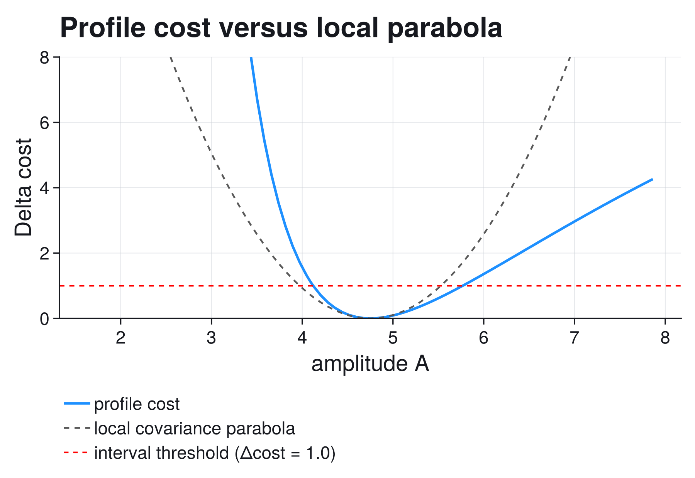
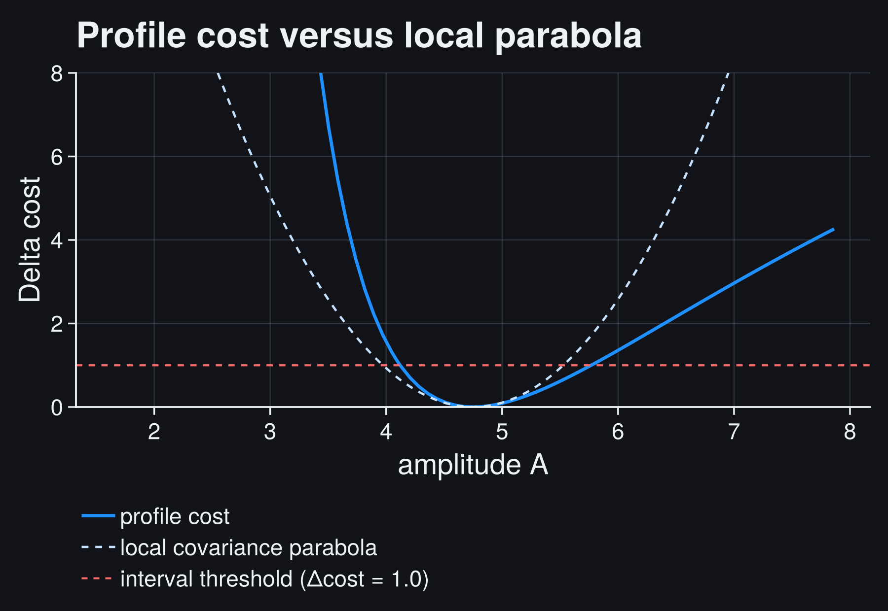
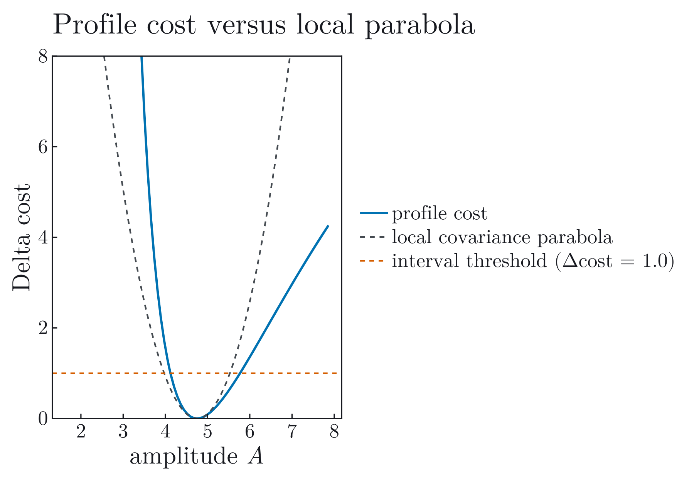
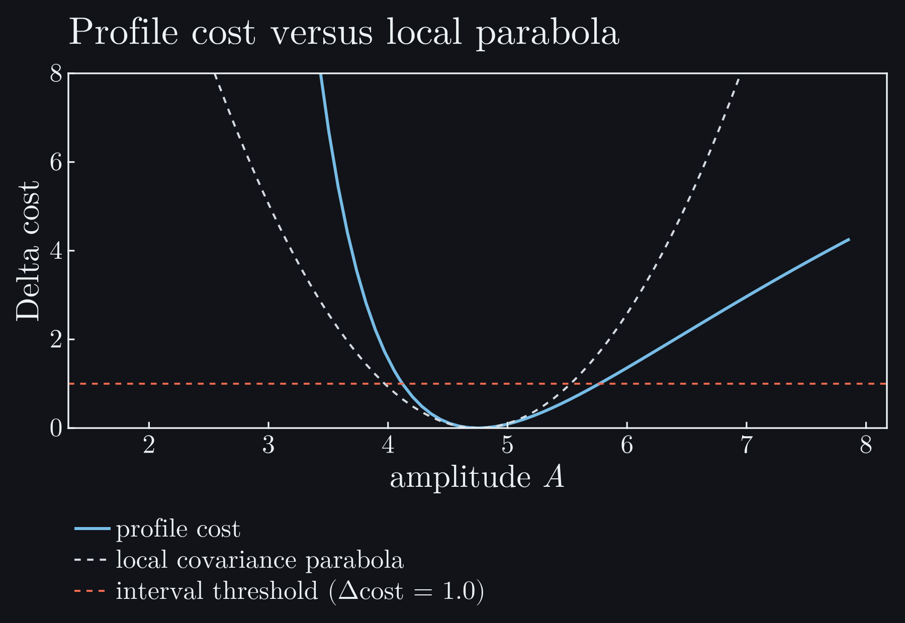
```

For every fixed amplitude, the profile scan refits ``\tau`` and ``c`` and
records

```math
\Delta C(A) = C\!\left(A,\widehat{\widehat{\tau}}(A),
\widehat{\widehat{c}}(A)\right) - C_{\min}.
```

The double hat means "refitted while ``A`` is held fixed." The dashed parabola
is what the local covariance matrix predicts:

```math
\Delta C_{\mathrm{local}}(A)
=
\left(\frac{A-\hat A}{\sigma_A}\right)^2.
```

The actual profile rises more slowly toward larger amplitudes. The one-sigma
profile interval is approximately

```math
A = 4.75^{+1.02}_{-0.63}\ \mathrm{V},
```

not ``4.75 \pm 0.78\ \mathrm{V}``. The asymmetry is scientifically relevant:
large amplitudes remain plausible because a longer time constant can hide the
plateau beyond the measured interval.

Here ``C=-2\log L`` up to constants. Under the usual regular likelihood-ratio
assumptions, ``\Delta C=1`` is the asymptotic one-sigma threshold for one
profiled parameter. The threshold line therefore turns the scan into an
interval construction rather than a qualitative curve inspection.

## Contour: Which Parameter Combinations Survive?

```@raw html
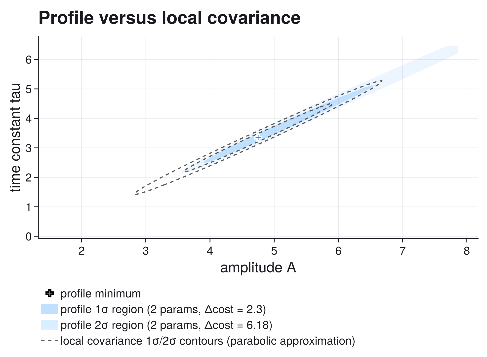
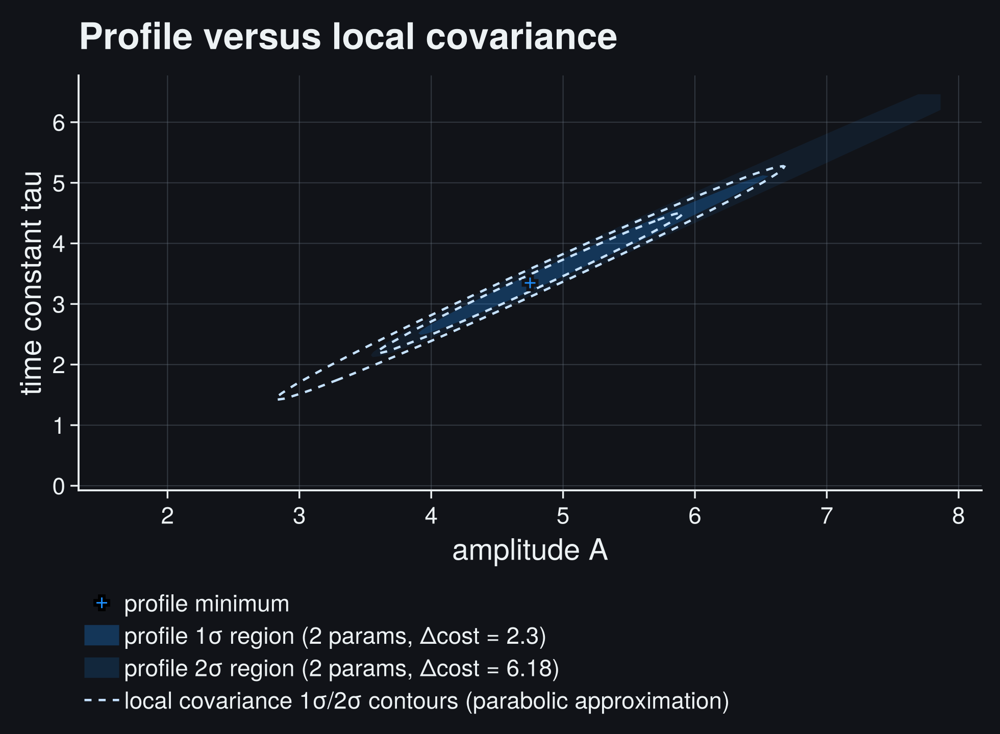
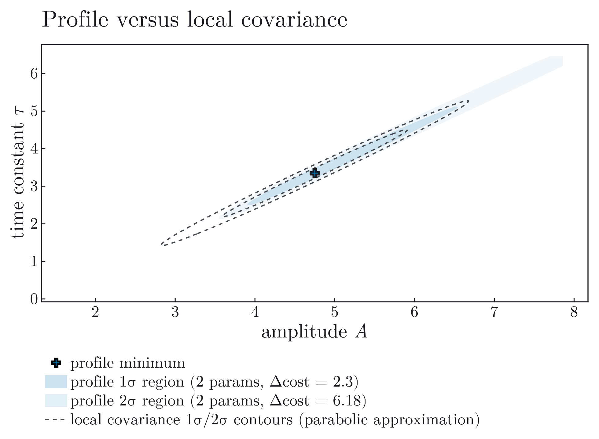
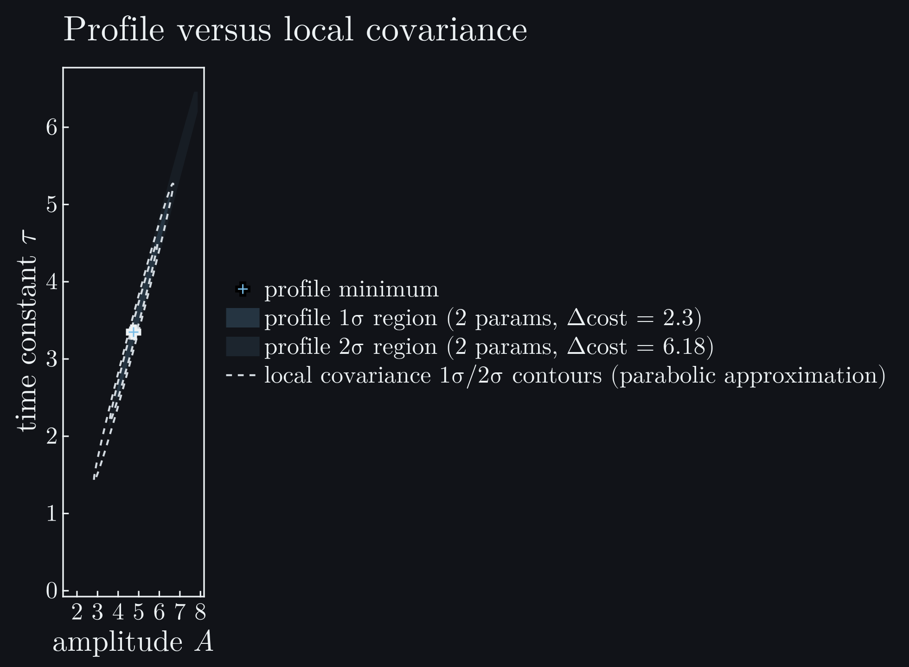
```

The filled regions are the actual profiled one- and two-sigma regions. At every
grid point in ``(A,\tau)``, JuFitter refits the baseline. The dashed curves are
the local covariance ellipses.

For two parameters under the same regular likelihood-ratio assumptions, the
common thresholds are

```math
\Delta C = 2.30 \quad \text{and} \quad \Delta C = 6.18
```

for one and two sigma respectively. They differ from the one-parameter profile
thresholds because a two-dimensional region must contain the stated
probability.

The profile region bends along combinations with similar early-time slope.
The local ellipse cannot follow that curvature. Reporting only the covariance
matrix would hide which high-``A``, high-``\tau`` combinations remain
compatible with the measurement.

## Matrix: Where Should You Look First?

For three or more fitted parameters, separate profile and contour plots become
hard to triage. `profile_matrix` computes the same checks as data first:
diagonal panels are one-parameter profiles, lower-triangle panels are
two-parameter contours, and upper-triangle panels show the local correlation
coefficient. The plot is only a rendering layer over that diagnostic object.
For automated notebooks or CI checks, `profile_matrix_triage(profile_overview)`
returns the same judgement as structured rows: parameter pair, status, finding
codes, and the first recommended action. That is the text-first route when you
want a run to fail or warn before anyone opens the figure.

```@raw html


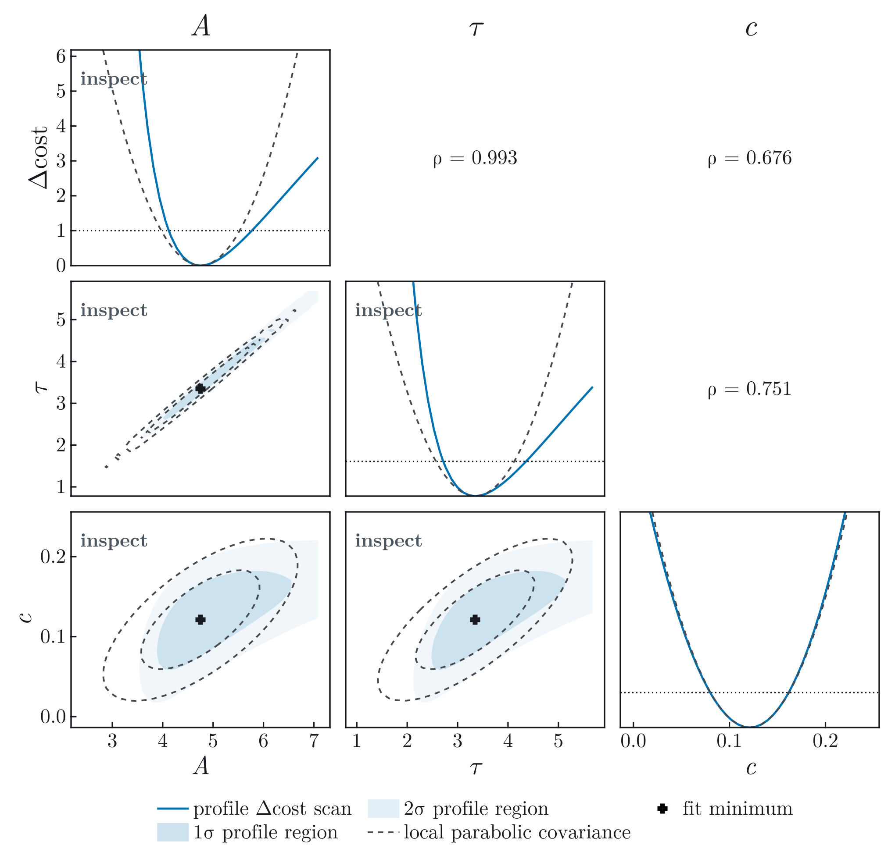
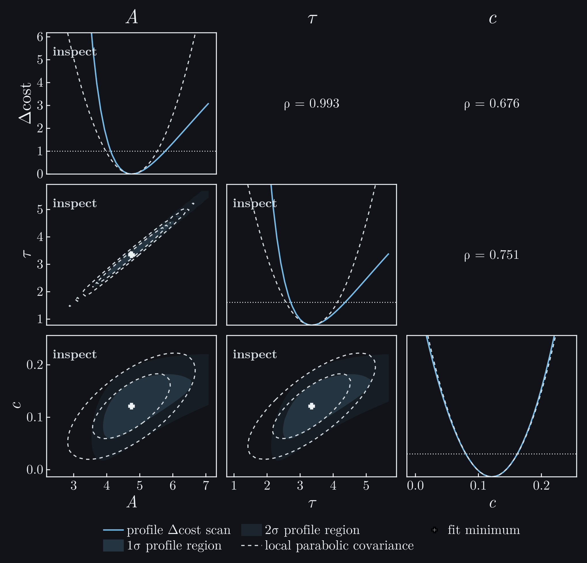
```

The useful reading order is mechanical:

1. Start in the upper triangle. Correlations near ``\pm1`` identify parameter
   pairs whose local covariance errors are fragile.
2. Move to the matching contour panel below the diagonal. If the profiled
   contour bends away from the dashed local ellipse, the likelihood geometry is
   not locally Gaussian over the region you intend to report.
3. Check the diagonal profile for the parameter you want to quote. If the
   profile is skewed, use the profile interval instead of ``\hat p\pm\sigma``.

In this example the amplitude-time-constant block is the dominant warning. The
baseline parameter is still constrained by the independent calibration, so it
does not produce the same long degeneracy direction. That distinction is the
reason to look at the matrix rather than only at the largest correlation
number.

## Decision In The Laboratory

The contour does not merely say "the fit is correlated." It identifies why:
the experiment has not observed enough of the saturation plateau.

The useful next action is therefore specific:

1. Extend the acquisition to times comparable to or larger than the fitted
   ``\tau``.
2. Keep the independent baseline measurement, because it prevents ``c`` from
   absorbing part of the early rise.
3. Report the profile interval or the profile contour until the added data make
   the local approximation adequate.

Changing optimizers, tightening tolerances, or adding more early-time points
cannot create information about the unseen plateau.

## Failure Modes To Inspect

**The profile does not reach the requested threshold.** Increase the scan range
only after checking whether the parameter is practically unidentifiable. A
one-sided or unbounded interval may be the correct conclusion.

**Profile refits fail.** Inspect `diagnose(profile_result)` or
`diagnose(contour_result)`. Failed cells can indicate poor scaling, invalid
model evaluations, active bounds, or a secondary minimum.

**A narrow contour appears fragmented.** Repeat the scan with a denser grid
before interpreting isolated regions as secondary minima. This example uses a
``121\times121`` grid because the amplitude-timescale region is much narrower
across the degeneracy than along it.

**The best fit sits on a bound.** Do not report a symmetric covariance error as
though the cost were unconstrained. State the bound and use a profile-based
limit or interval.

**The local band looks narrow although the parameters are uncertain.** This is
possible: the measured part of the curve can be predicted well while its
physical decomposition into ``A`` and ``\tau`` remains uncertain. Prediction
uncertainty and parameter identifiability answer different questions.

**The effective-variance approximation is questionable.** If time uncertainty
is large or the model is strongly curved over one ``\sigma_t``, use a more
complete errors-in-variables model instead of trusting first-order propagation.

Next useful pages: [Fitting for Practitioners](@ref),
[Profiles and Contours](../profiles_contours.md), and [XY Uncertainties](@ref).
