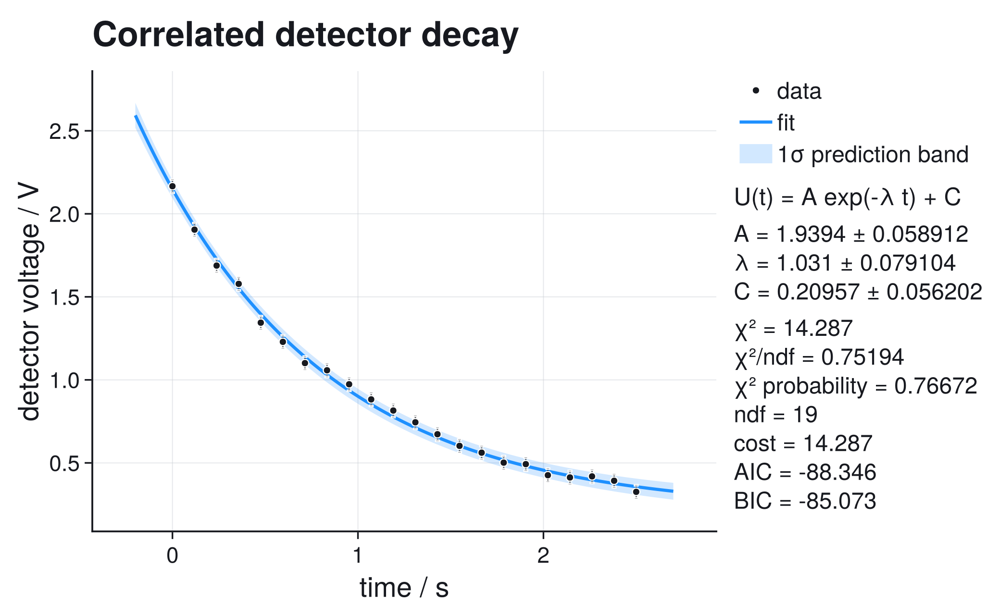
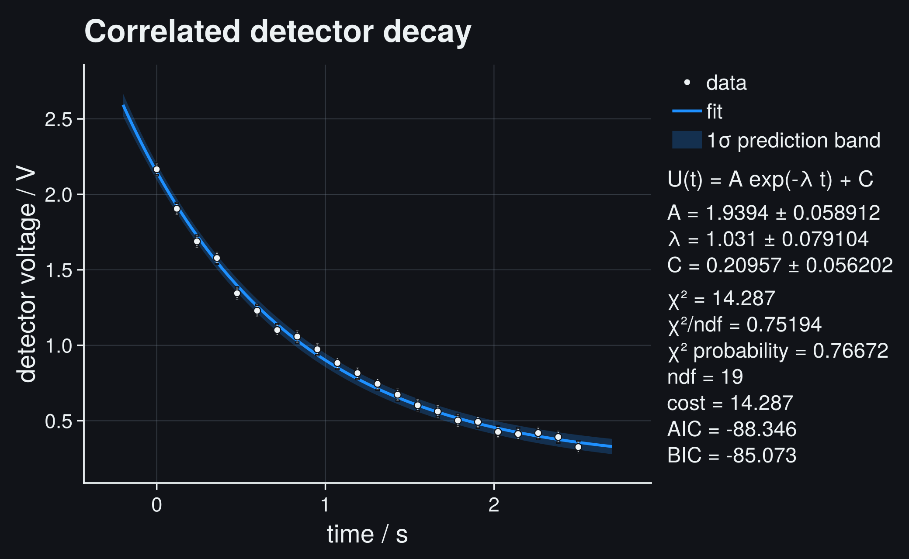
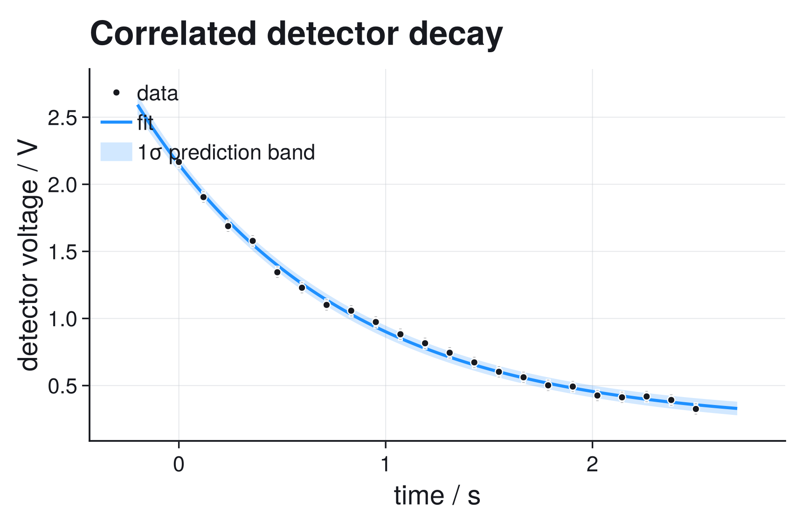
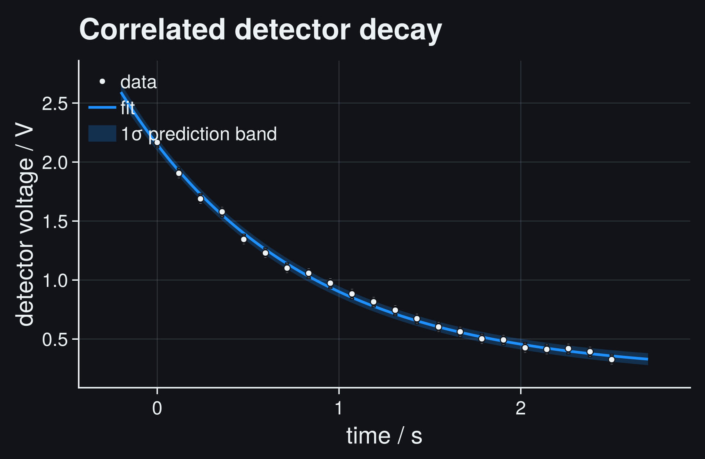
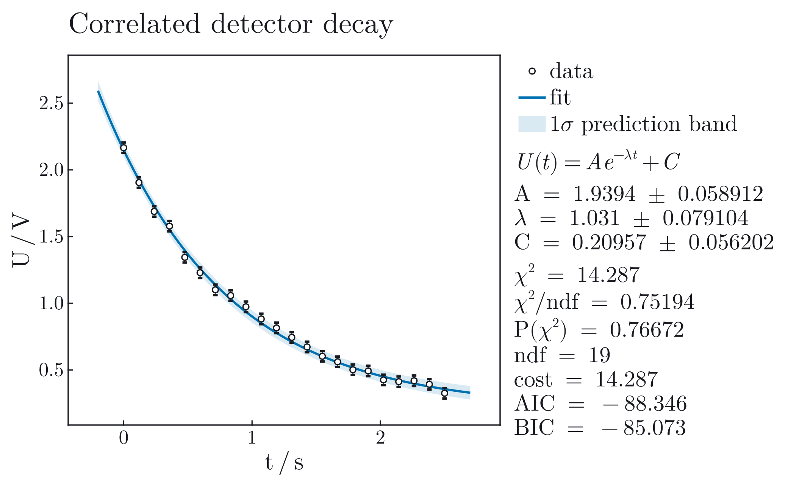
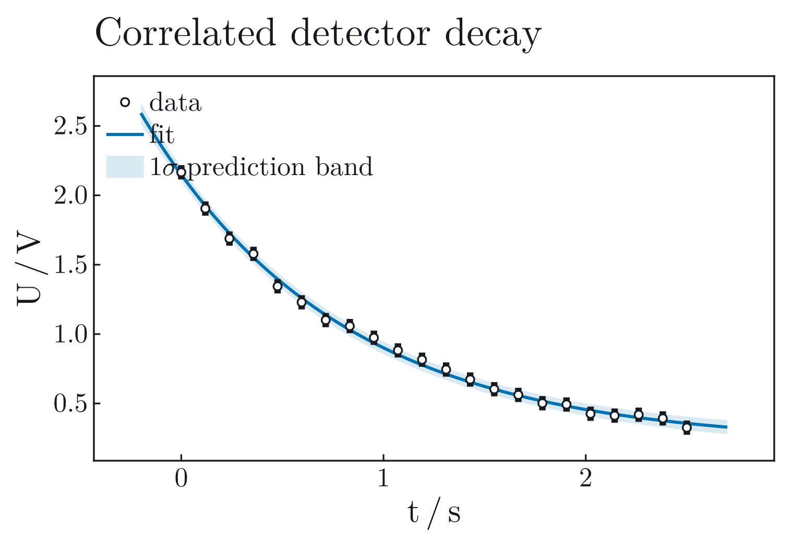
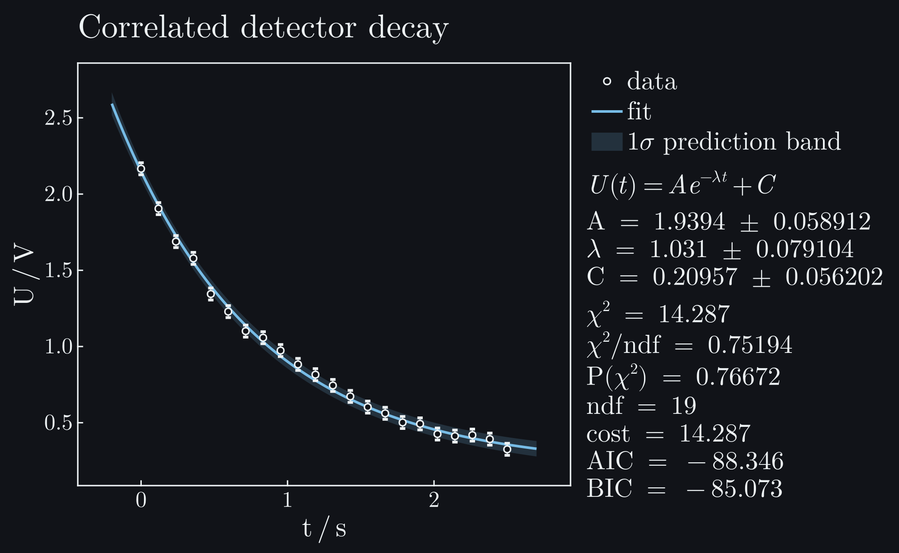
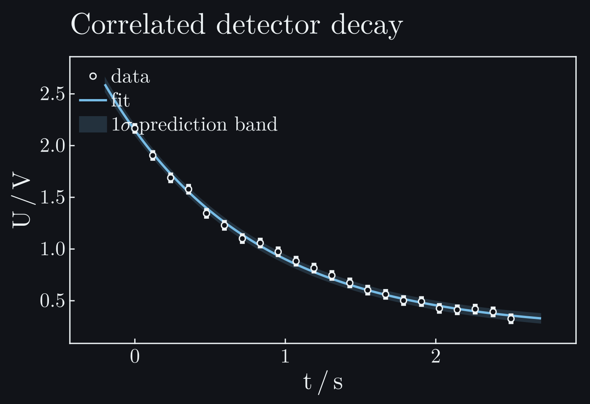

# Full Covariance

This workflow fits a detector-voltage transient when neighboring samples share
readout noise. The essential point is that correlated uncertainty changes the
statistical problem. A covariance matrix is not a prettier way to draw error
bars; it tells the fit which residual patterns are plausible together.

```@raw html








```

## Question

A decaying voltage is sampled repeatedly with the same readout chain. Neighboring
points are not independent because baseline drift, electronics, or smoothing in
the acquisition system affects several samples at once. The scientific question
is:

```math
U(t) = A e^{-\lambda t} + C,
```

where ``A`` and ``C`` are voltages and the positive decay rate ``\lambda`` has
units ``\mathrm{s^{-1}}``. The parameter uncertainties must account for the
correlated residuals.

If the correlations are ignored, the fit can look artificially precise. Many
small residuals in the same direction do not provide as much independent
information as the same number of uncorrelated residuals.

## Data and Covariance

The record below is controlled and deliberately imperfect, with a known
correlation time. Each point contains two distinct kinds of uncertainty:

- a local statistical part, such as readout noise that changes independently
  from sample to sample,
- a shared part, such as baseline drift, temperature drift, filtering, or
  electronics noise that affects nearby samples in similar directions.

If two points are close in acquisition order, they see more of the same shared
disturbance. If they are far apart, the shared disturbance has mostly changed.
The compact model used here keeps those contributions separate:

```math
V_{ij}
= \sigma_\mathrm{stat}^2\,\delta_{ij}
+ \sigma_\mathrm{corr}^2
  \exp\!\left(-\frac{|t_i-t_j|}{\tau_\mathrm{corr}}\right).
```

The Kronecker delta ``\delta_{ij}`` puts the local variance only on the diagonal.
The exponential term represents the disturbance shared by nearby samples. In
this record,

```math
\sigma_\mathrm{stat}=0.018\,\mathrm{V},\qquad
\sigma_\mathrm{corr}=0.035\,\mathrm{V},\qquad
\tau_\mathrm{corr}=0.28\,\mathrm{s}.
```

The marginal uncertainty of one point is therefore
``\sqrt{\sigma_\mathrm{stat}^2+\sigma_\mathrm{corr}^2}=0.0394\,\mathrm{V}``,
but adjacent points have correlation coefficient ``\rho\approx0.52``. Two
neighboring residuals with the same sign are consequently less surprising than
they would be for independent ``0.0394\,\mathrm{V}`` errors.

This is a useful first model when the acquisition chain has a finite memory:
baseline estimates, smoothing filters, thermal drift, or slowly varying
electronics offsets all tend to create nearby residuals with the same sign. It
is not the right model for every experiment. A constant calibration scale error,
for example, is a systematic effect that should usually be propagated to the
final result or represented by a separate nuisance parameter, not hidden inside
this short-range covariance matrix.

A three-sample sketch shows what the two terms do:

```math
V =
\underbrace{\sigma_\mathrm{stat}^2
\begin{pmatrix}1&0&0\\0&1&0\\0&0&1\end{pmatrix}}_{\text{independent readout}}
+
\underbrace{\sigma_\mathrm{corr}^2
\begin{pmatrix}1&\rho_1&\rho_2\\\rho_1&1&\rho_1\\\rho_2&\rho_1&1\end{pmatrix}}_{\text{shared disturbance}},
\qquad
\rho_k=e^{-\Delta t_k/\tau_\mathrm{corr}}.
```

## Model and Cost

With independent y errors, the weighted chi-square is

```math
\chi^2 = \sum_i \left(\frac{y_i - f(t_i,p)}{\sigma_i}\right)^2.
```

With a full covariance matrix ``V``, the Gaussian cost uses the quadratic form

```math
\chi^2 = r^\mathsf{T} V^{-1} r,
\qquad
r_i = y_i - f(t_i,p).
```

JuFitter does not form an explicit inverse for this calculation. It factors the
covariance and evaluates the whitened residuals, which is numerically safer:

```math
V = L L^\mathsf{T},
\qquad
\chi^2 = \lVert L^{-1} r \rVert^2.
```

The dense path is appropriate for small and medium datasets where the full
matrix is meaningful and affordable. It has ``O(n^2)`` memory cost and an
``O(n^3)`` factorization cost, so huge correlated datasets should use a
structured or problem-specific `WhiteningOperator` rather than a dense matrix.

## Fit

This is the complete code for the documentation example:

```julia
using JuFitter
using CairoMakie
using LinearAlgebra

# Measured decay samples. The values are listed explicitly because the fit
# should read like an analysis notebook, not like a data simulator.
t = [0.0, 0.1190, 0.2381, 0.3571, 0.4762, 0.5952, 0.7143, 0.8333,
     0.9524, 1.0714, 1.1905, 1.3095, 1.4286, 1.5476, 1.6667, 1.7857,
     1.9048, 2.0238, 2.1429, 2.2619, 2.3810, 2.5]
y = [2.16623, 1.90464, 1.68827, 1.57828, 1.34449, 1.22904, 1.10101,
     1.05791, 0.97363, 0.88257, 0.81542, 0.74456, 0.67276, 0.60263,
     0.56175, 0.50169, 0.49266, 0.42593, 0.41237, 0.41891, 0.39254,
     0.32576]

# Neighboring samples share a readout chain, so the uncertainty model is a
# covariance matrix instead of independent error bars.
n = length(t)
sigma_stat = 0.018
sigma_corr = 0.035
correlation_time = 0.28

cov_U = [
    sigma_stat^2 * (i == j) +
    sigma_corr^2 * exp(-abs(t[i] - t[j]) / correlation_time)
    for i in 1:n, j in 1:n
]

decay_model(t, p) = @. p[1] * exp(-p[2] * t) + p[3]

result = fit_model(
    decay_model,
    t,
    y;
    p0=[1.8, 0.8, 0.1],
    cov_y=cov_U,
)

# This deliberately incomplete comparison keeps only the diagonal variances.
diagonal_result = fit_model(
    decay_model,
    t,
    y;
    p0=[1.8, 0.8, 0.1],
    sigma_y=sqrt.(diag(cov_U)),
)

plot_fit(
    result;
    title="Correlated detector decay",
    model_label="U(t) = A exp(-λ t) + C",
    xlabel="time",
    xunit="s",
    ylabel="detector voltage",
    yunit="V",
    parameter_names=["A", "lambda", "C"],
    band=:prediction,
    nsigma=1,
    band_label="1σ prediction band",
    show_legend=true,
    stats_position=:right,
    stats_mode=:full,
    filename="full_covariance_decay.pdf",
)

println(report_text(result; parameter_names=["A", "lambda", "C"]))
println(diagnostic_dashboard_text(result))
println()
println("Diagonal-only comparison")
println("lambda = ", diagonal_result.params[2],
        " +/- ", diagonal_result.param_stderr[2], " s^-1")
println("chi2/ndf = ", diagonal_result.stats.chi2_ndf)
println(diagnostic_dashboard_text(diagonal_result))
```

```@raw html
<div class="jufitter-cell-output">
<div class="jufitter-cell-output-label">Real output (abridged)</div>
<pre>Fit report
backend = lsqfit
converged = true
iterations = unavailable
message = Converged with LsqFit

Parameters:
  A = 1.93938 +/- 0.0589119
  lambda = 1.03103 +/- 0.0791039
  C = 0.209571 +/- 0.0562024

Statistics:
  cost = chi2
  cost_min = 14.2868
  minus2loglik_min = -94.3457
  chi2 = 14.2868
  ndf = 19
  chi2/ndf = 0.751937
  pvalue = 0.766723
  AIC = -88.3457
  BIC = -85.0725

Fit diagnostic dashboard
status = ok - no immediate issue
critical = 0, warning = 0, info = 0
No major diagnostic issues detected by the current checks.
No next action required by the current diagnostic checks.

Diagonal-only comparison
lambda = 1.003076358513358 +/- 0.05572527436830675 s^-1
chi2/ndf = 0.5297614781491077
Fit diagnostic dashboard
status = review - inspect diagnostics
critical = 0, warning = 1, info = 0
1 warning(s). Inspect before trusting uncertainties or conclusions.

Next actions:
  1. Inspect this acquisition interval for drift, missing model structure, a calibration offset, or correlated uncertainty.</pre>
</div>
```

The visible 1σ prediction band combines parameter uncertainty with the
marginal observation uncertainty. The side report lists the parameters and
goodness-of-fit values computed from the full covariance model.

## Diagnostics

For a full-covariance fit, inspect more than the parameter table:

- Verify that `cov_U` is symmetric and positive definite. Invalid covariance
  matrices are scientific input errors, not style warnings.
- Compare the fitted parameters with a diagonal-error fit only as a diagnostic.
  Agreement in central values does not mean the uncertainties are equivalent.
- Inspect residuals in acquisition order. Long runs of same-sign residuals are
  less surprising under a correlated covariance model than under an independent
  model.
- Check whether the covariance model is justified by the instrument or
  acquisition process. A mathematically valid matrix is not automatically a
  physically valid uncertainty model.

The full-covariance dashboard reports `ok`; the diagonal-only comparison reports
`review` because its supposedly independent residuals retain a long same-sign
run. The dashboard is still only a first pass. Instrument knowledge must justify
the covariance model before the fitted uncertainties are publishable.

## Interpretation

The fitted amplitude ``A`` and offset ``C`` describe the voltage scale and
baseline. The model uses a positive physical decay rate directly as
``A\exp(-\lambda t)+C``; no sign conversion is hidden in the report or plot.

For the dataset shown here, the fit gives approximately

```math
A = (1.939 \pm 0.059)\,\mathrm{V},\qquad
\lambda = (1.031 \pm 0.079)\,\mathrm{s^{-1}},\qquad
C = (0.210 \pm 0.056)\,\mathrm{V}.
```

The full-covariance result has ``\chi^2/\mathrm{ndf}=0.752`` and
``P(\chi^2)=0.767``. Its local uncertainty on the decay rate is
``0.079\,\mathrm{s^{-1}}``. Keeping the same marginal error bars but discarding
their off-diagonal covariance gives ``0.056\,\mathrm{s^{-1}}`` and a structured
residual warning. In this record, the diagonal approximation therefore
understates the decay-rate uncertainty by about 30%.

That direction and size are not universal. Correlations can affect different
parameter combinations differently. The invariant point is that off-diagonal
terms determine how much independent evidence a residual pattern contains; they
cannot be reconstructed from error-bar lengths after the fit.

## What Can Go Wrong

Do not create a dense covariance matrix for huge data just because the API
accepts one. Dense covariance is exact but expensive. Large time series,
detector channels, and spatial grids need structured models if performance and
memory matter.

Do not add a small diagonal "jitter" silently to force a bad covariance matrix
to factor. If regularization is scientifically justified, it should be explicit
and reported.

Do not interpret a good p-value as proof that the covariance model is correct.
A wrong covariance can hide model mismatch or make uncertainties look more
credible than they are.

Next useful pages: [Damped Oscillator](resonance_decay.md),
[Fitting for Practitioners](@ref), and
[Gaussian Fits and Covariance](../gaussian_models.md).
