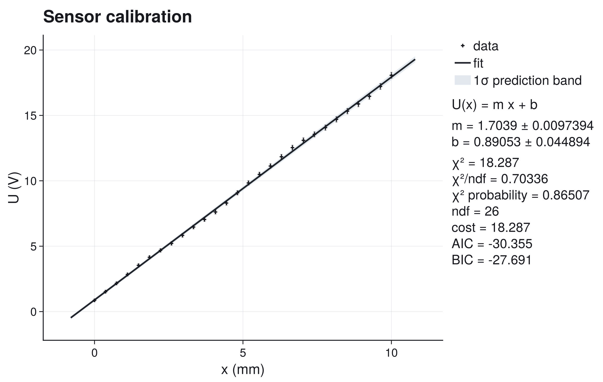
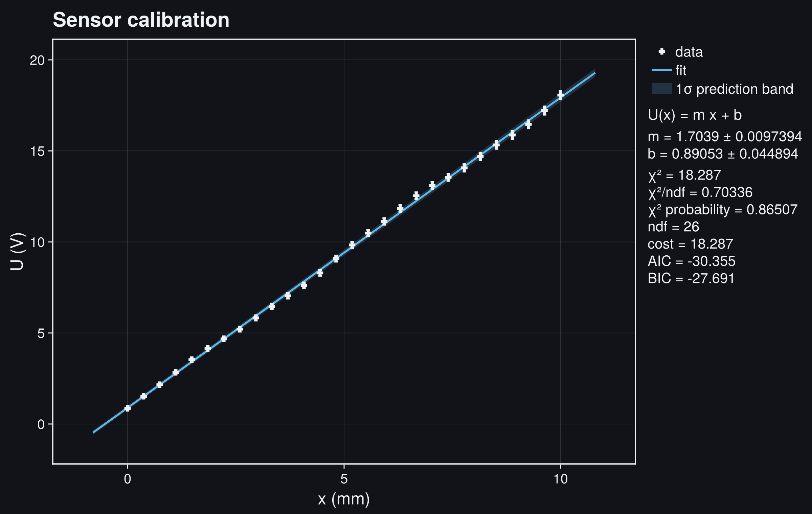
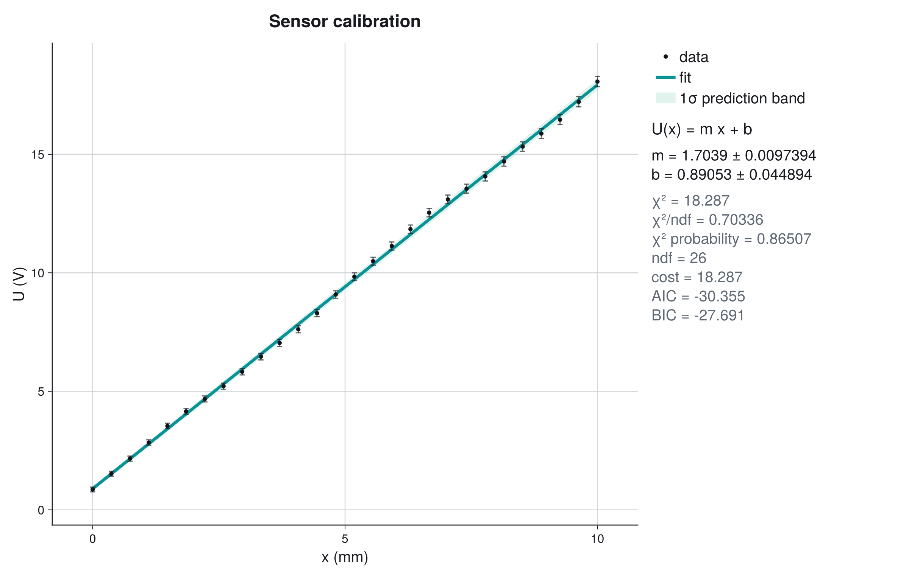
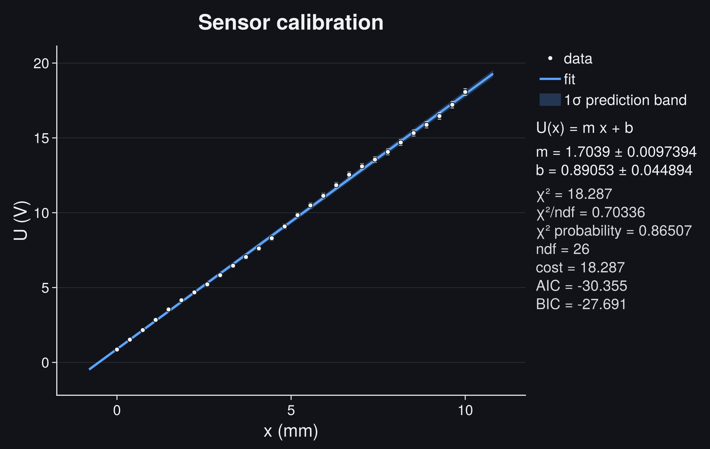
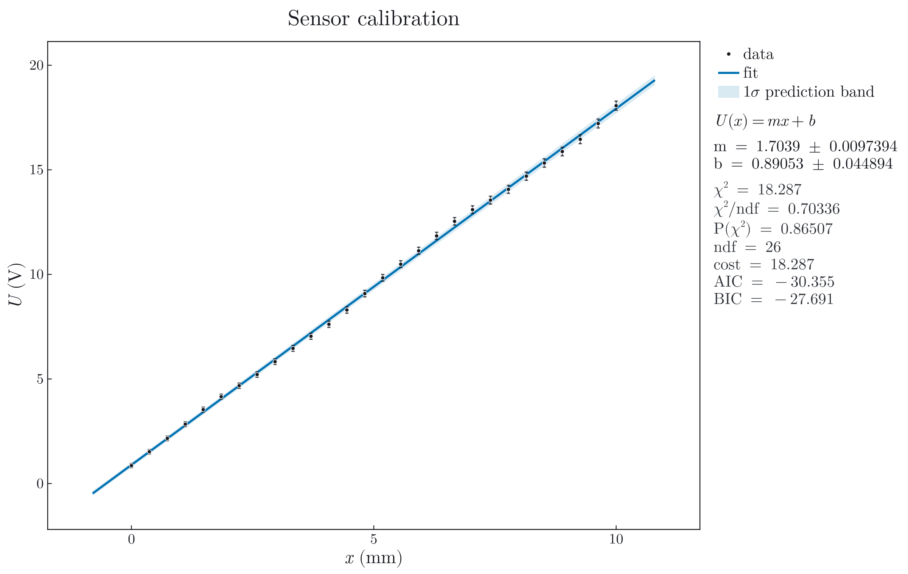
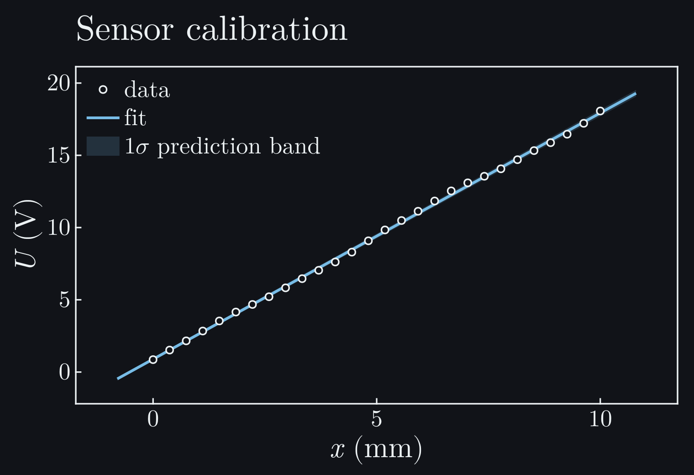

# Linear Calibration

This is the smallest useful JuFitter workflow: measured calibration points,
point-by-point uncertainties, a weighted fit, and a plot that states exactly
what its uncertainty band means.

```@raw html






```

## Question

A sensor produces a voltage ``U`` when the probe is moved to a known position
``x``. The calibration question is deliberately ordinary:

```math
U(x) = m x + b.
```

The slope ``m`` is the sensitivity of the sensor and ``b`` is the electronic or
mechanical zero offset. Even this simple case is useful because it contains the
complete JuFitter loop: explicit data, stated uncertainties, weighted fit,
diagnostics, and a plot whose band has a defined statistical meaning.

## Data

The arrays below are written explicitly, as they would be in a small lab
notebook after reading a CSV or typing values from an instrument log. The
uncertainties are one-standard-deviation voltage uncertainties. They grow
slightly with position because the measurement range and readout scatter grow
with the signal.

The example intentionally does not hide a data generator in the code cell. A
reader should see exactly which observations are fitted.

## Model and Cost

```math
U(x) = m x + b
```

The uncertainty is heteroscedastic: points at larger ``x`` are measured with a
slightly larger standard uncertainty. JuFitter therefore minimizes

```math
\chi^2(m,b)=\sum_i
\left(\frac{U_i-(m x_i+b)}{\sigma_{U,i}}\right)^2.
```

The plotted band is a **1σ prediction band**. It combines the local parameter
uncertainty of the fitted line with the expected scatter of one new
measurement. This is intentionally wider than a pure confidence band for the
mean curve.

## Complete Code

```julia
using CairoMakie
using JuFitter
using LaTeXStrings

# Calibration data: position in mm, sensor voltage in V, and individual
# one-standard-deviation voltage uncertainties.
x = [0.0, 0.3704, 0.7407, 1.1111, 1.4815, 1.8519, 2.2222, 2.5926,
     2.9630, 3.3333, 3.7037, 4.0741, 4.4444, 4.8148, 5.1852, 5.5556,
     5.9259, 6.2963, 6.6667, 7.0370, 7.4074, 7.7778, 8.1481, 8.5185,
     8.8889, 9.2593, 9.6296, 10.0]
y = [0.8596, 1.5216, 2.1594, 2.8399, 3.5361, 4.1533, 4.6783, 5.2132,
     5.8284, 6.4639, 7.0427, 7.6164, 8.2992, 9.0838, 9.8358, 10.4881,
     11.1291, 11.8393, 12.5375, 13.0958, 13.5503, 14.0656, 14.6970,
     15.3255, 15.8751, 16.4603, 17.2153, 18.0676]
sigma_y = [0.1000, 0.1044, 0.1089, 0.1133, 0.1178, 0.1222, 0.1267,
           0.1311, 0.1356, 0.1400, 0.1444, 0.1489, 0.1533, 0.1578,
           0.1622, 0.1667, 0.1711, 0.1756, 0.1800, 0.1844, 0.1889,
           0.1933, 0.1978, 0.2022, 0.2067, 0.2111, 0.2156, 0.2200]

model(x, p) = @. p[1] * x + p[2]

result = fit_model(model, x, y; p0=[1.5, 0.5], sigma_y=sigma_y)

plot_fit(
    result;
    title=L"\mathrm{Sensor\ calibration}",
    model_label=L"U(x)=m x + b",
    xlabel=L"x",
    xunit=L"\mathrm{mm}",
    ylabel=L"U",
    yunit=L"\mathrm{V}",
    parameter_names=[L"m", L"b"],
    latex_labels=true,
    latex_stats=true,
    band=:prediction,
    nsigma=1,
    band_label=L"1\sigma\ \mathrm{prediction\ band}",
    show_legend=true,
    stats_position=:right,
    stats_mode=:full,
)

println(report_text(result; parameter_names=["m", "b"]))
println(diagnostic_dashboard_text(result))
```

```@raw html
<div class="jufitter-cell-output">
<div class="jufitter-cell-output-label">Real output (abridged)</div>
<pre>Fit report
backend = lsqfit
converged = true
iterations = unavailable
message = Converged with LsqFit

Parameters:
  m = 1.70389 +/- 0.00973936
  b = 0.890534 +/- 0.0448941

Statistics:
  cost = chi2
  cost_min = 18.2874
  minus2loglik_min = -34.3551
  chi2 = 18.2874
  ndf = 26
  chi2/ndf = 0.703363
  pvalue = 0.865067
  AIC = -30.3551
  BIC = -27.6907

Fit diagnostic dashboard
status = review - inspect diagnostics
critical = 0, warning = 3, info = 0
3 warning(s). Inspect before trusting uncertainties or conclusions.

Next actions:
  1. Use a covariance model, inspect acquisition order/time dependence, or fit a model with the missing systematic component.
  2. Inspect this acquisition interval for drift, missing model structure, a calibration offset, or correlated uncertainty.
  3. Look for missing curvature, drift, hysteresis, time dependence, or an incorrect independent variable transformation.</pre>
</div>
```

## Run It

```bash
julia --project=docs examples/gallery/09_docs_gallery_suite.jl
```

## Diagnostics

The fit converges and the goodness-of-fit is not suspicious:

```math
\chi^2/\mathrm{ndf}=0.703,
\qquad
P(\chi^2)=0.865.
```

That does not mean the result should be copied blindly. The diagnostic dashboard
asks for review because the residual pattern is not perfectly random. In a real
calibration notebook the next quick checks are:

- plot residuals against acquisition order, not only against ``x``;
- verify that voltage uncertainties are one-standard-deviation quantities;
- check whether repeated measurements at the same position share drift or
  offset noise;
- compare the result with a residual plot or a covariance model if the same
  readout chain was used for all points.

The lesson is intentionally modest: an `ok`-looking line plot is not the same
as a completed measurement. JuFitter surfaces the first suspicious pattern
without hiding the fitted numbers.

## Interpretation

For this dataset the calibration law is approximately

```math
U(x) = (1.7039 \pm 0.0097)\,x + (0.8905 \pm 0.0449).
```

The plotted 1-sigma prediction band answers: where would a new observation be
expected under the fitted model and stated voltage uncertainty? It is wider
than the uncertainty of the mean fitted line because a future measurement also
contains observation noise.

## What Can Go Wrong

Do not use unweighted least squares if the points have different uncertainties.
The later high-voltage points here are less precise and should not have the
same statistical weight as the low-voltage points.

Do not treat the right-side parameter panel as a substitute for residual
inspection. A small p-value, a very large p-value, or structured pulls can all
indicate that the uncertainty model is incomplete.

Do not increase plot margins, hide bands, or round numbers until the statistical
meaning is clear. Plot polish comes after the measurement model is defensible.

Next useful pages: [XY Uncertainties](@ref), [Full Covariance](@ref), and
[Fitting for Practitioners](@ref).
