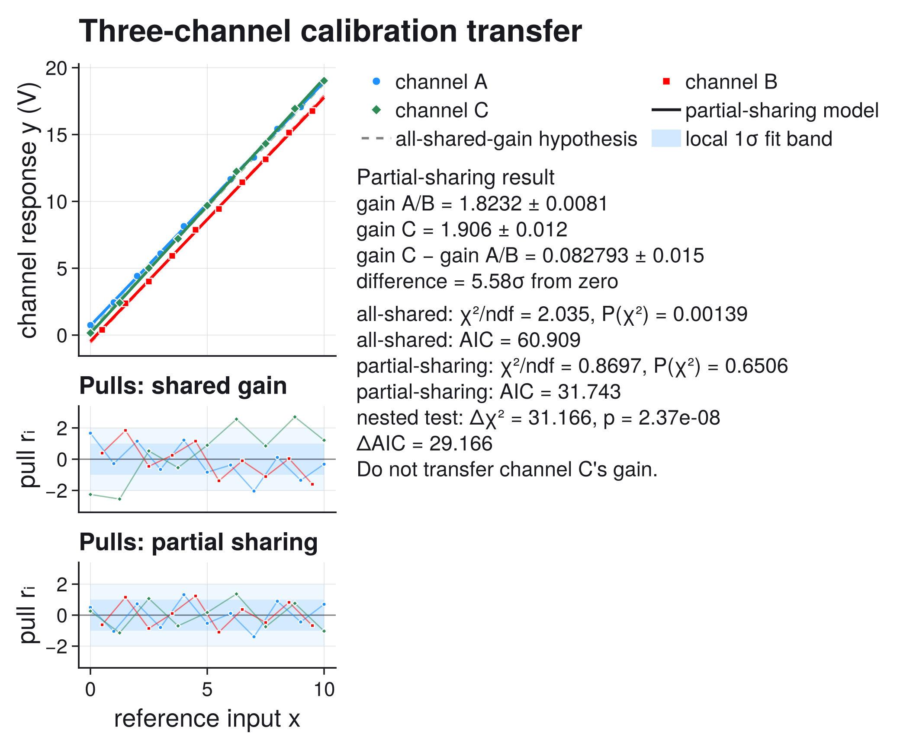
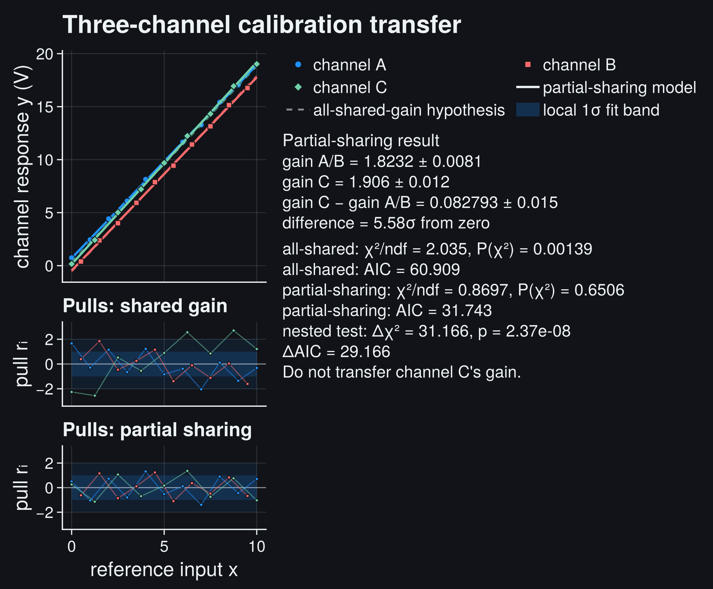
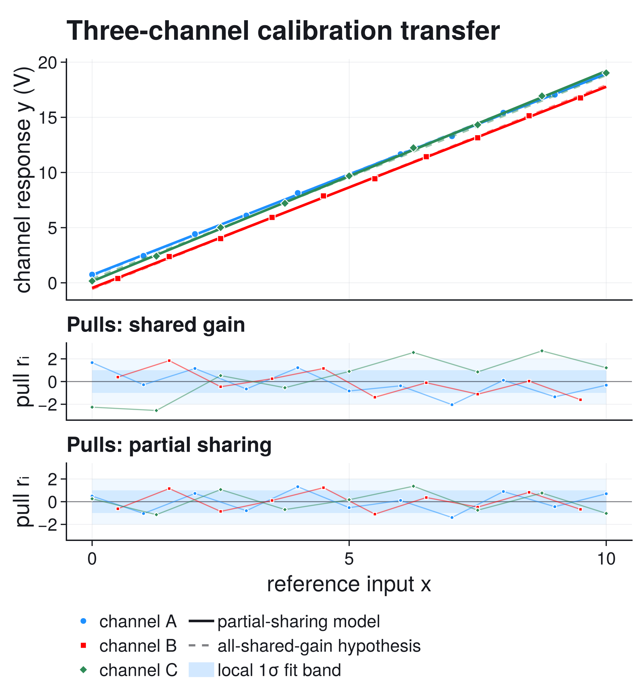
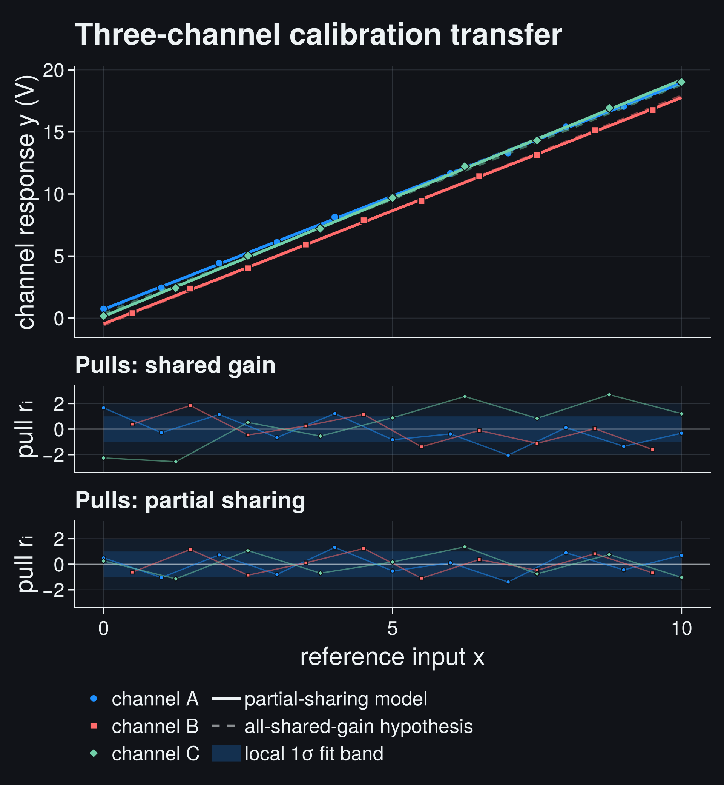

# Multi-Dataset Fit: Which Parameters May Be Shared?

Several datasets often measure the same physics without sharing every
instrument parameter. A simultaneous fit can use that structure, but sharing a
parameter is a scientific hypothesis, not a numerical convenience.

This controlled calibration-transfer example asks whether three readout
channels may use one common gain. The answer is no: channels A and B are
compatible, while channel C requires a separate gain.

```@raw html






```

The solid lines show the accepted partial-sharing model. The dashed lines show
what happens when all channels are forced to share one gain. In the main panel
the difference is easy to underestimate; the first pull panel makes the failure
of the all-shared hypothesis clear.

## The Scientific Question

Three nominally identical readout channels are calibrated against the same
reference input. Their electronic zero points may differ, but the proposed
transfer procedure assumes one common sensitivity:

```math
y_i(x)=g x+b_i,
\qquad i\in\{A,B,C\}.
```

If this assumption is valid, one accurately calibrated gain can be transferred
between channels after correcting their offsets. If one channel has a different
gain, that transfer introduces a systematic error that grows with input.

This page uses a controlled teaching record designed to expose that decision.
It is not attributed to a particular instrument. The three explicit data
tables have different x sampling, heteroscedastic absolute y uncertainties,
independent offsets, imperfect scatter, and an incompatible gain in channel C.
Because this is a method check, that incompatibility is known in advance; the
fit must recover it without using that knowledge as an input.

A useful mental model is three readout channels that share a sensor type but
not necessarily the whole electronics chain:

```math
\begin{array}{c|c|c}
\text{channel} & \text{gain source} & \text{offset source} \\
\hline
A & \text{amplifier family 1} & \text{own zero point} \\
B & \text{amplifier family 1} & \text{own zero point} \\
C & \text{replacement amplifier} & \text{own zero point}
\end{array}
```

The statistical question is therefore not only whether each line fits its own
points. It is whether the apparatus justifies sharing a parameter across
datasets.

## Data

The code below uses three explicit calibration channels. Each channel has its
own x grid and point-by-point absolute y uncertainty. There is no random-number
generator or hidden model parameter in the analysis cell: the arrays are the
complete observed record. Channels A and B should support gain transfer;
channel C is the test of whether the analysis rejects an unjustified transfer.

## The Multi-Dataset Cost

For independent Gaussian measurements, the simultaneous cost is

```math
\chi^2(p)
= \sum_i \sum_j
  \left[
    \frac{y_{ij}-f_i(x_{ij};p_i)}{\sigma_{ij}}
  \right]^2.
```

Each local model receives only the global parameters listed by its
`parameter_map`. The first hypothesis uses

```math
p_\mathrm{all}=(g,b_A,b_B,b_C),
```

with maps

```math
p_A=(p_1,p_2),\qquad
p_B=(p_1,p_3),\qquad
p_C=(p_1,p_4).
```

All three channels therefore use exactly the same gain ``g``.

The second hypothesis uses

```math
p_\mathrm{partial}=(g_{AB},b_A,b_B,g_C,b_C),
```

with maps

```math
p_A=(p_1,p_2),\qquad
p_B=(p_1,p_3),\qquad
p_C=(p_4,p_5).
```

Channels A and B share ``g_{AB}``; channel C has its own ``g_C``.

## Complete Fit Code

```julia
using Distributions
using JuFitter
using LinearAlgebra
using Printf

linear_channel(x, p) = @. p[1] * x + p[2]

x_a = [0.0, 1.0, 2.0, 3.0, 4.0, 5.0, 6.0, 7.0, 8.0, 9.0, 10.0]
y_a = [
    0.744750, 2.444135, 4.420060, 6.098325, 8.141240, 9.763075,
    11.660295, 13.287080, 15.417610, 17.051490, 19.047875,
]
sigma_a = [
    0.075, 0.083, 0.091, 0.099, 0.107, 0.115,
    0.123, 0.131, 0.139, 0.147, 0.155,
]

x_b = [0.5, 1.5, 2.5, 3.5, 4.5, 5.5, 6.5, 7.5, 8.5, 9.5]
y_b = [
    0.391920, 2.378570, 4.007500, 5.927490, 7.877840,
    9.433180, 11.431380, 13.147100, 15.144640, 16.759710,
]
sigma_b = [0.088, 0.094, 0.100, 0.106, 0.112, 0.118, 0.124, 0.130, 0.136, 0.142]

x_c = [0.0, 1.25, 2.5, 3.75, 5.0, 6.25, 7.5, 8.75, 10.0]
y_c = [
    0.159600, 2.417162, 5.013387, 7.207425, 9.690625,
    12.237350, 14.323312, 16.937275, 19.023650,
]
sigma_c = [0.08000, 0.09125, 0.10250, 0.11375, 0.12500,
           0.13625, 0.14750, 0.15875, 0.17000]

models = [linear_channel, linear_channel, linear_channel]
x_sets = [x_a, x_b, x_c]
y_sets = [y_a, y_b, y_c]
sigma_sets = [sigma_a, sigma_b, sigma_c]

all_shared_result = fit_multi_model(
    models,
    x_sets,
    y_sets;
    p0=[1.85, 0.7, -0.4, 0.1],
    sigma_y=sigma_sets,
    parameter_map=[[1, 2], [1, 3], [1, 4]],
    parameter_names=["shared gain", "offset A", "offset B", "offset C"],
)

partial_shared_result = fit_multi_model(
    models,
    x_sets,
    y_sets;
    p0=[1.82, 0.7, -0.4, 1.90, 0.1],
    sigma_y=sigma_sets,
    parameter_map=[[1, 2], [1, 3], [4, 5]],
    parameter_names=["gain A/B", "offset A", "offset B", "gain C", "offset C"],
)

gain_gap_gradient = [-1.0, 0.0, 0.0, 1.0, 0.0]
gain_gap = partial_shared_result.params[4] - partial_shared_result.params[1]
sigma_gain_gap = sqrt(dot(
    gain_gap_gradient,
    partial_shared_result.param_covariance * gain_gap_gradient,
))
delta_chi2 = all_shared_result.stats.chi2 - partial_shared_result.stats.chi2
nested_pvalue = ccdf(Chisq(1), delta_chi2)

println("All-shared-gain hypothesis")
println(report_text(all_shared_result))
println()
println("Partial-sharing model")
println(report_text(partial_shared_result))
@printf("gain C - gain A/B = %.5f +/- %.5f\n", gain_gap, sigma_gain_gap)
@printf("nested test: delta chi2 = %.5f for 1 dof, p = %.4g\n",
        delta_chi2, nested_pvalue)
println()
println("All-shared diagnostic dashboard")
println(diagnostic_dashboard_text(all_shared_result))
println("Partial-sharing diagnostic dashboard")
println(diagnostic_dashboard_text(partial_shared_result))
```

```@raw html
<div class="jufitter-cell-output">
<div class="jufitter-cell-output-label">Real output (abridged)</div>
<pre>All-shared-gain hypothesis
Fit report
backend = optimization
converged = true
iterations = 4
message = Success

Parameters:
  shared gain = 1.84775 +/- 0.0067733
  offset A = 0.61983 +/- 0.0401546
  offset B = -0.566252 +/- 0.0448925
  offset C = 0.340211 +/- 0.0447551

Statistics:
  cost = multi_chi2
  cost_min = 52.9085
  minus2loglik_min = 52.9085
  chi2 = 52.9085
  ndf = 26
  chi2/ndf = 2.03494
  pvalue = 0.00139032
  AIC = 60.9085
  BIC = 66.5133

Partial-sharing model
Fit report
backend = optimization
converged = true
iterations = 5
message = Success

Parameters:
  gain A/B = 1.8232 +/- 0.00807553
  offset A = 0.707442 +/- 0.0431124
  offset B = -0.46491 +/- 0.0484239
  gain C = 1.906 +/- 0.0124389
  offset C = 0.139047 +/- 0.0574583

Statistics:
  cost = multi_chi2
  cost_min = 21.7427
  minus2loglik_min = 21.7427
  chi2 = 21.7427
  ndf = 25
  chi2/ndf = 0.869707
  pvalue = 0.650557
  AIC = 31.7427
  BIC = 38.7487

gain C - gain A/B = 0.08279 +/- 0.01483
nested test: delta chi2 = 31.16586 for 1 dof, p = 2.369e-08

All-shared diagnostic dashboard
Fit diagnostic dashboard
status = review - inspect diagnostics
critical = 0, warning = 2, info = 0
2 warning(s). Inspect before trusting uncertainties or conclusions.

Next actions:
  1. Check residual structure and uncertainty estimates. If residuals are structured, improve the model before tuning errors.
  2. Treat the result as suspicious unless you can explain the residual pattern or uncertainty model.

Partial-sharing diagnostic dashboard
Fit diagnostic dashboard
status = ok - no immediate issue
critical = 0, warning = 0, info = 0
No major diagnostic issues detected by the current checks.
No next action required by the current diagnostic checks.</pre>
</div>
```

The automatic dashboard correctly marks the all-shared fit for review from its
large reduced chi-square and small p-value. Those aggregate checks establish
that the stated model and uncertainties are inconsistent with the data, but
they cannot identify which sharing assumption failed. The per-dataset pulls do
that localization; the nested test and propagated gain difference quantify the
evidence for freeing channel C's gain.

`parameter_map` is the essential part of the interface. The same local function
`linear_channel(x, p)` is reused for every channel, while the maps define which
global parameters each call receives.

## Diagnose The All-Shared Hypothesis

The fully shared model converges. Its fitted gain is a compromise between
incompatible channels:

```math
g_\mathrm{all}=1.8478\pm0.0068.
```

Convergence does not make that compromise physically valid. The fit gives

```math
\frac{\chi^2_\mathrm{all}}{\mathrm{ndf}}=2.035,
\qquad
P(\chi^2_\mathrm{all})=0.00139.
```

The first pull panel shows the specific failure. Channel C is systematically
below the common-gain model at low input and above it at high input. That sign
change is the residual signature of a slope mismatch. Channels A and B are
pulled in the opposite direction because the shared gain is forced to
compromise.

This is why inspecting only the global ``\chi^2`` is insufficient. The global
number says that something is wrong; per-dataset pulls show which sharing
assumption is wrong.

## Fit Only The Defensible Sharing Structure

Allowing channel C to have an independent gain gives

```math
g_{AB}=1.8232\pm0.0081,
\qquad
g_C=1.9060\pm0.0124.
```

The gain difference must be propagated from the **joint** covariance matrix:

```math
\Delta g = g_C-g_{AB},
\qquad
\sigma_{\Delta g}^2
= \nabla\Delta g^\mathsf{T}
  \operatorname{Cov}(p)
  \nabla\Delta g.
```

Here,

```math
\Delta g=0.0828\pm0.0148,
```

which differs from zero by approximately ``5.6\sigma`` under the local Gaussian
approximation.

The revised fit gives

```math
\frac{\chi^2_\mathrm{partial}}{\mathrm{ndf}}=0.870,
\qquad
P(\chi^2_\mathrm{partial})=0.651.
```

The second pull panel no longer contains a channel-dependent trend. Sharing the
gain between A and B is supported by this dataset; transferring channel C's
gain is not.

## Decision: Test The Nested Sharing Hypothesis

The partial-sharing model is obtained from the all-shared model by freeing one
parameter: ``g_C`` no longer has to equal ``g_{AB}``. Under the independent
Gaussian model with known standard deviations, the cost difference

```math
\Delta\chi^2
= \chi^2_\mathrm{all}-\chi^2_\mathrm{partial}
= 31.166
```

is compared with a chi-square distribution with one degree of freedom. The
result is

```math
P\!\left(\chi^2_1 \geq 31.166\right)
= 2.37\times10^{-8}.
```

This is the direct test of the equality constraint ``g_C=g_{AB}``. It agrees
with the approximately ``5.6\sigma`` gain difference derived from the joint
covariance. That agreement is expected for this linear Gaussian problem; in a
nonlinear or bounded problem, profile the difference instead of assuming a
symmetric Gaussian error.

## AIC As A Cross-Check

The partial-sharing model adds one parameter. A lower ``\chi^2`` is therefore
expected even if the extra freedom is unnecessary. AIC adds a parameter-count
penalty:

```math
\mathrm{AIC}=2k-2\log L_{\max}.
```

Both models use the same data and Gaussian cost, so their AIC values may be
compared:

```math
\Delta\mathrm{AIC}
= \mathrm{AIC}_\mathrm{all}-\mathrm{AIC}_\mathrm{partial}
\approx 29.2.
```

That improvement is much larger than the penalty for one extra gain parameter.
It reinforces the residual and gain-difference evidence against the
all-shared-gain hypothesis.

AIC is not proof that the partial-sharing model is physically true. It only
compares the candidate models supplied here. A nonlinear response, correlated
calibration errors, or a shared reference-standard uncertainty could still
require another model.

## What The Bands Mean

The main panel shows one **local 1σ fit band** for each channel under the
partial-sharing model. For a local linear model,

```math
\sigma_\mathrm{fit}^2(x)
= J(x)\,\operatorname{Cov}(p_i)\,J^\mathsf{T}(x),
\qquad
J(x)=(x,1).
```

These bands describe uncertainty in each fitted mean response. They are not
prediction bands for a future observation and therefore do not add
``\sigma_{ij}^2``. They also do not include uncertainty in the reference x
values or correlations caused by a shared calibration standard.

## What Can Go Wrong

- **Sharing by naming convention:** parameters should be shared because the
  physical model requires it, not because two columns have the same label.
- **Reading only the aggregate fit statistic:** one failing dataset can be
  hidden inside an acceptable-looking global curve.
- **Fitting every dataset independently:** this discards real shared
  information and prevents direct propagation through the joint covariance.
- **Ignoring shared systematic uncertainty:** `fit_multi_model` currently
  supports dataset-specific diagonal `sigma_y`; a common reference-standard
  error requires a richer covariance treatment than this example.
- **Using AIC across different data or likelihoods:** the comparison is
  meaningful here because both candidates use exactly the same observations
  and cost definition.

## Reproduce The Figure

The tracked script contains the complete fits, covariance propagation, pull
construction, local bands, and light/dark Makie figure:

```bash
julia --project=docs examples/gallery/10_multi_dataset_calibration.jl
```

The practical conclusion is precise: **transfer the gain between channels A and
B, but calibrate channel C separately.**

Next, use [Full Covariance](full_covariance.md) when datasets share systematic
uncertainty, or [Constraints and Profiles](constraints_profiles.md) when the
shared-parameter geometry is nonlinear and local errors may fail.
