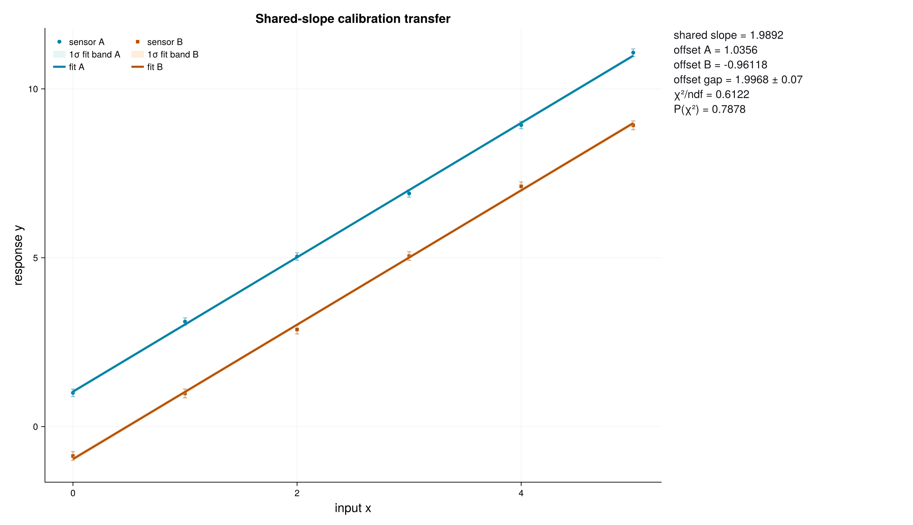
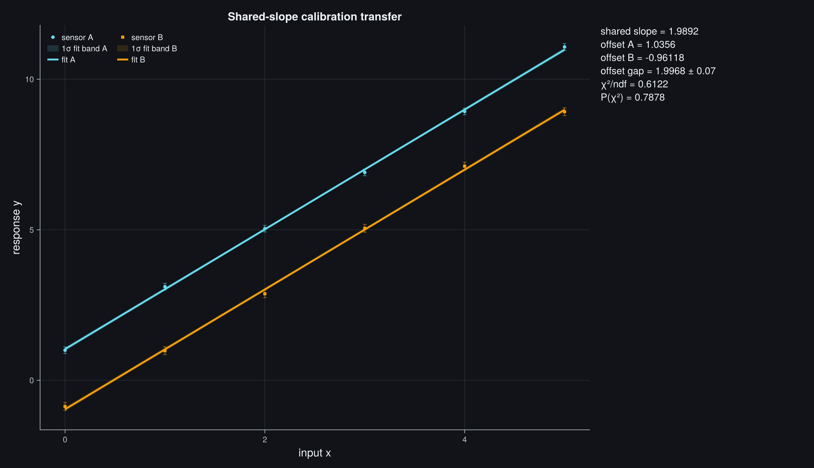

# Multi-Dataset Fit

Multi-dataset fits are needed when several measurements share physics but keep
their own offsets, scales, or nuisance parameters. A common example is a
calibration transfer: two sensors see the same slope because they measure the
same physical response, but each sensor has its own electronic zero point.

```@raw html


```

## Model

```math
y_A = m x + b_A,\qquad y_B = m x + b_B
```

The slope ``m`` is shared. Each dataset has its own offset and uncertainty
vector. The parameter map connects global parameters to local model arguments:

```math
p=(m,b_A,b_B),\qquad
p_A=(p_1,p_2),\qquad
p_B=(p_1,p_3).
```

The plotted bands are **1σ fit bands** for each fitted line. The report also
prints ``b_A-b_B`` with propagated uncertainty, because that offset difference
is usually the physically interesting transfer correction.

## Complete Code

```julia
using CairoMakie
using JuFitter

x1 = collect(0.0:1.0:5.0)
x2 = collect(0.0:1.0:5.0)

local_linear(x, p) = @. p[1] * x + p[2]

sigma1 = fill(0.11, length(x1))
sigma2 = fill(0.13, length(x2))

y1 = local_linear(x1, [2.0, 1.0]) .+ sigma1 .* sin.(1.4 .* x1)
y2 = local_linear(x2, [2.0, -1.0]) .+ sigma2 .* cos.(1.7 .* x2)

result = fit_multi_model(
    [local_linear, local_linear],
    [x1, x2],
    [y1, y2];
    p0=[1.7, 0.8, -0.8],
    parameter_map=[[1, 2], [1, 3]],
    sigma_y=[sigma1, sigma2],
)

offset_gap = result.params[2] - result.params[3]
offset_gradient = [0.0, 1.0, -1.0]
sigma_gap = sqrt(dot(offset_gradient,
                     result.param_covariance * offset_gradient))

println("shared slope = ", result.params[1])
println("offset gap = ", offset_gap, " +/- ", sigma_gap)
```
