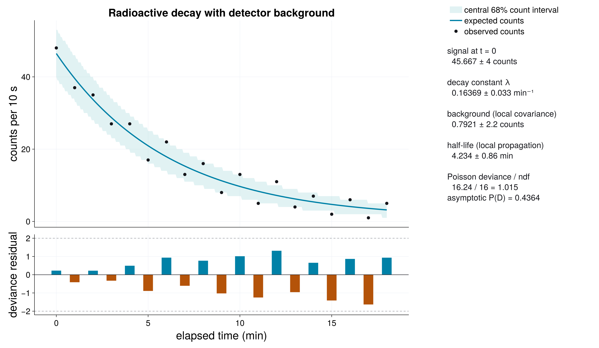
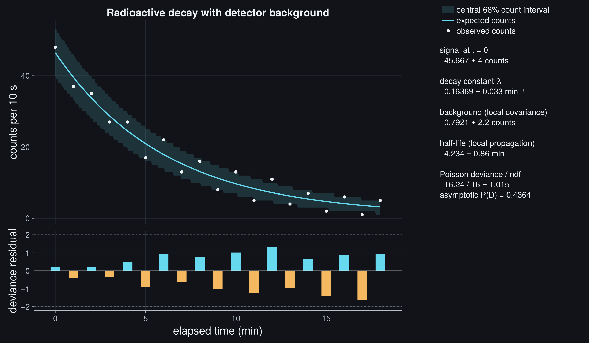
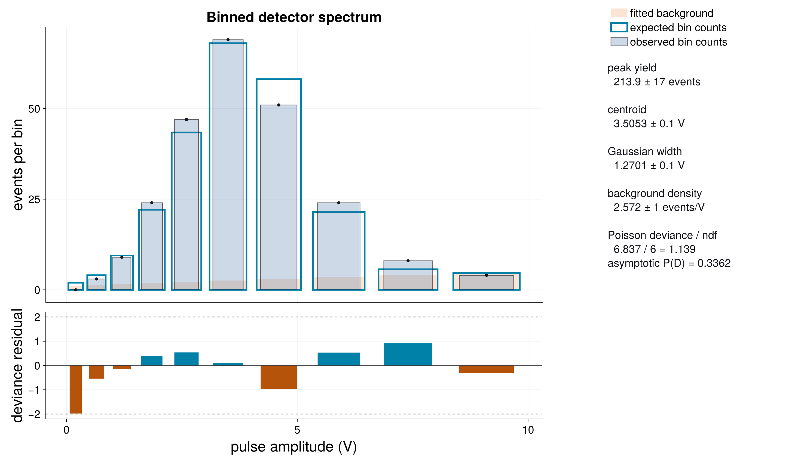
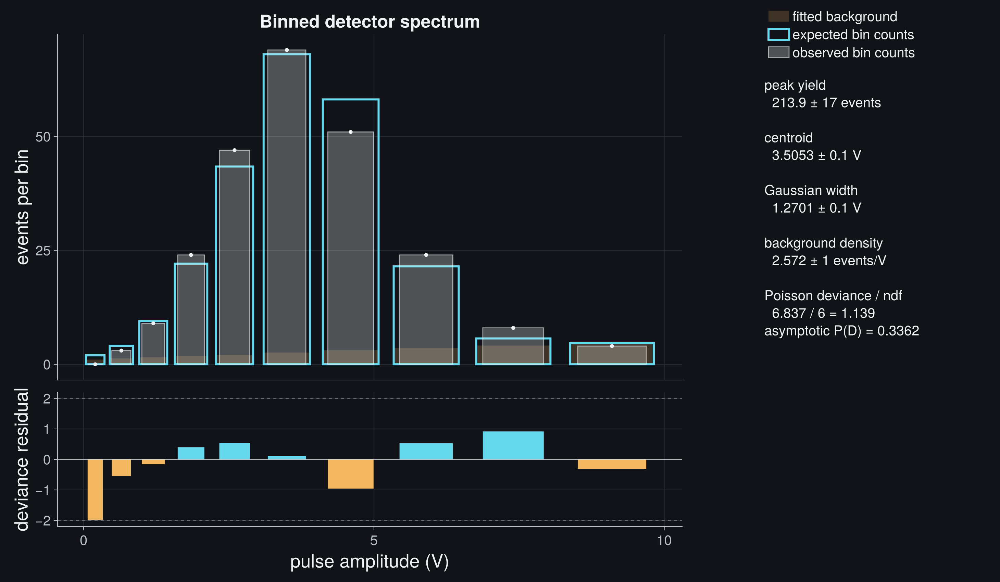

# Poisson Counts And Histograms

Counts are not measurements with an automatically attached symmetric error bar.
They are realizations of a discrete probability distribution. This page follows
two common detector workflows: a radioactive decay measured in repeated time
windows and a pulse-height spectrum collected in unequal bins.

## Question One: What Is The Half-Life?

A detector records the number of events in a 10-second acquisition window once
per minute. The source activity decays, but the detector also sees an
approximately constant background:

```math
\mu(t) = S_0 e^{-\lambda t} + B.
```

The fitted parameters are the initial source signal ``S_0``, decay constant
``\lambda``, and background expectation ``B``. The physically interesting
derived quantity is

```math
T_{1/2} = \frac{\log 2}{\lambda}.
```

```@raw html


```

The observed points deliberately have no ``\sqrt n`` error bars. Such bars are
only a large-count visual approximation, become asymmetric near zero, and
cannot represent a zero-count observation. The shaded region is instead the
central 68% interval of future Poisson counts predicted by the fitted model. It
is a **prediction interval for discrete observations**, not a confidence band
for the mean curve. It is conditional on the fitted mean and does not include
parameter uncertainty.

## Poisson Likelihood And Deviance

For independent counts,

```math
n_i \sim \operatorname{Poisson}(\mu_i).
```

`fit_poisson_model` minimizes twice the negative log-likelihood:

```math
C(p)
=
-2\log L(p)
=
2\sum_i
\left[
\mu_i(p)-n_i\log\mu_i(p)+\log\Gamma(n_i+1)
\right].
```

The factorial term does not move the optimum, but retaining it gives the full
Poisson cost. The goodness-of-fit quantity is the Poisson deviance:

```math
D
=
2\sum_i
\left[
\mu_i-n_i+n_i\log\!\left(\frac{n_i}{\mu_i}\right)
\right],
```

with the continuous limit ``2\mu_i`` when ``n_i=0``. The lower plot shows signed
deviance residuals,

```math
r_i
=
\operatorname{sign}(n_i-\mu_i)
\sqrt{
2\left[
\mu_i-n_i+n_i\log\!\left(\frac{n_i}{\mu_i}\right)
\right]
}.
```

They put upward and downward count fluctuations on a roughly comparable scale.
A structureless mix around zero supports the model; long runs with one sign,
isolated large values, or dependence on the expected count level suggest a
missing component or a wrong count model.

## Complete Decay Fit

The dataset is controlled and reproducible, but intentionally includes the
irregular fluctuations and low-count tail expected in a short counting
experiment.

```julia
using JuFitter

time_min = collect(0.0:1.0:18.0)
counts = [
    48, 37, 35, 27, 27, 17, 22, 13, 16, 8,
    13, 5, 11, 4, 7, 2, 6, 1, 5,
]

decay_model(t, p) = @. p[1] * exp(-p[2] * t) + p[3]

decay_result = fit_poisson_model(
    decay_model,
    time_min,
    counts;
    p0=[40.0, 0.15, 3.0],
    bounds=([1e-6, 1e-6, 1e-6], [200.0, 2.0, 50.0]),
    parameter_names=["initial signal", "decay constant", "background"],
    initial_guesses=[
        [40.0, 0.15, 3.0],
        [70.0, 0.30, 2.0],
        [25.0, 0.08, 5.0],
    ],
)

lambda = decay_result.params[2]
sigma_lambda = decay_result.param_stderr[2]
half_life = log(2) / lambda
sigma_half_life = log(2) * sigma_lambda / lambda^2

println("half-life = ", half_life, " +/- ", sigma_half_life, " min")
println(diagnostic_dashboard_text(decay_result))
```

Multiple initial guesses are cheap insurance for this nonlinear signal-plus-
background model. They do not replace diagnostics, but they reduce the chance
that one poor starting point defines the reported result.

The result is approximately

```math
\lambda = 0.164 \pm 0.033\ \mathrm{min}^{-1},
\qquad
T_{1/2} = 4.23 \pm 0.86\ \mathrm{min}.
```

The fitted background is weakly constrained because the acquisition ends with
only a few low-count windows. Its local symmetric error extends below the
physical positivity bound, so it should not be reported as the final background
interval. Inspect a profile and report an asymmetric interval or upper limit in
a critical analysis. A longer background-only acquisition would improve the
separation between the decaying signal and detector background.

The half-life uncertainty above is first-order propagation of the local
``\lambda`` covariance. Transform a profile interval for ``\lambda`` when the
half-life uncertainty is central to the scientific conclusion.

The deviance is approximately ``16.24`` for ``16`` degrees of freedom, giving
an asymptotic p-value near ``0.44``. This is compatible with the model; it is
not proof that the exponential-plus-background law is uniquely correct.

## Question Two: Where Is The Spectral Peak?

A pulse-height spectrum contains a Gaussian-like detector peak above a uniform
background. The bins are deliberately unequal, including one empty low-amplitude
bin. The fitted quantities are peak yield ``N``, centroid ``m``, Gaussian width
``s``, and background density ``\rho_B``.

```@raw html


```

The model must return the expected count in each bin, not the density evaluated
at the bin center. For bin edges ``e_i`` and ``e_{i+1}``,

```math
\mu_i
=
N
\left[
\Phi\!\left(\frac{e_{i+1}-m}{s}\right)
-
\Phi\!\left(\frac{e_i-m}{s}\right)
\right]
+
\rho_B(e_{i+1}-e_i).
```

Integrating the model is essential when bins have different widths or the
density changes significantly across a bin. Evaluating only at bin centers can
bias the peak position, width, and yield.

## Complete Histogram Fit

```julia
using JuFitter
using SpecialFunctions

edges = [0.0, 0.4, 0.9, 1.5, 2.2, 3.0, 4.0, 5.2, 6.6, 8.2, 10.0]
counts = [0, 3, 9, 24, 47, 69, 51, 24, 8, 4]

function expected_counts(edges, p)
    peak_yield, centroid, width, background_density = p
    return [
        peak_yield * 0.5 * (
            erf((edges[i + 1] - centroid) / (sqrt(2) * width)) -
            erf((edges[i] - centroid) / (sqrt(2) * width))
        ) + background_density * (edges[i + 1] - edges[i])
        for i in 1:(length(edges) - 1)
    ]
end

spectrum_result = fit_histogram_model(
    expected_counts,
    edges,
    counts;
    p0=[210.0, 3.8, 1.0, 1.0],
    bounds=([1e-6, 0.0, 0.05, 1e-6], [1000.0, 10.0, 5.0, 100.0]),
    parameter_names=["peak yield", "centroid", "width", "background density"],
    initial_guesses=[
        [210.0, 3.8, 1.0, 1.0],
        [300.0, 4.2, 1.5, 0.5],
        [150.0, 3.2, 0.7, 2.0],
    ],
)

println("centroid = ", spectrum_result.params[2],
        " +/- ", spectrum_result.param_stderr[2], " V")
println(diagnostic_dashboard_text(spectrum_result))
```

The fitted centroid and width are approximately

```math
m = 3.505 \pm 0.103\ \mathrm{V},
\qquad
s = 1.270 \pm 0.100\ \mathrm{V}.
```

The empty first bin remains informative: it penalizes models that predict too
many low-amplitude events. Replacing its uncertainty by ``\sqrt{0}=0`` in a
Gaussian least-squares fit would either make the calculation singular or tempt
the analyst to invent an arbitrary error bar.

The deviance is approximately ``6.84`` for ``6`` degrees of freedom, with an
asymptotic p-value near ``0.34``. The deviance residual panel shows no obvious
localized mismatch around the peak or in the tails.

## What To Inspect Before Reporting

**The counts are background-subtracted.** Differences of Poisson variables are
not Poisson and can be negative. Fit source and background measurements jointly,
or use a likelihood that represents the subtraction procedure.

**The variance exceeds the mean.** Dead time, pile-up, drift, clustering, or
unmodelled rate changes can produce overdispersion. A Poisson likelihood then
understates uncertainty even if the fitted curve looks plausible.

**A bin is empty.** Keep it. Empty bins constrain the expected rate and are
handled naturally by the Poisson likelihood.

**The result changes with binning.** Check the expected-count integration,
detector resolution model, and whether an unbinned or extended-unbinned
likelihood is more appropriate.

**The p-value is treated as exact.** The chi-square approximation for the
deviance is asymptotic. With very sparse counts, active bounds, or weakly
identified parameters, calibrate goodness of fit by simulation before making a
critical claim.

**A parameter sits on its positivity bound.** Local symmetric errors and
asymptotic likelihood-ratio thresholds may be unreliable. Inspect a profile and
report a one-sided limit when appropriate.

Next useful pages: [Constraints And Profiles](@ref),
[Fitting for Practitioners](@ref), and [Statistical Foundations](@ref).
