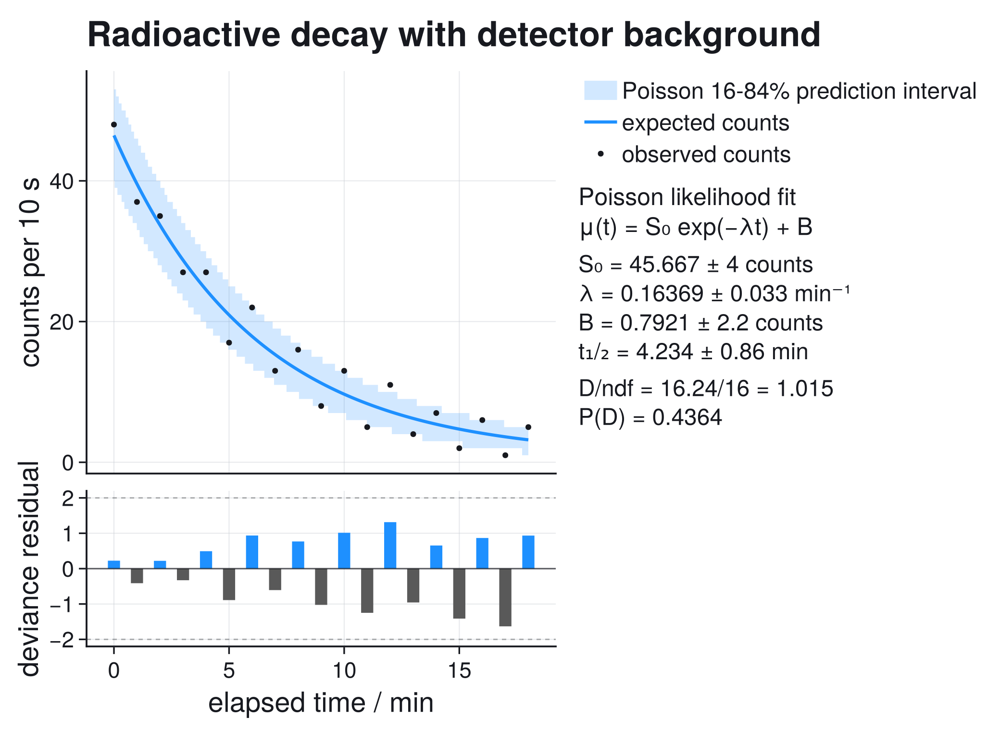
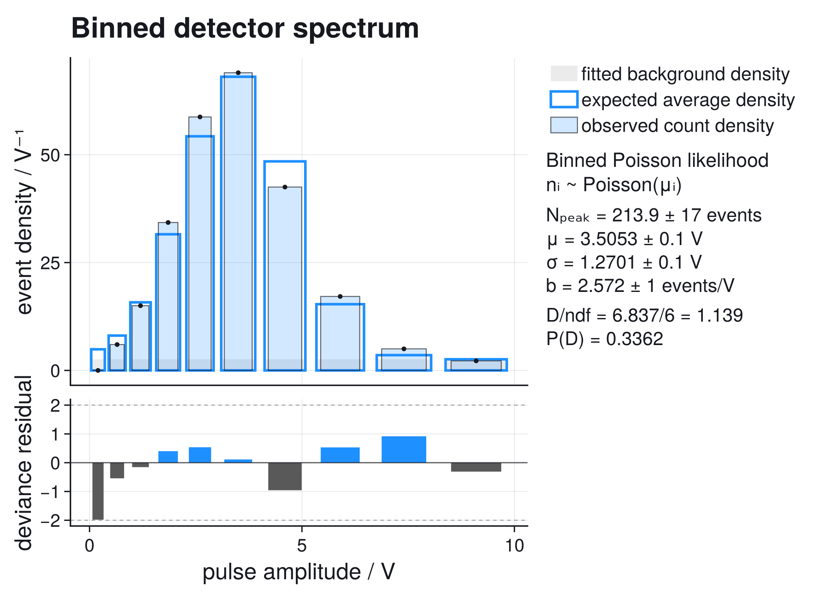

# Poisson Counts and Histograms

Counts are realizations of a discrete probability distribution, not
measurements with a symmetric error bar. This page follows
two common detector workflows: a radioactive decay measured in repeated time
windows and a pulse-height spectrum collected in unequal bins.

## Question One: What Is The Half-Life?

The first controlled record represents a detector that counts events in a
10-second acquisition window once per minute. The source activity decays, but
the detector also sees an approximately constant background:

```math
\mu(t) = S_0 e^{-\lambda t} + B.
```

The fitted parameters are the initial source signal ``S_0``, decay constant
``\lambda``, and background expectation ``B``. The physically interesting
derived quantity is

```math
T_{1/2} = \frac{\log 2}{\lambda}.
```

```@raw html

```

The observed points have no ``\sqrt n`` error bars: near zero, such bars
cannot represent the strongly asymmetric sampling distribution
([Poisson Counts And Histograms](../statistics.md#Poisson-Counts-And-Histograms)).
The shaded region instead spans the 16th to 84th percentiles of future Poisson
counts predicted by the fitted model. It is a **prediction interval for
discrete observations**, not a confidence band for the mean curve; it is
conditional on the fitted mean and does not include parameter uncertainty.
Because counts are discrete, its actual coverage changes in steps and is
generally not exactly 68%.

The band edges are stepped: Poisson observations are integers, so the 16th and
84th percentiles can change only by whole counts as ``\mu(t)`` varies, and
ScientificFitting renders each change as a vertical edge instead of
interpolating fractional count quantiles. The plateaus become wider at late
times because the exponential mean approaches the background more slowly:
``|\mathrm{d}\mu/\mathrm{d}t|`` decreases. The lower and upper edges jump at
different times because the two percentiles cross different probability
thresholds.

## Data

The count arrays are listed explicitly in the fit sections. They are
controlled teaching records, not measurements attributed to a particular
isotope or detector campaign; the listed integers are the complete input. The
first series has a low-count tail; the second is an unequally binned
pulse-height spectrum with one empty bin.

A one-bin sanity check: if the model predicts ``\mu=0.7`` counts, observing
``n=0`` is not pathological; it has probability ``e^{-0.7}\approx0.50``. A
Gaussian least-squares fit with ``\sqrt n`` would assign zero uncertainty to
the same observation.

## Poisson Likelihood and Deviance

For independent counts,

```math
n_i \sim \operatorname{Poisson}(\mu_i).
```

This statement assumes disjoint acquisition windows, independent events, known
exposure and efficiency, and a stable background. Substantial dead time, pile-up, clustering, or an unmodelled exposure
change breaks the model. If exposure differs between windows, that exposure
belongs inside each ``\mu_i`` rather than in an after-the-fact rescaling.

`fit_poisson_model` minimizes twice the negative log-likelihood:

```math
C(p)
=
-2\log L(p)
=
2\sum_i
\left[
\mu_i(p)-n_i\log\mu_i(p)+\log\Gamma(n_i+1)
\right].
```

The goodness-of-fit quantity is the Poisson deviance:

```math
D
=
2\sum_i
\left[
\mu_i-n_i+n_i\log\!\left(\frac{n_i}{\mu_i}\right)
\right],
```

with the continuous limit ``2\mu_i`` when ``n_i=0``. The lower plot shows signed
deviance residuals,

```math
r_i
=
\operatorname{sign}(n_i-\mu_i)
\sqrt{
2\left[
\mu_i-n_i+n_i\log\!\left(\frac{n_i}{\mu_i}\right)
\right]
}.
```

They put upward and downward count fluctuations on a roughly comparable scale.
A structureless mix around zero supports the model; long runs with one sign,
isolated large values, or dependence on the expected count level suggest a
missing component or a wrong count model.

## Complete Decay Fit

```julia
using ScientificFitting
using Printf

time_min = collect(0.0:1.0:18.0)
counts = [
    48, 37, 35, 27, 27, 17, 22, 13, 16, 8,
    13, 5, 11, 4, 7, 2, 6, 1, 5,
]

decay_model(t, p) = @. p[1] * exp(-p[2] * t) + p[3]

decay_result = fit_poisson_model(
    decay_model,
    time_min,
    counts;
    p0=[40.0, 0.15, 3.0],
    bounds=([1e-6, 1e-6, 1e-6], [200.0, 2.0, 50.0]),
    parameter_names=["initial signal", "decay constant", "background"],
    initial_guesses=[
        [70.0, 0.30, 2.0],
        [25.0, 0.08, 5.0],
    ],
    multistart=3, # p0 and the two additional starts.
)

lambda = decay_result.params[2]
sigma_lambda = decay_result.param_stderr[2]
half_life = log(2) / lambda
sigma_half_life = log(2) * sigma_lambda / lambda^2

@printf("half-life = %.3f +/- %.3f min\n", half_life, sigma_half_life)
@printf("background = %.3f +/- %.3f counts per 10 s\n",
        decay_result.params[3], decay_result.param_stderr[3])
@printf("deviance/ndf = %.3f\n", decay_result.stats.chi2_ndf)
@printf("P(D) = %.3f\n", decay_result.stats.pvalue)
println(diagnostic_dashboard_text(decay_result))
```

```@raw html
<div class="scientificfitting-cell-output">
<div class="scientificfitting-cell-output-label">Output from this code</div>
<pre>half-life = 4.234 +/- 0.863 min
background = 0.792 +/- 2.189 counts per 10 s
deviance/ndf = 1.015
P(D) = 0.436
Fit diagnostic dashboard
status = ok - no immediate issue
critical = 0, warning = 0, info = 0
No major diagnostic issues detected by the current checks.
No next action required by the current diagnostic checks.</pre>
</div>
```

Multiple initial guesses reduce the chance that one poor starting point
defines the reported result for this nonlinear signal-plus-background model.

## Interpretation: Decay Result

The result is approximately

```math
\lambda = 0.164 \pm 0.033\ \mathrm{min}^{-1},
\qquad
T_{1/2} = 4.23 \pm 0.86\ \mathrm{min}.
```

The fitted background is ``0.792\pm2.189`` counts per window in the local
quadratic approximation. That symmetric interval extends below the physical
positivity bound because the acquisition ends with only a few low-count
windows, and should not be reported as the final background interval. A
profile scan ([Profiles And Contours](../statistics.md#Profiles-And-Contours))
refits the signal parameters at each forced background value; if the lower
threshold is cut off by zero, report an asymmetric
interval or a one-sided upper limit. A longer background-only acquisition would
separate source and detector background more directly.

The half-life uncertainty above is first-order propagation of the local
``\lambda`` covariance. Transform a profile interval for ``\lambda`` when the
half-life uncertainty is central to the scientific conclusion.

The deviance is approximately ``16.24`` for ``16`` degrees of freedom, giving
an asymptotic p-value near ``0.44``, compatible with the model
([Goodness Of Fit](../statistics.md#Goodness-Of-Fit)).

## Question Two: Where Is The Spectral Peak?

A pulse-height spectrum contains a Gaussian-like detector peak above a uniform
background. The bins are unequal, including one empty low-amplitude bin:
narrow bins retain shape resolution near the populated peak, wider bins keep
the sparse high-amplitude tail from dominating the display. This is defensible
only when the edges are fixed independently of the observed fluctuations and
the model is integrated over those exact edges. The fitted
quantities are peak yield ``N``, centroid ``m``, Gaussian width ``s``, and
background density ``\rho_B``.

```@raw html

```

The model must return the expected count in each bin, not the density evaluated
at the bin center. For bin edges ``e_i`` and ``e_{i+1}``,

```math
\mu_i
=
N
\left[
\Phi\!\left(\frac{e_{i+1}-m}{s}\right)
-
\Phi\!\left(\frac{e_i-m}{s}\right)
\right]
+
\rho_B(e_{i+1}-e_i).
```

Evaluating the density only at bin centers can bias the peak position, width,
and yield when bins differ in width or the density changes across a bin.

For display only, the upper panel divides observed and expected counts by each
bin width: the bar area still equals the bin count, and a uniform background
appears flat instead of growing taller in wider bins. The likelihood and the
lower-panel deviance residuals use the original integer counts.

## Complete Histogram Fit

```julia
using ScientificFitting
using Printf
using SpecialFunctions

edges = [0.0, 0.4, 0.9, 1.5, 2.2, 3.0, 4.0, 5.2, 6.6, 8.2, 10.0]
counts = [0, 3, 9, 24, 47, 69, 51, 24, 8, 4]

function expected_counts(edges, p)
    peak_yield, centroid, width, background_density = p
    return [
        peak_yield * 0.5 * (
            erf((edges[i + 1] - centroid) / (sqrt(2) * width)) -
            erf((edges[i] - centroid) / (sqrt(2) * width))
        ) + background_density * (edges[i + 1] - edges[i])
        for i in 1:(length(edges) - 1)
    ]
end

spectrum_result = fit_histogram_model(
    expected_counts,
    edges,
    counts;
    p0=[210.0, 3.8, 1.0, 1.0],
    bounds=([1e-6, 0.0, 0.05, 1e-6], [1000.0, 10.0, 5.0, 100.0]),
    parameter_names=["peak yield", "centroid", "width", "background density"],
    initial_guesses=[
        [300.0, 4.2, 1.5, 0.5],
        [150.0, 3.2, 0.7, 2.0],
    ],
    multistart=3,
)

@printf("peak yield = %.1f +/- %.1f events\n",
        spectrum_result.params[1], spectrum_result.param_stderr[1])
@printf("centroid = %.3f +/- %.3f V\n",
        spectrum_result.params[2], spectrum_result.param_stderr[2])
@printf("width = %.3f +/- %.3f V\n",
        spectrum_result.params[3], spectrum_result.param_stderr[3])
@printf("background density = %.3f +/- %.3f events/V\n",
        spectrum_result.params[4], spectrum_result.param_stderr[4])
@printf("deviance/ndf = %.3f\n", spectrum_result.stats.chi2_ndf)
@printf("P(D) = %.3f\n", spectrum_result.stats.pvalue)
println(diagnostic_dashboard_text(spectrum_result))
```

```@raw html
<div class="scientificfitting-cell-output">
<div class="scientificfitting-cell-output-label">Output from this code</div>
<pre>peak yield = 213.9 +/- 17.3 events
centroid = 3.505 +/- 0.103 V
width = 1.270 +/- 0.100 V
background density = 2.572 +/- 1.035 events/V
deviance/ndf = 1.139
P(D) = 0.336
Fit diagnostic dashboard
status = ok - no immediate issue
critical = 0, warning = 0, info = 0
No major diagnostic issues detected by the current checks.
No next action required by the current diagnostic checks.</pre>
</div>
```

The fitted centroid and width are approximately

```math
m = 3.505 \pm 0.103\ \mathrm{V},
\qquad
s = 1.270 \pm 0.100\ \mathrm{V}.
```

The empty first bin remains informative: it penalizes models that predict too
many low-amplitude events.

## Diagnostics

The deviance is approximately ``6.84`` for ``6`` degrees of freedom, with an
asymptotic p-value near ``0.34``. A count model can have an acceptable global
deviance while still missing structure in a narrow peak, a tail, or the empty
bins, so inspect the deviance residual panel next: look for runs of same-sign
residuals, one tail that is systematically high, or a peak that is too narrow.

The automatic dashboard reports `ok` because the optimizer converged, the
covariance estimate is usable, and no generic fit pathology was detected; it
does not prove that the Poisson process is the correct physical counting
model.

## What Can Go Wrong

**The counts are background-subtracted.** Differences of Poisson variables are
not Poisson and can be negative. Fit source and background measurements jointly,
or use a likelihood that represents the subtraction procedure.

**The variance exceeds the mean.** Dead time, pile-up, drift, clustering, or
unmodelled rate changes can produce overdispersion. A Poisson likelihood then
understates uncertainty even if the fitted curve looks plausible.

**A bin is empty.** Keep it. Empty bins constrain the expected rate and are
handled naturally by the Poisson likelihood.

**The result changes with binning.** Check the expected-count integration,
detector resolution model, and whether an unbinned or extended-unbinned
likelihood is more appropriate.

**The p-value is treated as exact.** The chi-square approximation for the
deviance is asymptotic. With very sparse counts, active bounds, or weakly
identified parameters, calibrate goodness of fit by simulation before making a
critical claim.

**A parameter sits on its positivity bound.** Local symmetric errors and
asymptotic likelihood-ratio thresholds may be unreliable. Inspect a profile and
report a one-sided limit when appropriate.

Next useful pages: [Constraints and Profiles](@ref),
[Fitting for Practitioners](@ref), and
[Likelihoods and Model Comparison](../statistics.md#Observation-Likelihoods).
