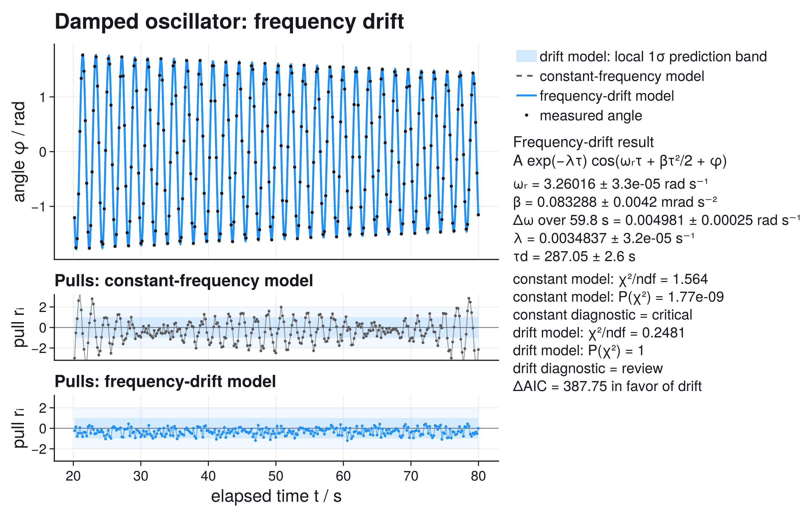
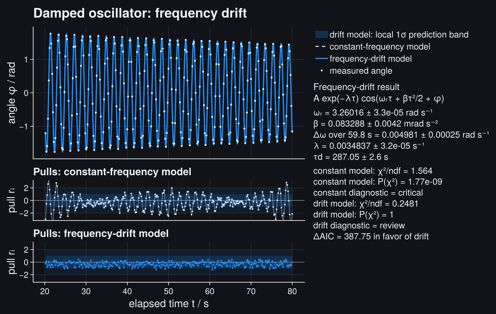
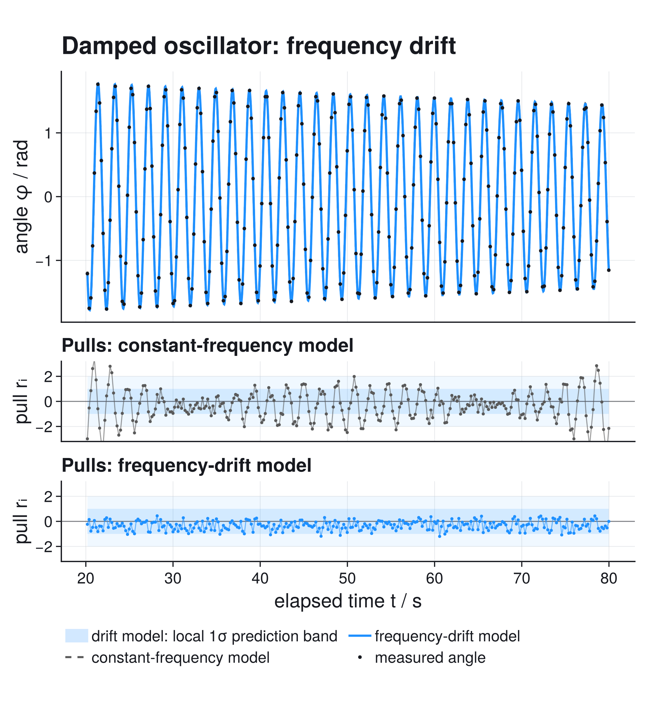
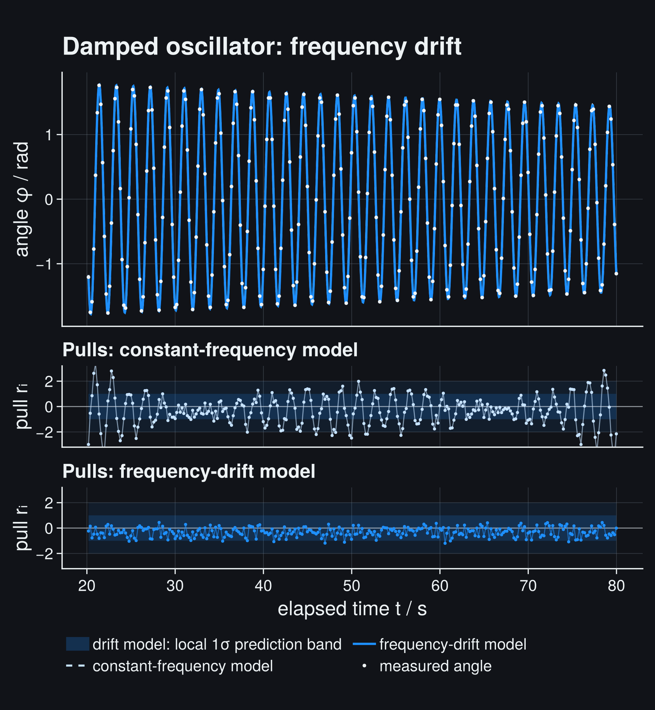
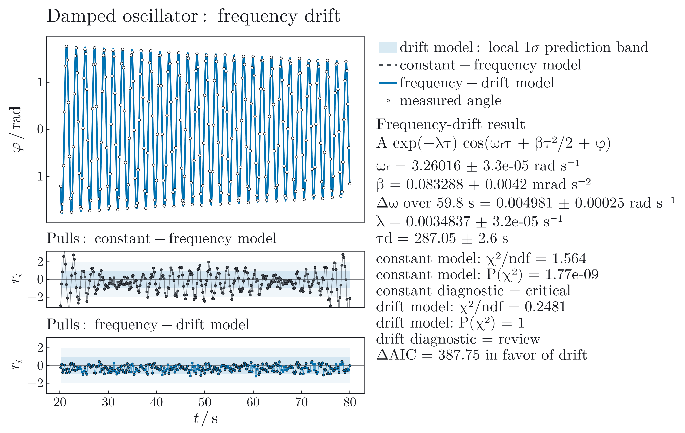
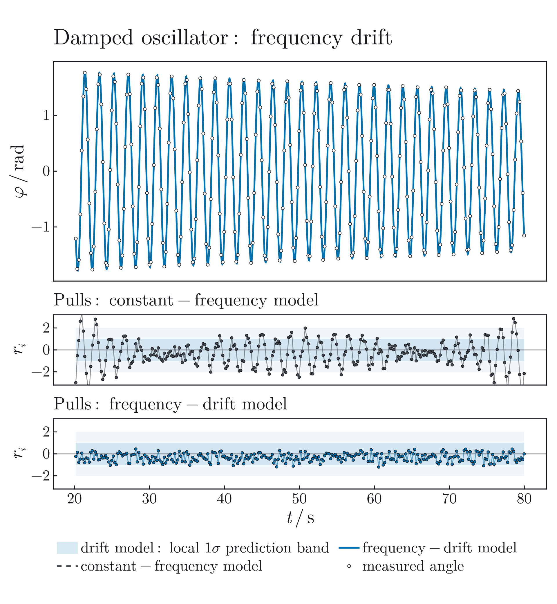
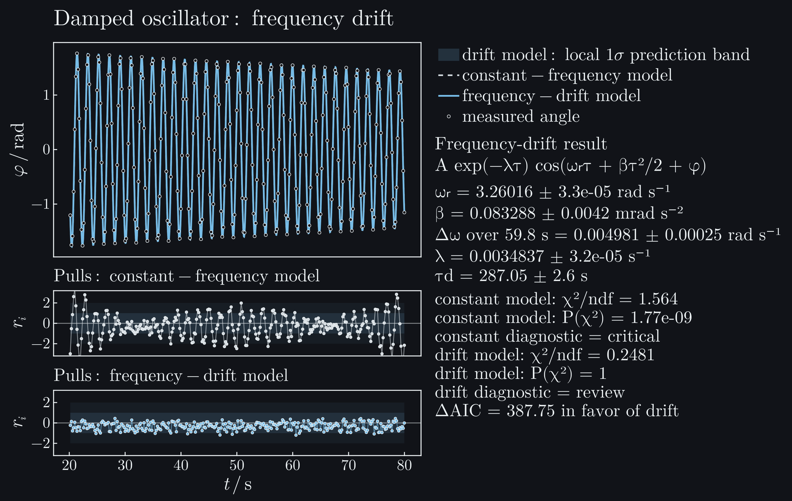
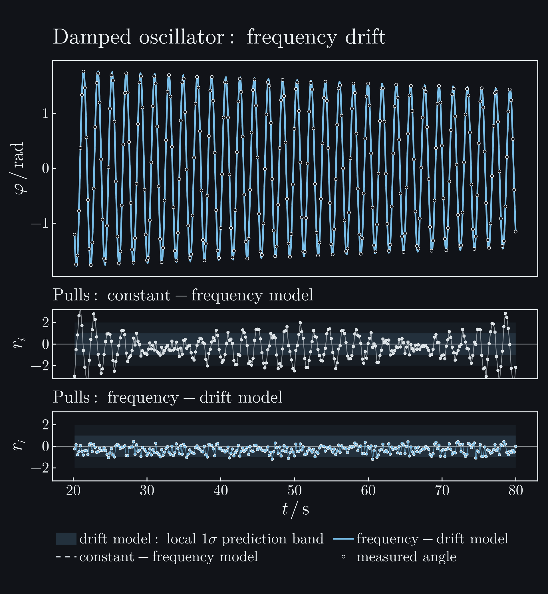

# Damped Oscillator: When A Good-Looking Fit Is Wrong

A dense nonlinear fit can look almost perfect while its residuals reject the
model. This workflow uses a laboratory recording of a freely decaying
mechanical oscillator to answer two questions:

1. What damping rate and oscillation frequency describe the record?
2. Is a constant-frequency damped oscillator an adequate model?

The second question changes the conclusion.

## Question

The measurement asks whether a standard constant-frequency damped oscillator is
an adequate description of the recorded motion, or whether the data require a
small additional frequency drift.

```@raw html








```

The main panel alone barely distinguishes the two models. The pull panels do:
the constant-frequency model leaves coherent deviations, while a weak frequency
drift removes most of that structure.

## The Measurement

The source acquisition recorded the angular displacement at 50 Hz. The
distributed CSV keeps every tenth raw sample between 20.18 s and 79.98 s,
giving 300 points at approximately 5 Hz. The values were neither smoothed nor
interpolated.

| Column | Meaning | Unit |
| --- | --- | --- |
| `time_s` | acquisition timestamp | s |
| `phi_rad` | measured angular displacement | rad |
| `sigma_phi_rad` | assigned standard uncertainty of the angle | rad |

The angle was reconstructed from a path displacement measured at a radius of
91.9 mm. The acquisition analysis assigned a 1 mm path-length uncertainty, so
the angle uncertainty stored in the file is

```math
\sigma_\phi
= \frac{1\ \mathrm{mm}}{91.9\ \mathrm{mm}}
= 0.0108814\ \mathrm{rad}.
```

This is an instrument-based assignment, not a standard deviation estimated
from repeated decay records. The analysis keeps it unchanged and assigns a
0.5 ms standard timestamp uncertainty from the acquisition timing resolution.
Both x and y uncertainty therefore enter the fit. Whether an independent
Gaussian model is compatible with those assignments is a result to diagnose,
not a scale to tune after seeing the residuals.

The record has dense sampling, periodic parameters, a slowly changing envelope,
and residual structure that a plot of the fitted curve can hide.

## Model: Start With The Physical Baseline

For a torsion oscillator with moment of inertia ``\Theta``, damping coefficient
``b``, and torsional stiffness ``D``, the linear equation of motion is

```math
\Theta\ddot\phi+b\dot\phi+D\phi=0.
```

In the underdamped regime its solution can be written as

```math
\phi(t)
= A_\mathrm{ref}
  e^{-\lambda \tau}
  \cos\!\left(\omega_\mathrm{ref}\tau+\phi_\mathrm{ref}\right),
\qquad
\tau=t-t_\mathrm{ref}.
```

The parameters are:

- ``A_\mathrm{ref}``: amplitude at the reference time,
- ``\lambda``: exponential damping rate,
- ``\omega_\mathrm{ref}``: damped angular frequency,
- ``\phi_\mathrm{ref}``: phase at the reference time.

The time coordinate is centered at the middle of the record. This is not a
cosmetic rewrite. Without centering, phase and frequency must compensate for a
large arbitrary time origin and become more strongly correlated.

The damping time is the derived quantity

```math
\tau_d = \frac{1}{\lambda}.
```

For the constant-coefficient model,

```math
\lambda=\frac{b}{2\Theta},
\qquad
\omega_\mathrm{ref}
=\sqrt{\frac{D}{\Theta}-\lambda^2}.
```

## Diagnostics: Fit and Diagnose the Baseline

The fit uses a Gaussian likelihood with the assigned angle uncertainty and
effective-variance propagation of timestamp uncertainty. Multiple initial
guesses are important because phase-periodic models have repeated local minima.
The explicit `tol=1e-7` is a numerical stopping tolerance, not a measurement
uncertainty. Tightening it further does not change the reported digits here,
but can make LBFGS chase floating-point changes below that precision.

For this diagonal uncertainty model, the plotted pulls are

```math
r_i
=\frac{\phi_i-f(t_i,p)}
{\sqrt{\sigma_{\phi,i}^2+
\left(\partial f/\partial t\right)_i^2\sigma_{t,i}^2}}.
```

Independent standard-normal pulls should fluctuate without long runs and have
roughly unit width. Coherent waves indicate missing model structure; a much
narrower cloud indicates conservative uncertainties or correlations between
samples.

```julia
using ScientificFitting

function load_damped_oscillator(path)
    rows = readlines(path)[2:end]
    parsed = [parse.(Float64, split(row, ",")) for row in rows if !isempty(strip(row))]
    return (
        time=[row[1] for row in parsed],
        angle=[row[2] for row in parsed],
        sigma_angle=[row[3] for row in parsed],
    )
end

data = load_damped_oscillator(
    "examples/data/damped_oscillator/pohl_wheel_free_decay.csv",
)
time = data.time
angle = data.angle
sigma_angle = data.sigma_angle
sigma_time = fill(0.0005, length(time))
time_reference = (minimum(time) + maximum(time)) / 2

constant_frequency_model(t, p) = @. p[1] * exp(-p[4] * (t - time_reference)) *
                                     cos(p[2] * (t - time_reference) + p[3])

constant_result = fit_model(
    constant_frequency_model,
    time,
    angle;
    p0=[1.6, 3.26, 0.0, 0.0035],
    sigma_y=sigma_angle,
    sigma_x=sigma_time,
    bounds=([0.0, 2.0, -20.0, 0.0], [5.0, 5.0, 20.0, 0.05]),
    initial_guesses=[
        [1.6, 3.26, 0.0, 0.0035],
        [1.8, 3.20, 2.0, 0.0020],
        [1.5, 3.35, -2.0, 0.0060],
    ],
    maxiters=3000,
    tol=1e-7,
)

println(report_text(
    constant_result;
    parameter_names=["A_ref", "omega_ref", "phi_ref", "lambda"],
))
println(diagnostic_dashboard_text(constant_result))
```

```@raw html
<div class="scientificfitting-cell-output">
<div class="scientificfitting-cell-output-label">Output from this code</div>
<pre>Fit report
backend = optimization
converged = true
iterations = 35
message = Success

Parameters:
  A_ref = 1.60616 +/- 0.000897684
  omega_ref = 3.2601 +/- 3.271e-5
  phi_ref = -0.763197 +/- 0.000567184
  lambda = 0.00348457 +/- 3.21332e-5

Statistics:
  cost = gaussian_likelihood
  cost_min = -1689.59
  minus2loglik_min = -1689.59
  chi2 = 462.933
  ndf = 296
  chi2/ndf = 1.56396
  pvalue = 1.76695e-9
  AIC = -1681.59
  BIC = -1666.77
Fit diagnostic dashboard
status = critical - fix before use
critical = 1, warning = 2, info = 0
1 critical issue(s), 2 warning(s). Fix the issue before using this result for conclusions.

Next actions:
  1. Under the stated assumptions this fit is statistically implausible. Inspect residuals and the uncertainty model.
  2. Use a covariance model, inspect acquisition order/time dependence, or fit a model with the missing systematic component.
  3. Inspect residuals near the largest pull. One point may dominate the result or the uncertainty model may be too optimistic.
</pre>
</div>
```

The fit converges and gives plausible parameter values, but convergence answers
only whether the optimizer found a minimum. It does not validate the model.

For this fit,

```math
\frac{\chi^2}{\mathrm{ndf}} = 1.564,
\qquad
P(\chi^2) = 1.77\times 10^{-9}.
```

Under the stated independent Gaussian uncertainty model, residuals this
incompatible with the fit would be extraordinarily unlikely. ScientificFitting therefore
returns a critical dashboard status, not `ok`.

The first pull panel explains why. The deviations change coherently over time
instead of scattering without structure around zero. Adding more digits to the
reported damping rate would not repair this.

## Test A Specific Missing Effect

A slowly changing oscillation frequency produces an accumulating phase error.
The smallest useful extension adds a linear frequency drift:

```math
\phi(t)
= A_\mathrm{ref}e^{-\lambda\tau}
  \cos\!\left(
    \omega_\mathrm{ref}\tau
    + \frac{1}{2}\beta\tau^2
    + \phi_\mathrm{ref}
  \right),
```

where

```math
\omega(t)=\frac{\mathrm{d}}{\mathrm{d}t}
\left(
  \omega_\mathrm{ref}\tau+\frac{1}{2}\beta\tau^2+\phi_\mathrm{ref}
\right)
=\omega_\mathrm{ref}+\beta\tau.
```

The new parameter ``\beta`` has units ``\mathrm{rad\,s^{-2}}`` and measures the
rate of change of angular frequency. This is a phenomenological test, not yet a
claim about mechanism: amplitude-dependent stiffness, temperature drift, or a
small timing-scale error could all produce accumulated phase structure.

```julia
frequency_drift_model(t, p) = @. p[1] * exp(-p[4] * (t - time_reference)) *
                                  cos(
    p[2] * (t - time_reference) +
    0.5 * p[5] * (t - time_reference)^2 +
    p[3],
)

drift_result = fit_model(
    frequency_drift_model,
    time,
    angle;
    p0=[1.6, 3.26, 0.0, 0.0035, 0.0],
    sigma_y=sigma_angle,
    sigma_x=sigma_time,
    bounds=([0.0, 2.0, -20.0, 0.0, -0.01], [5.0, 5.0, 20.0, 0.05, 0.01]),
    initial_guesses=[
        [1.6, 3.26, 0.0, 0.0035, 0.0],
        [1.8, 3.20, 2.0, 0.0020, 0.0001],
        [1.5, 3.35, -2.0, 0.0060, -0.0001],
    ],
    maxiters=4000,
    tol=1e-7,
)

println(report_text(
    drift_result;
    parameter_names=["A_ref", "omega_ref", "phi_ref", "lambda", "beta"],
))
println(diagnostic_dashboard_text(drift_result))
```

```@raw html
<div class="scientificfitting-cell-output">
<div class="scientificfitting-cell-output-label">Output from this code</div>
<pre>Fit report
backend = optimization
converged = true
iterations = 41
message = Success

Parameters:
  A_ref = 1.60608 +/- 0.000897621
  omega_ref = 3.26016 +/- 3.28557e-5
  phi_ref = -0.775608 +/- 0.000846739
  lambda = 0.00348365 +/- 3.21247e-5
  beta = 8.32878e-5 +/- 4.21994e-6

Statistics:
  cost = gaussian_likelihood
  cost_min = -2079.34
  minus2loglik_min = -2079.34
  chi2 = 73.1838
  ndf = 295
  chi2/ndf = 0.248081
  pvalue = 1.0
  AIC = -2069.34
  BIC = -2050.82
Fit diagnostic dashboard
status = review - inspect diagnostics
critical = 0, warning = 1, info = 0
1 warning(s). Inspect before trusting uncertainties or conclusions.

Next actions:
  1. The uncertainties may be too large, correlations may be ignored, or the data may not be independent.</pre>
</div>
```

## Read The Comparison, Not Just The Better Curve

The fitted drift and damping parameters are

```math
\beta
= (8.33 \pm 0.42)\times 10^{-5}\ \mathrm{rad\,s^{-2}},
```

```math
\lambda
= (3.484 \pm 0.032)\times 10^{-3}\ \mathrm{s^{-1}},
\qquad
\tau_d
= (287.1 \pm 2.6)\ \mathrm{s}.
```

The quoted damping-time uncertainty is the local first-order propagation
``\sigma_{\tau_d}=\sigma_\lambda/\lambda^2``. It inherits the same local
covariance and uncertainty-model limitations as the fitted ``\lambda`` error.

Across the recorded interval, the fitted angular frequency changes by

```math
\Delta\omega
= \beta(t_{\max}-t_{\min})
= (4.98 \pm 0.25)\times 10^{-3}\ \mathrm{rad\,s^{-1}}.
```

That change is only about 0.15% of ``\omega_\mathrm{ref}``, yet its phase effect
accumulates over many cycles and becomes obvious in the pulls.

The two fits use the same observations and likelihood, so their AIC values may
be compared. The drift model improves AIC by approximately 388 despite adding
only one parameter. The constant-frequency model is therefore inadequate for
this record.

The drift model removes the coherent phase pattern, but its pulls are now much
narrower than a unit Gaussian:

```math
\frac{\chi^2_\mathrm{drift}}{\mathrm{ndf}}=0.248,
\qquad
P(\chi^2_\mathrm{drift})\approx 1.
```

That is not evidence of an exceptionally perfect experiment. It suggests that
the assigned angle uncertainty is conservative, that neighboring samples are
not independent, or both. ScientificFitting therefore returns `review`, not `ok`. The
data strongly support an accumulated phase correction, but the local parameter
errors should not be treated as final until the uncertainty model has been
validated with instrument specifications or repeated decay records.

## What The Band Means

The main panel shows the drift model's **local 1σ prediction band**. It combines:

```math
\sigma_\mathrm{pred}^2(t)
= J_p(t)\,\mathrm{Cov}(p)\,J_p^\mathsf{T}(t)
+ \sigma_\phi^2
+ \left(\frac{\partial\phi}{\partial t}\sigma_t\right)^2.
```

The band is narrow compared with the full oscillation amplitude and is
therefore difficult to judge in the main panel. The pull panels display the
same uncertainty scale directly: the darker region is ``\pm1\sigma`` and the
lighter region is ``\pm2\sigma``.

This band uses the local covariance matrix. It is conditional on the fitted
model and does not include uncertainty about whether frequency drift is the
correct physical explanation.

## Complete Reproducible Figure

The tracked script contains the complete fit, diagnostics, derived quantities,
prediction-band propagation, and compound Makie figure:

```bash
julia --project=docs examples/gallery/08_damped_oscillator_decay.jl
```

It prints both diagnostic dashboards and writes
`examples/output/08_damped_oscillator_decay.png`. Running the public example
does not modify the documentation source tree.

## What To Do Before Reporting A Physical Result

For a critical analysis, the next work is experimental rather than cosmetic:

1. Determine whether neighboring angle samples share acquisition or filtering
   correlations.
2. Validate the supplied angle uncertainty against repeated measurements or
   stationary segments.
3. Test whether the frequency drift repeats in independent decay records.
4. Compare the drift model with a physically motivated nonlinear-oscillator or
   friction model.
5. Refit after defining the correct covariance model, then reassess pulls and
   parameter intervals.

The correct conclusion from this page is not “the more flexible model wins.”
It is: **the baseline model fails; frequency drift explains the dominant
structure; the uncertainty model still requires investigation.**

To model shared sample noise explicitly, revisit
[Full Covariance](full_covariance.md). Continue with
[Photoelectric Work Function](photoelectric_threshold.md) for a derived physical
quantity obtained from two fitted regimes.
