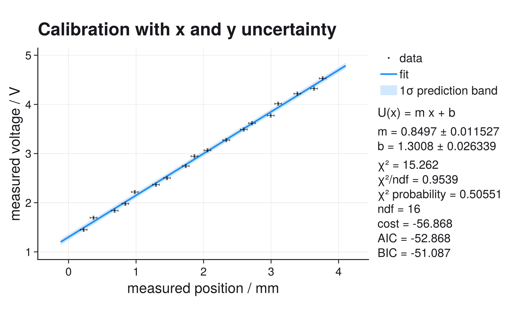
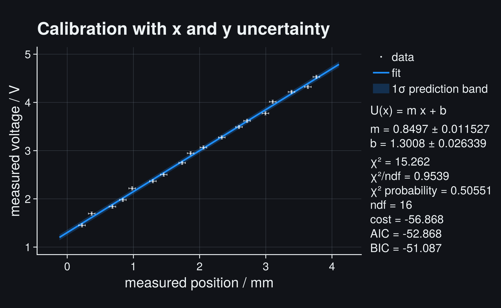
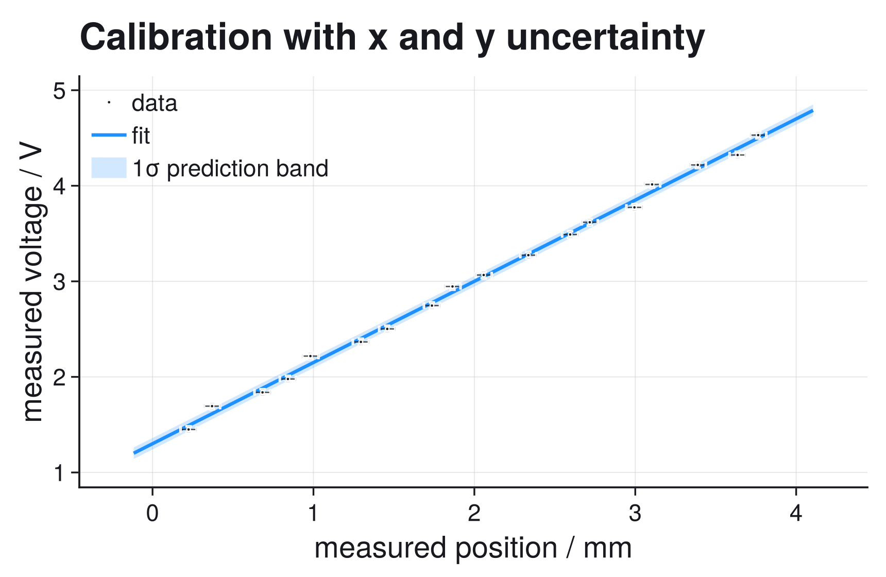
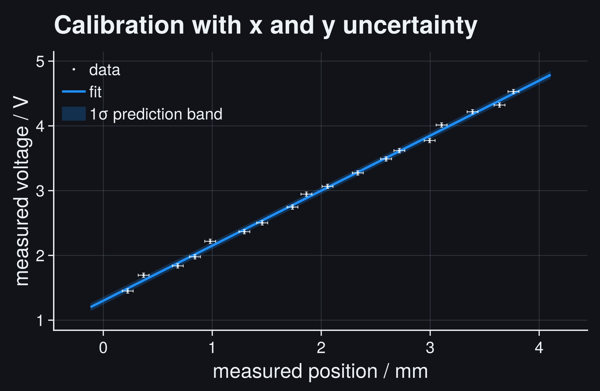
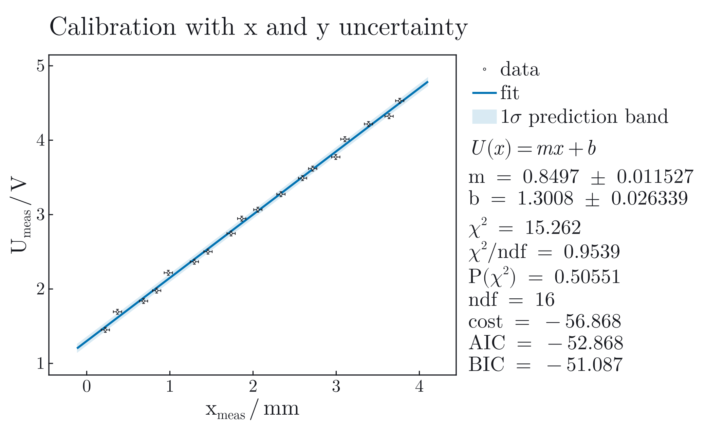
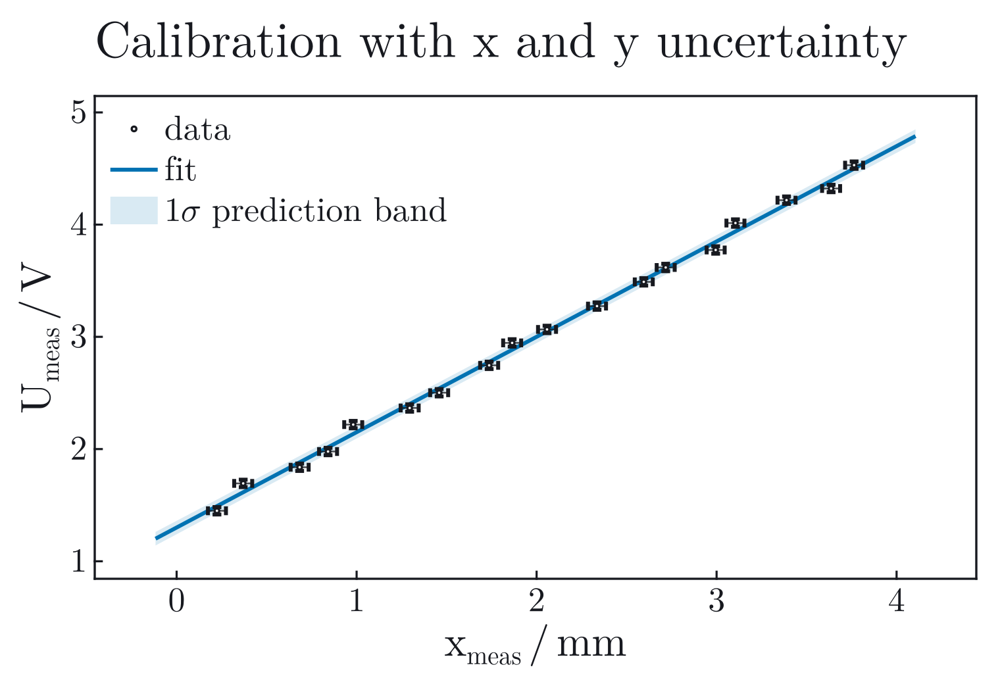
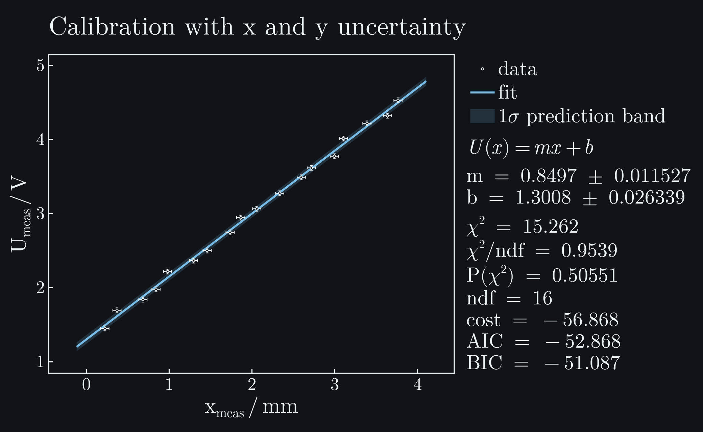
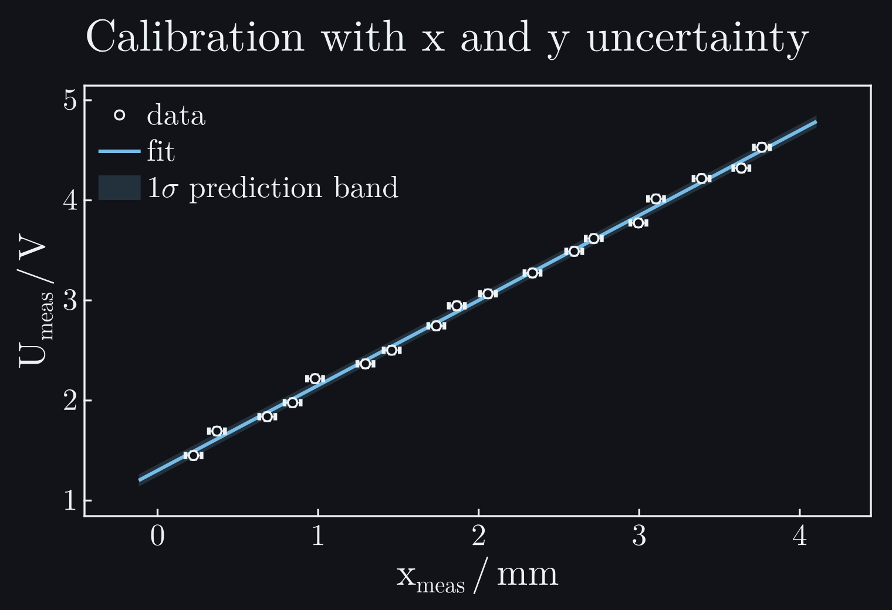

# XY Uncertainties

This controlled calibration workflow shows what changes when the independent
variable has uncertainty too. Horizontal error bars are not only a plotting
feature: if the model is steep enough, uncertainty in ``x`` contributes to the
statistical cost and to the fitted parameter errors.

```@raw html








```

## Question

A voltage sensor is calibrated by measuring stage position ``x_\mathrm{meas}``
in millimetres and sensor response ``U_\mathrm{meas}`` in volts. Both
instruments have finite resolution. The scientific question is:

```math
U = m x + b,
```

with realistic uncertainty on both ``m`` and ``b``. If ``x`` uncertainty is
ignored, the fit treats the measured abscissa as exact and usually reports
parameter errors that are too small.

## Data

The example uses a controlled, explicit calibration record rather than a
perfect line. Position and voltage contain different fixed, irregular
measurement deviations; no random generator is hidden in the page.

The uncertainties are:

- ``\sigma_x = 0.05\,\mathrm{mm}`` for every measured position,
- ``\sigma_U = 0.033\,\mathrm{V}`` for every measured voltage.

The visible horizontal and vertical error bars correspond to these 1σ standard
uncertainties. The 1σ prediction band in the plot includes the fitted
parameter uncertainty and the observation noise used by the plotting routine.

## Model and Cost

For a model ``f(x,p)``, an uncertainty in ``x`` changes the vertical residual
through the local model slope:

```math
f(x + \delta x, p) \approx f(x,p)
+ \frac{\partial f}{\partial x}(x,p)\,\delta x.
```

The effective vertical variance is therefore approximated as

```math
\sigma_{\mathrm{eff},i}^2
= \sigma_{y,i}^2
+ \left(\frac{\partial f}{\partial x}(x_i,p)\sigma_{x,i}\right)^2.
```

For a straight line this becomes

```math
\sigma_{\mathrm{eff},i}^2 = \sigma_y^2 + (m\sigma_x)^2.
```

The size of the effect is easy to estimate before fitting. If
``m\approx0.85\,\mathrm{V\,mm^{-1}}`` and
``\sigma_x=0.05\,\mathrm{mm}``, the x-resolution contributes about
``m\sigma_x\approx0.043\,\mathrm{V}`` in the vertical direction. That is larger
than ``\sigma_U=0.033\,\mathrm{V}``. Drawing horizontal error bars while fitting
as if x were exact would therefore understate the parameter uncertainty.

ScientificFitting uses this effective variance when `sigma_x` is supplied. This is a
local first-order approximation. It is appropriate for smooth models and
moderate x errors; it is not a full errors-in-variables model.

## Fit

This is the complete code for the documentation example:

```julia
using CairoMakie
using ScientificFitting

# Both coordinates are measured. sigma_x and sigma_U are standard
# uncertainties, not visual-only error-bar lengths.
x_measured = [0.2240, 0.3698, 0.6835, 0.8413, 0.9811, 1.2948,
              1.4586, 1.7364, 1.8641, 2.0579, 2.3356, 2.5954,
              2.7172, 2.9949, 3.1047, 3.3885, 3.6362, 3.7640]
U_measured = [1.450, 1.694, 1.838, 1.978, 2.218, 2.366,
              2.502, 2.746, 2.946, 3.066, 3.274, 3.490,
              3.618, 3.774, 4.014, 4.218, 4.322, 4.530]
sigma_x = fill(0.050, length(x_measured))
sigma_U = fill(0.033, length(x_measured))

line_model(x, p) = @. p[1] * x + p[2]

result = fit_model(
    line_model,
    x_measured,
    U_measured;
    p0=[0.8, 1.2],
    sigma_y=sigma_U,
    sigma_x=sigma_x,
)

plot_fit(
    result;
    title="Calibration with x and y uncertainty",
    model_label="U(x) = m x + b",
    xlabel="measured position",
    xunit="mm",
    ylabel="measured voltage",
    yunit="V",
    parameter_names=["m", "b"],
    band=:prediction,
    nsigma=1,
    band_label="1σ prediction band",
    show_legend=true,
    stats_position=:right,
    stats_mode=:full,
    # Compact observations keep both uncertainty components visible.
    data_markersize=5,
    filename="xy_uncertainties.pdf",
)

println(report_text(result; parameter_names=["m", "b"]))
println(diagnostic_dashboard_text(result))
```

```@raw html
<div class="scientificfitting-cell-output">
<div class="scientificfitting-cell-output-label">Output from this code</div>
<pre>Fit report
backend = optimization
converged = true
iterations = 7
message = Success

Parameters:
  m = 0.849698 +/- 0.0115274
  b = 1.30078 +/- 0.0263385

Statistics:
  cost = gaussian_likelihood
  cost_min = -56.8681
  minus2loglik_min = -56.8681
  chi2 = 15.2624
  ndf = 16
  chi2/ndf = 0.953897
  pvalue = 0.505514
  AIC = -52.8681
  BIC = -51.0874
Fit diagnostic dashboard
status = ok - no immediate issue
critical = 0, warning = 0, info = 0
No major diagnostic issues detected by the current checks.
No next action required by the current diagnostic checks.</pre>
</div>
```

The visible band is a 1σ prediction band; it is not a profile interval and not
a confidence band for the mean line alone.

## Diagnostics

This workflow is a good place to check whether a result is numerically
reasonable before moving to more complicated models:

- Compare the result with and without `sigma_x`. The central value should not
  jump wildly for this dataset, but the parameter uncertainty should increase
  when x errors are included.
- Inspect residuals for structure. Smooth residuals mean that the line may be
  an incomplete model, even when the error bars were propagated correctly.
- Check ``\chi^2/\mathrm{ndf}``. Values far above one suggest underestimated
  uncertainties or model mismatch; values far below one suggest overestimated
  uncertainties or correlated residuals.
- For steep nonlinear models, run profiles or a more explicit measurement-error
  model before trusting local symmetric errors.

The dashboard reports `status = ok - no immediate issue`: convergence,
goodness-of-fit, residual structure, and local covariance pass its current
first-line checks. This is not proof that the effective-variance approximation
is the correct physical model; that judgment still depends on how the two
instruments produce their errors.

## Interpretation

The fitted slope is the calibration sensitivity, and the intercept is the
offset. Because ``\sigma_x`` contributes through the slope, the uncertainty of
``m`` and ``b`` depends on the fitted model itself. This is why x errors cannot
be fixed later by drawing larger horizontal error bars on a finished plot.

For the dataset shown here, the fitted sensitivity and offset are

```math
m = (0.8497 \pm 0.0115)\,\mathrm{V\,mm^{-1}},
\qquad
b = (1.3008 \pm 0.0263)\,\mathrm{V}.
```

The fitted relation is ``U(x)=m x+b`` with ``x`` in millimetres. Under the
stated independent Gaussian resolution model, ``\chi^2/\mathrm{ndf}=0.954`` and
``P(\chi^2)=0.506`` are statistically unremarkable.

The reported covariance is still local. It describes the curvature of the cost
near the best fit after the effective-variance approximation has been applied.
If the approximation is poor, the covariance can be precise but statistically
misleading.

## What Can Go Wrong

Do not use `sigma_x` as a visual-only option. It changes the cost function. If
you only want horizontal error bars in a custom plot, keep that separate from
the fit.

Do not use effective variance blindly for discontinuous or kinked models. A
first-order derivative approximation is not meaningful at a threshold, clipping
point, or sharp regime switch.

Do not assume this solves all x-error problems. Large x errors, latent true
abscissae, and calibration transfer problems may require a full measurement
model with nuisance parameters or a structured covariance description.

Next useful pages: [Full Covariance](@ref),
[Damped Oscillator](resonance_decay.md), and
[Gaussian Fits and Covariance](../gaussian_models.md#Uncertainty-In-X).
