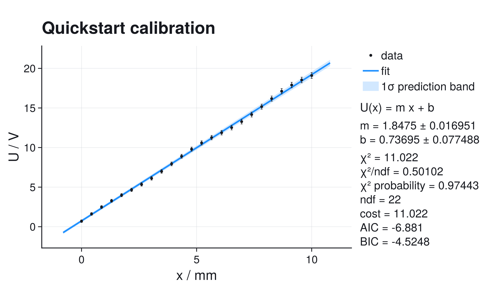
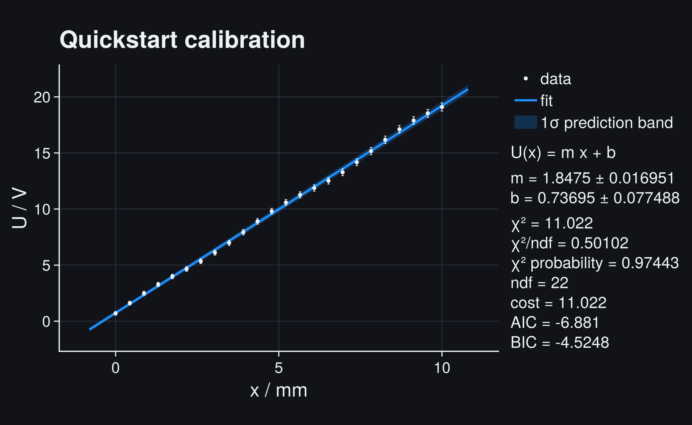
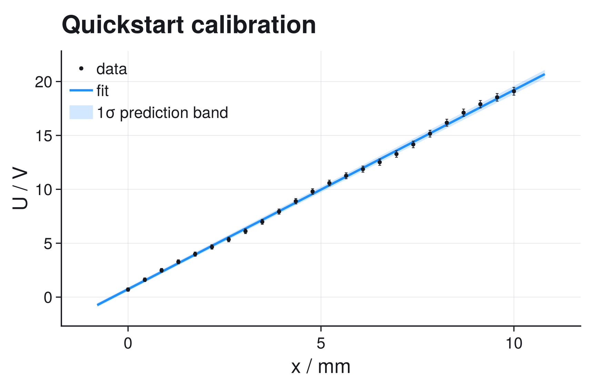
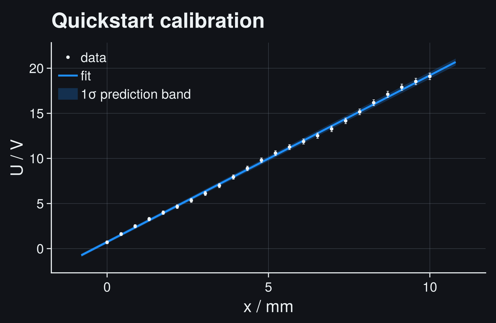
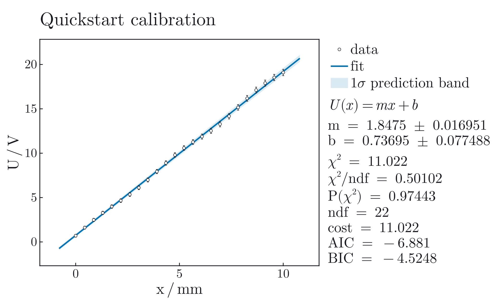
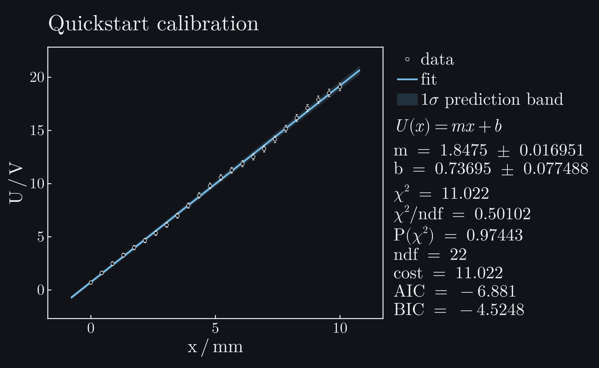
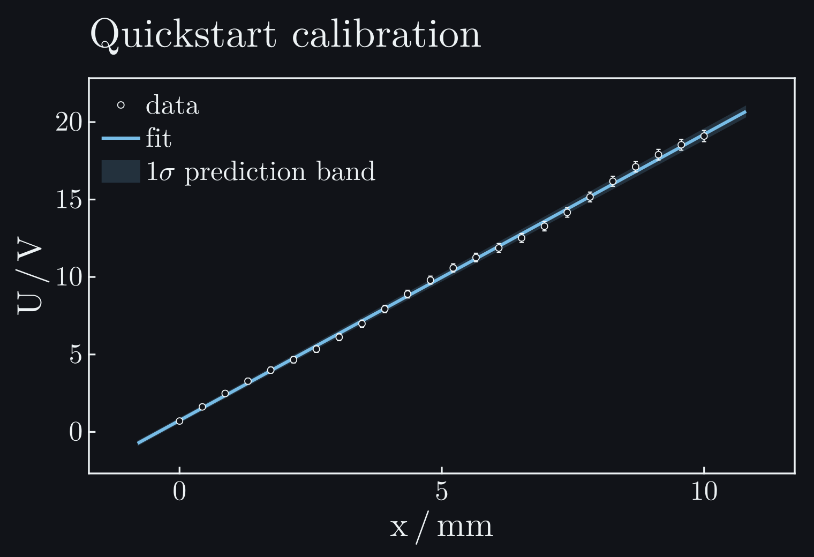

# ScientificFitting

```@raw html
<section class="scientificfitting-hero">
  <div class="scientificfitting-kicker">Scientific fitting for Julia</div>
  <p class="scientificfitting-lede">
    Fit measured data with explicit uncertainty models, inspect the result,
    and produce a clear Makie figure without rebuilding the analysis around
    the plot.
  </p>
  <div class="scientificfitting-hero-actions">
    <a class="scientificfitting-button primary" href="quickstart.html">Run the quickstart</a>
    <a class="scientificfitting-button" href="gallery.html">Explore complete analyses</a>
    <a class="scientificfitting-button" href="https://github.com/Amin-El-Sayed/ScientificFitting.jl">View on GitHub</a>
  </div>
</section>
```

```@raw html








<p class="scientificfitting-figure-note">Measured points, one-standard-deviation error bars, fitted model, one-sigma prediction band, and the numerical result share one figure. Use the controls above to change the documentation theme and plot style.</p>
```

## One Fit, Three Useful Outputs

```@raw html
<div class="scientificfitting-card-grid">
  <div class="scientificfitting-card">
    <h3>Numerical result</h3>
    <p><code>FitResult</code> or <code>LikelihoodFitResult</code> keeps parameters, local covariance, residuals, cost, goodness-of-fit information when defined, solver status, and the normalized problem.</p>
  </div>
  <div class="scientificfitting-card">
    <h3>Actionable diagnosis</h3>
    <p>Structured findings distinguish a converged optimizer from a result whose model, uncertainty assumptions, or local errors still need inspection.</p>
  </div>
  <div class="scientificfitting-card">
    <h3>Makie figure</h3>
    <p>The default layout is ready for a notebook or report and remains an ordinary Makie figure that can accept experiment-specific annotations.</p>
  </div>
</div>
```

The core fitting and text-reporting API does not load Makie. Add CairoMakie only
when a workflow needs static plots or publication export.

## Choose A Path

```@raw html
<div class="scientificfitting-card-grid">
  <div class="scientificfitting-card">
    <h3>First fit</h3>
    <p>Install the current release, run a weighted fit, read its report, and understand the first diagnostic warning.</p>
    <p><a href="install.html">Install</a> · <a href="quickstart.html">Quickstart</a></p>
  </div>
  <div class="scientificfitting-card">
    <h3>Work from an example</h3>
    <p>Follow complete analyses from linear calibration through covariance, nonlinear models, profiles, count likelihoods, and shared-parameter fits.</p>
    <p><a href="gallery.html">Gallery</a></p>
  </div>
  <div class="scientificfitting-card">
    <h3>Fix a suspicious fit</h3>
    <p>Use residuals, pulls, goodness of fit, profiles, and contours to decide what to inspect next.</p>
    <p><a href="fitting_for_practitioners.html">Practitioner guide</a></p>
  </div>
  <div class="scientificfitting-card">
    <h3>Audit the method</h3>
    <p>Read the assumptions and derivations behind chi-square, likelihoods, covariance, profile intervals, contours, and model comparison.</p>
    <p><a href="statistical_foundations.html">Mathematics and statistics</a></p>
  </div>
  <div class="scientificfitting-card">
    <h3>Find an exact API</h3>
    <p>Use the workflow map first, then the curated signatures, defaults, return types, and failure semantics.</p>
    <p><a href="api.html">API reference</a></p>
  </div>
</div>
```
