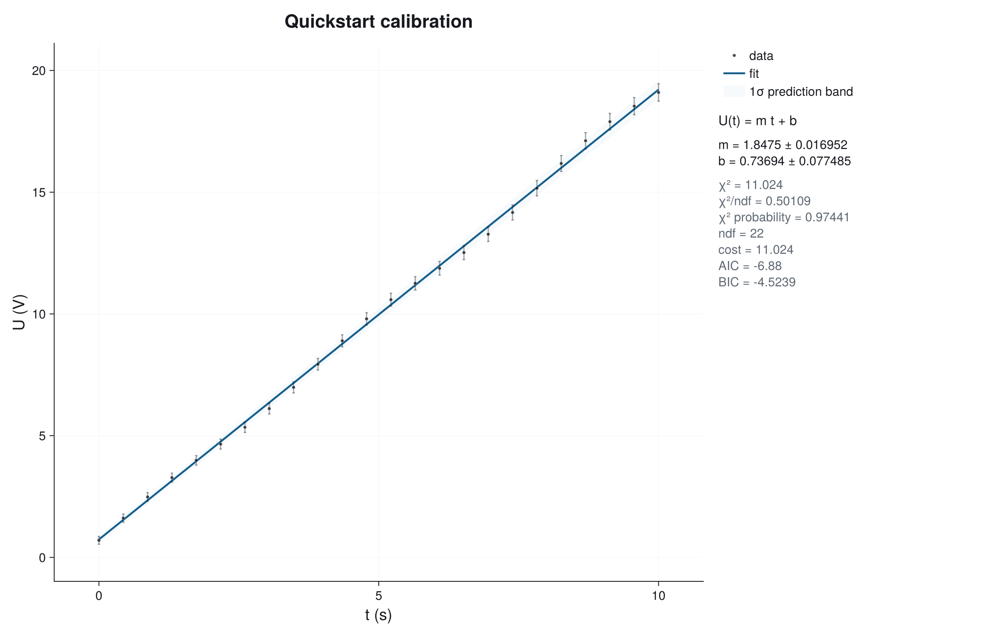
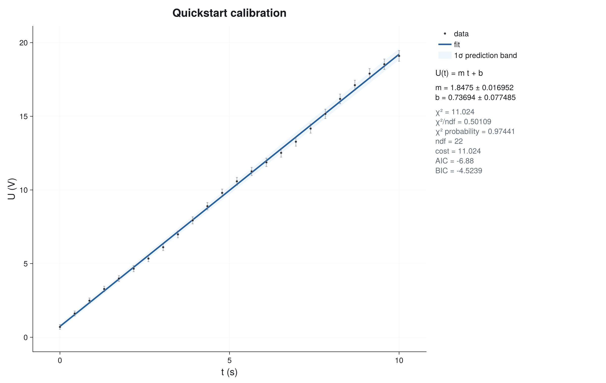
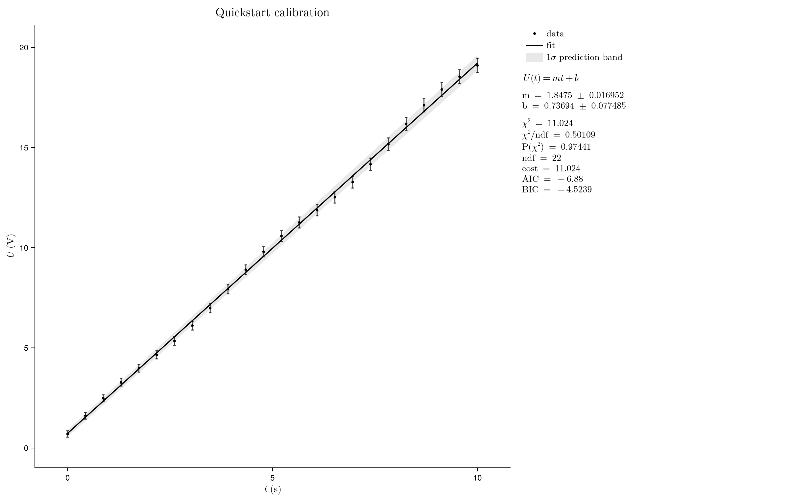

# Plotting Design

Plotting is a primary feature, not decoration after fitting.

## Default User Story

The common workflow should be short and reliable:

```julia
fitplot(x, y; sigma_y)
fitplot(model, x, y; p0, sigma_y)
plot_fit(result)
```

The output should have sensible margins, readable labels, visible uncertainties,
a clear fit curve, and a compact right-side summary without requiring manual
layout tuning. In-axis statistic boxes remain available, but they are not the
default because they compete with the data.

`plot_fit` preserves the requested `figure_size`. A short report must not
collapse the data area into a shallow banner, and a long report must not silently
change the exported dimensions. The right-side panel is top-aligned while the
data axis controls the row height.

## Design Principles

- Beautiful defaults first; customization second.
- Automatic layout must account for error bars, bands, labels, optional legends,
  and statistics panels.
- All high-level options should map cleanly to Makie concepts.
- Export quality must be consistent across PNG, PDF, and SVG.
- Plot functions should return the Makie `Figure` for further user control.
- Adding Makie elements after `plot_fit` returns must not resize or invalidate
  the existing plot. Users can add labels, axes, markers, annotations, or new
  layout rows and then export the same figure.

## Plot Design Direction

The default `:workbench` style is intentionally restrained and scientific:

- white background for print, slides, and documentation
- dark ink for axes, labels, and data
- subtle gray grid lines that can be disabled via `axis_kwargs`
- a single restrained fit color in the data area
- soft confidence bands that stay behind the data
- no legend by default when the visual mapping is obvious
- compact, left-aligned right-side legend and fit summary instead of a box
  covering the data
- model formula and goodness-of-fit numbers in the summary area

JuFitter has three style contracts. They correspond to real output contexts,
not minor visual variations:

- `:workbench`: robust notebook and laboratory default. Neutral data, one blue
  fit accent, subtle grid, and readable plain-text reporting.
- `:showcase`: documentation and presentation style. It keeps neutral data,
  uses one cool blue fit accent, and slightly stronger hierarchy for pages and talks
  without changing the scientific layout.
- `:publication`: compact black-and-white structure, Computer Modern
  typography, no grid, and geometry suitable for vector export.

Light and dark rendering are selected independently through
`appearance=:light | :dark`. LaTeX conversion is also independent:
`latex_labels=true` and `latex_stats=true` opt into math rendering. This avoids
the previous ambiguity where style names silently mixed color, typography,
LaTeX, and output density.

The legacy names `:clean`, `:minimal`, `:paper`, `:latex`, and `:dark` remain
accepted as compatibility aliases, but new code should use the three contracts
above plus `appearance`.

## Controlled Style Comparison

Style comparisons are only meaningful when the scientific content is held
fixed. Every image below uses the same data, uncertainties, fitted result,
1-sigma prediction band, legend, report fields, labels, and output size. Only
the public `theme` keyword changes.

```@raw html
<div class="jufitter-gallery-grid jufitter-style-grid">
<div class="jufitter-gallery-item"><div><h3>workbench</h3><p>Reliable default for notebooks, laboratory work, and ordinary reports.</p></div></div>
<div class="jufitter-gallery-item"><div><h3>showcase</h3><p>Restrained color and strong hierarchy for documentation and presentations.</p></div></div>
<div class="jufitter-gallery-item"><div><h3>publication</h3><p>Compact black-and-white geometry and Computer Modern typography for papers.</p></div></div>
</div>
```

The documentation should follow
[Beautiful Makie](https://beautiful.makie.org/dev/) as the canonical visual
reference: visual examples first, concise code next to the rendered output,
Makie-native idioms, generous spacing, and no generic Documenter-default
gallery look.

## High-Level Controls

- `theme=:workbench | :showcase | :publication | :custom`
- `appearance=:auto | :light | :dark`
- `latex_labels`, `latex_stats`
- `xlabel`, `ylabel`, `xunit`, `yunit`, `title`, `model_label`
- `parameter_names`
- `report=:plot | :console | :both | :none`
- `band=:none | :confidence | :prediction`
- `nsigma`
- `show_legend`, `stats_position=:right | :inside`, `show_residuals`, `show_pulls`
- `plot_contour(...; show_regions=true, show_heatmap=false)` for threshold-first
  contour diagnostics; heatmaps remain available for explicit surface analysis
- `plot_profile_matrix(...)` for a compact multi-parameter overview with
  diagonal profile scans, lower-triangle pairwise contours, local covariance
  overlays, and upper-triangle correlation coefficients
- `axis_kwargs`, `line_kwargs`, `scatter_kwargs`, `band_kwargs`,
  `legend_kwargs`
- `plot_theme(...)`, `plot_palette(...)`, and `plot_info_panel!(...)` for
  custom Makie figures that should preserve JuFitter's visual system
- `fit_axis(fig)` plus `add_curve!`, `add_points!`, `add_vline!`,
  `add_hline!`, `add_vband!`, and `add_hband!` for post-fit annotations
  without recomputing the fit

For compound plots, allocate the scientific panels first and place
`plot_info_panel!` in a dedicated cell or span. The information panel does not
dictate parent height, so a fit axis, residual stack, or diagnostic grid remains
stable even when report content changes.

Post-fit annotation helpers are deliberately thin Makie wrappers. They return
the created Makie plot object, accept ordinary Makie keyword arguments such as
`color`, `linestyle`, `linewidth`, `marker`, and `label`, and do not modify the
underlying `FitResult`. Use them for threshold markers, extrapolation curves,
derived-quantity points, accepted physical regions, and notebook annotations.

The same `theme` and `appearance` contract applies to `plot_profile`,
`plot_contour`, `plot_residuals`, and `plot_diagnostics`. Their default colors
are derived from the selected style; explicit color keywords remain available
when a scientific convention requires them.

## Documentation-Wide Style Switching

A documentation-wide plot-style switch is feasible without recoloring images
in CSS. The reliable implementation is to pre-render each documentation figure
for the supported style and appearance combinations, then let the page select
the matching asset. This preserves exact Makie geometry, typography, and
contrast.

Before enabling that switch, every custom gallery figure must use
`plot_theme`, `plot_palette`, and `plot_info_panel!`. Standard JuFitter plots
already satisfy this contract. A few compound gallery figures still own manual
Makie layouts and are being migrated before the switch becomes public.

## Diagnostic Plot Direction

Diagnostic plots are not decorative. They answer whether the numerical result is
safe to interpret.

The profile and contour plots should make one comparison visually obvious:

- **profile cost**: the actual refitted cost when one parameter is fixed,
- **local parabola**: the covariance/Hessian approximation used for symmetric
  local errors,
- **profile interval**: where the actual profile crosses the chosen threshold,
- **profile contour**: the actual two-parameter cost geometry,
- **local ellipse**: the covariance approximation in the same parameter plane.

If the actual profile follows the local parabola and the actual contour follows
the local ellipse, local covariance errors are usually adequate. If the profile
is skewed, has shoulders, changes curvature, or the contour is banana-shaped,
clipped, or non-elliptic, the local error estimate is not the final answer. Use
profile intervals, inspect bounds/constraints, rescale or reparameterize the
model, or collect data that breaks the degeneracy.

Practical notebook diagnostic layout:

- top: short diagnosis summary with actionable findings,
- main: data, fit, uncertainty band, and highlighted suspicious points,
- residual/pull panel: structure, outliers, and autocorrelation cues,
- parameter panel: profile/parabola, contour/ellipse comparisons, or a
  `plot_profile_matrix` overview when more than two parameters need a quick
  scan,
- side panel: goodness-of-fit, active bounds, condition numbers, and suggested
  next actions.

## Acceptance Tests

- Small datasets do not produce cramped plots.
- Dense datasets do not obscure the fit curve.
- Error bars and confidence bands are fully inside the visible range.
- Long labels, LaTeX labels, and parameter summaries are not clipped.
- The default right-side report does not change the requested output size.
- A custom Makie element can be added after `plot_fit` without collapsing the
  existing layout.
- JuFitter annotation helpers can add curves, points, lines, and bands to an
  existing fit axis without rerunning the fit.
- Wide documentation plots never overlap the navigation sidebar.
- Multi-dataset and multi-fit plots use clear visual hierarchy.
- Profile plots can overlay the local parabolic approximation.
- Contour plots can overlay the local covariance ellipse.
- Profile-matrix plots can export a multi-parameter overview and reject invalid
  parameter selections.
