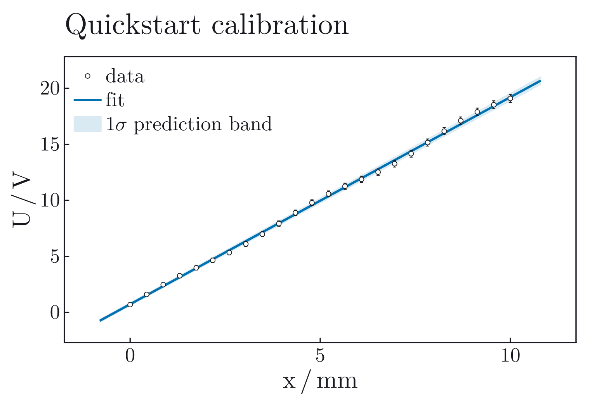

# Plotting And Customization

JuFitter's plotting layer is an optional CairoMakie extension. Fitting,
reporting, diagnostics, profiles, and contours work without Makie; loading
`CairoMakie` adds the visual interface. A plot always reads an existing fit
result, so changing a label, style, band, or annotation never changes the
numerical analysis.

## The Short Path

`fitplot` combines fitting and plotting for notebook work:

```julia
using JuFitter
using CairoMakie

out = fitplot(
    model,
    x,
    y;
    p0=[1.0, 0.0],
    sigma_y=sigma_y,
    xlabel="position",
    xunit="mm",
    ylabel="voltage",
    yunit="V",
    show_panel=true,
)

result = out.result
fig = out.figure
```

All `fitplot` methods return the named tuple `(result, figure)`. The numerical
result is therefore available for further diagnostics even in the shortest
workflow.

When an x-y `FitResult` already exists, use `plot_fit(result)`. It returns a
Makie `Figure` and does not rerun the optimizer:

```julia
fig = plot_fit(result; title="Sensor calibration")
```

The default layout allocates the scientific axis first and lets Makie's layout
system size the optional information panel from its content. Error bars,
uncertainty bands, labels, and the model range are included when automatic axis
limits are calculated. Manual margin guessing should not be part of the normal
workflow.

## Reports, Legends, And Panels

The one-call interface uses independent switches rather than bundled output
modes:

- `show_panel=true` includes the numerical result panel in the figure;
- `print_report=true` prints `report_text(result)` to the terminal;
- `show_legend=true` controls the legend independently.

Both `fitplot` and `plot_fit` default to `show_panel=true`. Only `fitplot` has
`print_report`, because `plot_fit` never emits terminal output. Thus all four
panel/terminal combinations are direct Boolean choices rather than style names.

```julia
plot_fit(
    result;
    show_panel=true,
    stats_position=:right,   # or :inside
    show_legend=true,
    stats_mode=:compact,     # or :full
)
```

With `stats_position=:right`, the legend is placed above the model and parameter
summary in the same left-aligned information panel. With
`stats_position=:inside`, `legend_position` and `inside_stats_position` control
the in-axis locations independently. `show_panel=false` removes the report
panel entirely.

The sans style defaults to `(1040, 640)` with a right-side panel and
`(860, 560)` without one. The TeX style uses `(1000, 640)` with the panel and
`(760, 520)` without it. Pass
`figure_size=(width, height)` for a required
export footprint. The requested size is preserved; report length does not
silently resize the saved figure. `stats_panel_width=:auto` should remain the
default unless an external journal template requires an explicit width.

## Two Visual Styles

The maintained themes describe visual properties only. They do not decide
whether a panel is present, and they never change data, fit, uncertainty band,
or statistics.

- `theme=:sans` is the default. It follows Makie's direct line-and-band grammar:
  sans-serif type, neutral filled observations, a saturated blue fit, visible
  guides, strong open axes, and a left-aligned title.
- `theme=:tex` uses Makie's LaTeX font family, hollow observations, a complete
  axis frame with inward ticks, no grid, and the Okabe-Ito blue/vermillion pair
  when multiple curves require color.

The same contracts apply to compound diagnostics. Diagnostic status labels are
controlled separately through `panel_status_mode`; changing fonts or axis
grammar does not silently remove scientific warnings.

Both images below contain the same observations, errors, fit, one-sigma
prediction band, labels, and panel state. Only visual style changes.

```@raw html
<div class="jufitter-gallery-grid jufitter-style-grid">
<div class="jufitter-gallery-item"><div><h3>sans</h3><p>Sans-serif typography, open axes, filled observations, and light grid guides.</p></div></div>
<div class="jufitter-gallery-item"><div><h3>tex</h3><p>TeX typography, a full frame, inward ticks, hollow observations, and no grid.</p></div></div>
</div>
```

Color appearance is independent of style:

```julia
plot_fit(result; theme=:sans, appearance=:dark)
```

`appearance=:auto` currently resolves to the light appearance. Select
`:light` or `:dark` explicitly when an exported asset must match a document.
The documentation switch swaps real Makie-rendered light/dark assets; it does
not invert or recolor PNG files in CSS.

LaTeX conversion is also independent:

```julia
using LaTeXStrings

plot_fit(
    result;
    theme=:tex,
    latex_labels=true,
    latex_stats=true,
    model_label=L"U_0(\nu)=h\nu/e-\Phi/e",
    xlabel=L"\nu",
    xunit=L"\mathrm{THz}",
)
```

Plain strings remain text, even when rendered with LaTeX typography. Pass a
`LaTeXString`, such as `L"\nu"`, when a label contains mathematical symbols.
`latex_stats=true` applies to the structured right-side panel; the compact
in-axis text box remains plain text.

## Figure Size Is Not Resolution

Makie interprets `Figure(size=(width, height))` as a logical canvas in CSS-like
pixels. Increasing that size to obtain a sharper PNG makes the plot physically
larger; when a document scales it back down, every label becomes smaller with
it. Keep the figure at its intended display size and control raster density
when saving:

```julia
fig = plot_fit(result; figure_size=(960, 600))
save("fit.png", fig; px_per_unit=2)  # sharper raster, unchanged layout
save("fit.svg", fig)                 # vector output for scalable documents
```

The documentation gallery follows the same rule: compound figures use a
declared browser-sized canvas, while `px_per_unit` supplies retina-resolution
pixels. Font-size checks therefore refer to the rendered page, not the raw PNG
dimensions.

Use `:sans` and `:tex` in new code. The former screen-oriented names
`:analysis`, `:presentation`, `:screen`, `:lab`, `:workbench`, `:modern`,
`:clean`, `:minimal`, and `:showcase` resolve to `:sans`; `:article`,
`:publication`, `:paper`, and `:latex` resolve to `:tex`.

## State What The Band Means

`plot_fit` defaults to a one-sigma confidence band:

- `band=:confidence` propagates the local parameter covariance to the fitted
  mean curve;
- `band=:prediction` adds the observation uncertainty in y and the effective x
  uncertainty, answering where a new measurement may land;
- `band=:none` hides the band;
- `nsigma` multiplies the displayed standard-deviation scale.

```julia
plot_fit(
    result;
    band=:prediction,
    nsigma=2,
    band_label="2-sigma prediction band",
    show_legend=true,
)
```

The band comes from local covariance propagation. `nsigma=2` is not a guarantee
of exact 95% coverage for a nonlinear, bounded, or non-Gaussian fit. When the
profile is asymmetric or a contour is non-elliptic, report profile-based
intervals and use the band only as the stated local approximation.

A matrix-free `WhiteningOperator` must provide `marginal_sigma` before
`band=:prediction` can draw pointwise observation uncertainty. Without those
marginal standard deviations, use `band=:confidence`; the fit itself remains
fully defined by the whitening operation.

## Model Range And Automatic Limits

By default, `fit_range=:axis` draws the fitted model to the padded x limits, not
only from the first to the last observation. This makes interpolation and
modest extrapolation visually continuous with the axis. The alternatives are
explicit:

```julia
plot_fit(result; fit_range=:data)             # first to last measured x
plot_fit(result; xgrid=collect(0.0:0.01:8.0)) # exact requested domain
```

With `auto_limits=true`, JuFitter includes data, x/y error bars, the sampled
model curve, and the selected band when it computes limits. `limit_padding`
controls the fractional breathing room around that content. Use
`auto_limits=false` only when supplying limits through Makie axis options or
when coordinating several panels manually. If those manual limits extend the
model domain, pass a matching `xgrid`; the plotting layer does not infer a new
sampling grid from arbitrary Makie axis attributes.

`plot_aspect` is an explicit geometric constraint, not an automatic default.
Leave it unset unless equal or prescribed axis geometry carries scientific
meaning.

## Customize Through Makie, Not Around It

The style supplies defaults. Explicit JuFitter keywords override those defaults,
and each Makie `*_kwargs` container is applied last:

```julia
fig = plot_fit(
    result;
    theme=:sans,
    fit_color=:navy,
    axis_kwargs=(
        xgridvisible=false,
        ygridvisible=false,
    ),
    line_kwargs=(
        linestyle=:dash,
        linewidth=3.0,
    ),
    scatter_kwargs=(
        marker=:utriangle,
        markersize=9,
    ),
    band_kwargs=(color=(:steelblue, 0.18),),
)
```

`axis_kwargs`, `line_kwargs`, `scatter_kwargs`, `band_kwargs`,
`xerrorbars_kwargs`, `yerrorbars_kwargs`, and `legend_kwargs` accept a
`NamedTuple` or dictionary of ordinary Makie attributes. `theme_override`
merges a Makie `Theme` into the selected JuFitter theme when a project needs a
consistent font or axis convention across many figures.

## Add Scientific Objects After Fitting

Retrieve the data axis from a finished figure and add annotations without
recomputing the fit:

```julia
fig = plot_fit(result; theme=:sans, show_legend=false)
ax = fit_axis(fig)
colors = plot_palette(:sans)

add_vband!(ax, 2.8, 3.2; color=(colors.band_color, 0.16), label="accepted range")
add_vline!(ax, 3.0; color=colors.fit_color, linestyle=:dash, label="threshold")
add_curve!(ax, x -> reference_model(x); color=:gray35, label="reference")
add_points!(ax, derived_x, derived_y; marker=:star5, color=:black, label="derived value")

axislegend(ax; position=:rt)
```

`add_curve!` samples a function on an explicit `xgrid`, an `xspan`, or the
axis's current x limits. `add_vband!` and `add_hband!` use Makie's axis-relative
span primitives: they cover the full orthogonal axis but do not enlarge its
automatic data limits. They can therefore be added before or after the first
render. All helpers return the created Makie plot object and accept ordinary
Makie attributes.

A right-side legend created by `plot_fit` reflects the plot objects that exist
at construction time. For layers added later, either create an in-axis
`axislegend` as above or build a custom right-side panel after all plot objects
exist.

## Compose A Custom Multi-Panel Figure

`plot_theme`, `plot_palette`, and `plot_info_panel!` expose the same visual
contract for a figure whose scientific layout is not a single fit axis:

```julia
theme = plot_theme(:sans; appearance=:light)
colors = plot_palette(:sans; appearance=:light)

fig = with_theme(theme) do
    fig = Figure(size=(1200, 720))
    ax = Axis(fig[1, 1]; xlabel="time / s", ylabel="signal / V")

    data_plot = scatter!(ax, x, y; color=colors.data_color)
    fit_plot = lines!(ax, xgrid, yfit; color=colors.fit_color)

    plot_info_panel!(
        fig[1, 2];
        theme=:sans,
        appearance=:light,
        legend_plots=[data_plot, fit_plot],
        legend_labels=["data", "fit"],
        model_label="damped oscillator",
        parameter_lines=["A = ...", "lambda = ..."],
        statistic_lines=["chi2/ndf = ..."],
    )
    fig
end
```

The panel reports its natural width to Makie's `GridLayout` and does not dictate
the height of the scientific row. Use `Auto()` sizing for normal layouts; pass
an explicit panel width only when the external output format requires one.

## Diagnostic Figures

Diagnostic plots use the same `theme` and `appearance` contract:

- `plot_residuals(result; kind=:residual | :pull | :ratio)` locates data-space
  mismatch;
- `plot_diagnostics(result)` combines fit and diagnostic views;
- `plot_profile(profile_result; local_sigma=...)` compares the refitted profile
  with the local parabola;
- `plot_contour(contour_result; local_covariance=..., local_center=...)` shows
  filled profile regions with the local covariance approximation as a line;
- `plot_profile_matrix(...)` gives the multi-parameter overview.

Single-profile and contour legends default to `legend_position=:below`. The
axis therefore keeps the full scientific content width even when confidence
labels are descriptive. Set `legend_position=:right` for a bounded side column,
or pass `legend_kwargs` for direct Makie-level legend customization.

Expensive profile matrices can be computed without Makie, inspected in a
headless job, and rendered later without repeating any refits:

```julia
matrix = profile_matrix(
    result;
    parameters=[1, 2, 3],
    parameter_names=["A", "lambda", "offset"],
    adaptive=true,
)

rows = profile_matrix_triage(matrix)

using CairoMakie
fig = plot_profile_matrix(matrix; theme=:tex)
```

Diagonal panels compare actual profiles with local parabolas. Lower-triangle
panels compare filled one- and two-sigma profile regions with dashed local
covariance ellipses. Upper-triangle panels report local correlations. Read the
matrix as triage: a warning label, skewed profile, open region, clipped contour,
or disagreement with the local overlay tells you which parameter pair needs a
closer analysis.

## Export

Pass a filename directly or save the returned figure with Makie:

```julia
plot_fit(result; filename="fit.pdf", theme=:tex)

fig = plot_fit(result; theme=:sans)
save("fit.svg", fig)
save("fit.png", fig; px_per_unit=2)
```

Use PDF or SVG when editable vector geometry is required and PNG for notebooks
or raster publication pipelines. Inspect the final exported file at its actual
display size; a plot that is readable on a large interactive canvas may still
be too dense in a single journal column.
