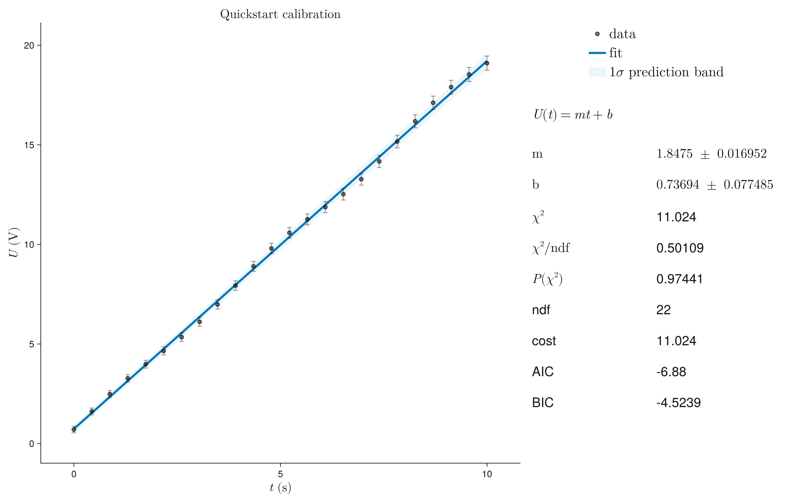
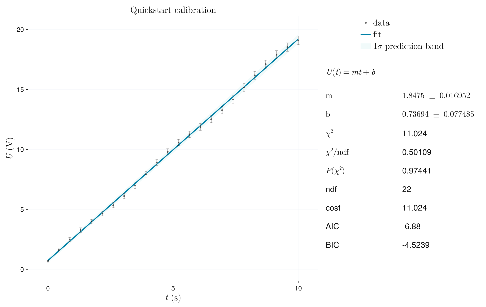
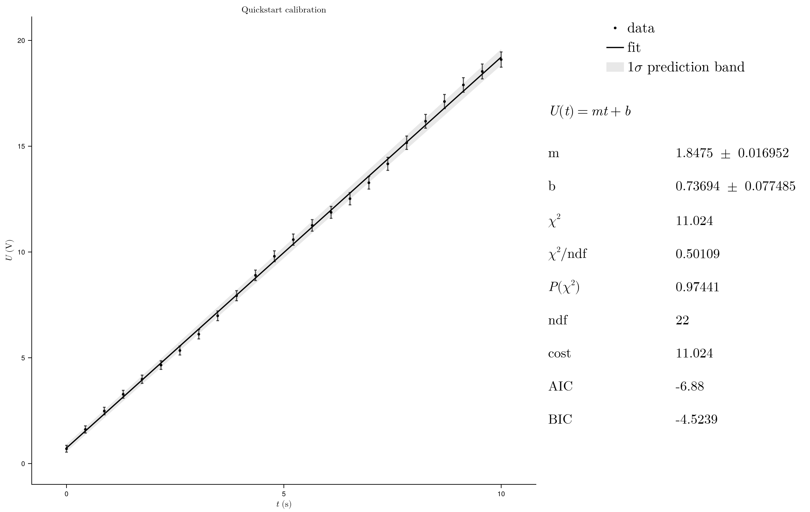
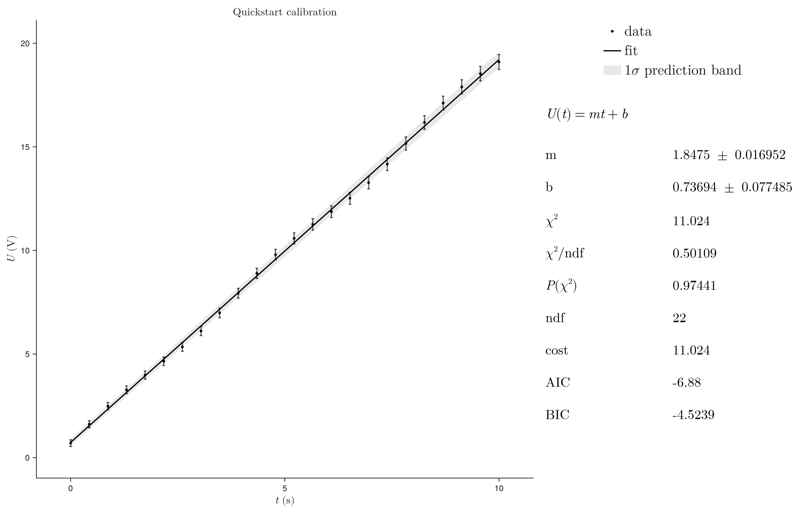
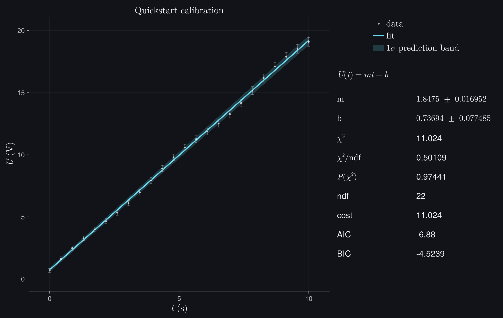

# Plotting Design

Plotting is a primary feature, not decoration after fitting.

## Default User Story

The common workflow should be short and reliable:

```julia
fitplot(x, y; sigma_y)
fitplot(model, x, y; p0, sigma_y)
plot_fit(result)
```

The output should have sensible margins, readable labels, visible uncertainties,
a clear fit curve, and a compact right-side summary without requiring manual
layout tuning. In-axis statistic boxes remain available, but they are not the
default because they compete with the data.

## Design Principles

- Beautiful defaults first; customization second.
- Automatic layout must account for error bars, bands, labels, optional legends,
  and statistics panels.
- All high-level options should map cleanly to Makie concepts.
- Export quality must be consistent across PNG, PDF, and SVG.
- Plot functions should return the Makie `Figure` for further user control.

## Plot Design Direction

The default `:clean` style is intentionally restrained and scientific:

- white background for print, slides, and documentation
- dark ink for axes, labels, and data
- subtle gray grid lines that can be disabled via `axis_kwargs`
- a single restrained fit color in the data area
- soft confidence bands that stay behind the data
- no legend by default when the visual mapping is obvious
- compact right-side fit summary instead of a box covering the data
- model formula and goodness-of-fit numbers in the summary area

Additional built-in styles cover common production needs:

- `:minimal`: white background, fine markers, thin fit line, subtle grid, and
  high precision for dense datasets.
- `:paper`: white background, Computer Modern typography, black axes/data, and
  a restrained fit accent suitable for physics-style publications.
- `:dark`: native dark export for documentation dark mode and talks.

## Controlled Style Comparison

Style comparisons are only meaningful when the scientific content is held
fixed. Every image below uses the same data, uncertainties, fitted result,
1-sigma prediction band, legend, report fields, labels, and output size. Only
the public `theme` keyword changes.

```@raw html
<div class="jufitter-gallery-grid">
<div class="jufitter-gallery-item"><div><h3>clean</h3><p>Readable default for notebooks, reports, and the gallery.</p></div></div>
<div class="jufitter-gallery-item"><div><h3>minimal</h3><p>Fine geometry for dense datasets without sacrificing readable labels.</p></div></div>
<div class="jufitter-gallery-item"><div><h3>paper</h3><p>Compact black-and-white structure with a restrained fit accent.</p></div></div>
<div class="jufitter-gallery-item"><div><h3>publication</h3><p>Publication-oriented sizing and hierarchy.</p></div></div>
<div class="jufitter-gallery-item"><div><h3>latex</h3><p>Computer Modern typography and mathematical labels.</p></div></div>
<div class="jufitter-gallery-item"><div><h3>dark</h3><p>Native dark rendering rather than a CSS-inverted light image.</p></div></div>
</div>
```

The documentation should follow
[Beautiful Makie](https://beautiful.makie.org/dev/) as the canonical visual
reference: visual examples first, concise code next to the rendered output,
Makie-native idioms, generous spacing, and no generic Documenter-default
gallery look.

## High-Level Controls

- `theme=:clean | :minimal | :paper | :publication | :latex | :dark | custom`
- `xlabel`, `ylabel`, `xunit`, `yunit`, `title`, `model_label`
- `parameter_names`
- `report=:plot | :console | :both | :none`
- `band=:none | :confidence | :prediction`
- `nsigma`
- `show_legend`, `stats_position=:right | :inside`, `show_residuals`, `show_pulls`
- `plot_contour(...; show_regions=true, show_heatmap=false)` for threshold-first
  contour diagnostics; heatmaps remain available for explicit surface analysis
- `axis_kwargs`, `line_kwargs`, `scatter_kwargs`, `band_kwargs`,
  `legend_kwargs`

## Diagnostic Plot Direction

Diagnostic plots are not decorative. They answer whether the numerical result is
safe to interpret.

The profile and contour plots should make one comparison visually obvious:

- **profile cost**: the actual refitted cost when one parameter is fixed,
- **local parabola**: the covariance/Hessian approximation used for symmetric
  local errors,
- **profile interval**: where the actual profile crosses the chosen threshold,
- **profile contour**: the actual two-parameter cost geometry,
- **local ellipse**: the covariance approximation in the same parameter plane.

If the actual profile follows the local parabola and the actual contour follows
the local ellipse, local covariance errors are usually adequate. If the profile
is skewed, has shoulders, changes curvature, or the contour is banana-shaped,
clipped, or non-elliptic, the local error estimate is not the final answer. Use
profile intervals, inspect bounds/constraints, rescale or reparameterize the
model, or collect data that breaks the degeneracy.

Practical notebook diagnostic layout:

- top: short diagnosis summary with actionable findings,
- main: data, fit, uncertainty band, and highlighted suspicious points,
- residual/pull panel: structure, outliers, and autocorrelation cues,
- parameter panel: profile/parabola and contour/ellipse comparisons,
- side panel: goodness-of-fit, active bounds, condition numbers, and suggested
  next actions.

## Acceptance Tests

- Small datasets do not produce cramped plots.
- Dense datasets do not obscure the fit curve.
- Error bars and confidence bands are fully inside the visible range.
- Long labels, LaTeX labels, and parameter summaries are not clipped.
- Multi-dataset and multi-fit plots use clear visual hierarchy.
- Profile plots can overlay the local parabolic approximation.
- Contour plots can overlay the local covariance ellipse.
