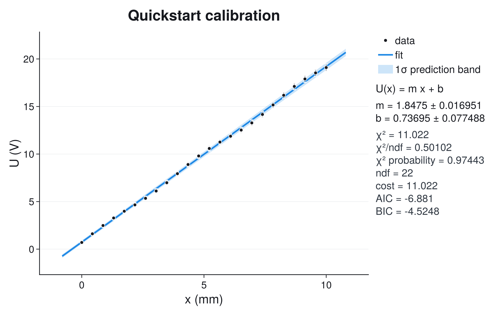

# Plotting And Customization

JuFitter's plotting layer is an optional CairoMakie extension. Fitting,
reporting, diagnostics, profiles, and contours work without Makie; loading
`CairoMakie` adds the visual interface. A plot always reads an existing fit
result, so changing a label, style, band, or annotation never changes the
numerical analysis.

## The Short Path

`fitplot` combines fitting and plotting for notebook work:

```julia
using JuFitter
using CairoMakie

out = fitplot(
    model,
    x,
    y;
    p0=[1.0, 0.0],
    sigma_y=sigma_y,
    xlabel="position",
    xunit="mm",
    ylabel="voltage",
    yunit="V",
    report=:plot,
)

result = out.result
fig = out.figure
```

All `fitplot` methods return the named tuple `(result, figure)`. The numerical
result is therefore available for further diagnostics even in the shortest
workflow.

When a fit already exists, use `plot_fit(result)`. It returns a Makie `Figure`
and does not rerun the optimizer:

```julia
fig = plot_fit(result; title="Sensor calibration")
```

The default layout allocates the scientific axis first and lets Makie's layout
system size the optional information panel from its content. Error bars,
uncertainty bands, labels, and the model range are included when automatic axis
limits are calculated. Manual margin guessing should not be part of the normal
workflow.

## Reports, Legends, And Panels

The one-call interface separates terminal output from plot content:

- `report=:plot` shows the plot-side result panel;
- `report=:console` prints `report_text(result)` and omits the panel;
- `report=:both` does both;
- `report=:none` produces neither report.

These four values belong to `fitplot`. Starting from an existing result,
`plot_fit` exposes the visual controls directly:

```julia
plot_fit(
    result;
    show_stats=true,
    stats_position=:right,   # or :inside
    show_legend=true,
    stats_mode=:compact,     # or :full
)
```

With `stats_position=:right`, the legend is placed above the model and parameter
summary in the same left-aligned information panel. With
`stats_position=:inside`, `legend_position` and `inside_stats_position` control
the in-axis locations independently. `show_stats=false` removes the report
panel entirely.

The default figure is `(1220, 720)` with a right-side panel and `(980, 640)`
without one. Pass `figure_size=(width, height)` for a required export footprint.
The requested size is preserved; report length does not silently resize the
saved figure. `stats_panel_width=:auto` should remain the default unless an
external journal template requires an explicit width.

## Three Output Styles

The styles represent different working contexts. They do not change the data,
fit, uncertainty band, or information shown.

- `theme=:lab` is the high-contrast notebook and laboratory default: sans-serif
  type, cross markers, visible grid, and restrained blue fit geometry.
- `theme=:modern` is intended for documentation, teaching, and presentations:
  sans-serif type, round markers, a stronger line/band hierarchy, and a visible
  grid.
- `theme=:article` is a compact vector-export style: Computer Modern type,
  color-safe blue, lighter geometry, and no grid.

Every image below contains the same observations, errors, fit, one-sigma
prediction band, labels, legend, report fields, and output dimensions.

```@raw html
<div class="jufitter-gallery-grid jufitter-style-grid">
<div class="jufitter-gallery-item"><div><h3>lab</h3><p>Direct working view with strong axes, cross markers, and a visible grid.</p></div></div>
<div class="jufitter-gallery-item"><div><h3>modern</h3><p>Round markers and a stronger line/band hierarchy for screen use.</p></div></div>
<div class="jufitter-gallery-item"><div><h3>article</h3><p>Compact serif typography and color-safe geometry for vector export.</p></div></div>
</div>
```

Color appearance is independent of style:

```julia
plot_fit(result; theme=:modern, appearance=:dark)
```

`appearance=:auto` currently resolves to the light appearance. Select
`:light` or `:dark` explicitly when an exported asset must match a document.
The documentation switch swaps real Makie-rendered light/dark assets; it does
not invert or recolor PNG files in CSS.

LaTeX conversion is also independent:

```julia
plot_fit(
    result;
    theme=:article,
    latex_labels=true,
    latex_stats=true,
    xlabel="nu",
    xunit="THz",
)
```

Use the three current style names in new code. Older style aliases remain
accepted for compatibility, but they do not define additional visual systems.

## State What The Band Means

`plot_fit` defaults to a one-sigma confidence band:

- `band=:confidence` propagates the local parameter covariance to the fitted
  mean curve;
- `band=:prediction` adds the observation uncertainty in y and the effective x
  uncertainty, answering where a new measurement may land;
- `band=:none` hides the band;
- `nsigma` multiplies the displayed standard-deviation scale.

```julia
plot_fit(
    result;
    band=:prediction,
    nsigma=2,
    band_label="2-sigma prediction band",
    show_legend=true,
)
```

The band comes from local covariance propagation. `nsigma=2` is not a guarantee
of exact 95% coverage for a nonlinear, bounded, or non-Gaussian fit. When the
profile is asymmetric or a contour is non-elliptic, report profile-based
intervals and use the band only as the stated local approximation.

## Model Range And Automatic Limits

By default, `fit_range=:axis` draws the fitted model to the padded x limits, not
only from the first to the last observation. This makes interpolation and
modest extrapolation visually continuous with the axis. The alternatives are
explicit:

```julia
plot_fit(result; fit_range=:data)             # first to last measured x
plot_fit(result; xgrid=collect(0.0:0.01:8.0)) # exact requested domain
```

With `auto_limits=true`, JuFitter includes data, x/y error bars, the sampled
model curve, and the selected band when it computes limits. `limit_padding`
controls the fractional breathing room around that content. Use
`auto_limits=false` only when supplying limits through Makie axis options or
when coordinating several panels manually.

`plot_aspect` is an explicit geometric constraint, not an automatic default.
Leave it unset unless equal or prescribed axis geometry carries scientific
meaning.

## Customize Through Makie, Not Around It

The style supplies defaults. Explicit JuFitter keywords override those defaults,
and each Makie `*_kwargs` container is applied last:

```julia
fig = plot_fit(
    result;
    theme=:modern,
    fit_color=:navy,
    axis_kwargs=(
        xgridvisible=false,
        ygridvisible=false,
    ),
    line_kwargs=(
        linestyle=:dash,
        linewidth=3.0,
    ),
    scatter_kwargs=(
        marker=:utriangle,
        markersize=9,
    ),
    band_kwargs=(color=(:steelblue, 0.18),),
)
```

`axis_kwargs`, `line_kwargs`, `scatter_kwargs`, `band_kwargs`,
`xerrorbars_kwargs`, `yerrorbars_kwargs`, and `legend_kwargs` accept a
`NamedTuple` or dictionary of ordinary Makie attributes. `theme_override`
merges a Makie `Theme` into the selected JuFitter theme when a project needs a
consistent font or axis convention across many figures.

## Add Scientific Objects After Fitting

Retrieve the data axis from a finished figure and add annotations without
recomputing the fit:

```julia
fig = plot_fit(result; theme=:modern, show_legend=false)
ax = fit_axis(fig)
colors = plot_palette(:modern)

add_vband!(ax, 2.8, 3.2; color=(colors.band_color, 0.16), label="accepted range")
add_vline!(ax, 3.0; color=colors.fit_color, linestyle=:dash, label="threshold")
add_curve!(ax, x -> reference_model(x); color=:gray35, label="reference")
add_points!(ax, derived_x, derived_y; marker=:star5, color=:black, label="derived value")

axislegend(ax; position=:rt)
```

`add_curve!` samples a function on an explicit `xgrid`, an `xspan`, or the
axis's current x limits. `add_vband!` and `add_hband!` use the current limits in
the other direction, so add them after the final axis limits are established.
All helpers return the created Makie plot object and accept ordinary Makie
attributes.

A right-side legend created by `plot_fit` reflects the plot objects that exist
at construction time. For layers added later, either create an in-axis
`axislegend` as above or build a custom right-side panel after all plot objects
exist.

## Compose A Custom Multi-Panel Figure

`plot_theme`, `plot_palette`, and `plot_info_panel!` expose the same visual
contract for a figure whose scientific layout is not a single fit axis:

```julia
theme = plot_theme(:modern; appearance=:light)
colors = plot_palette(:modern; appearance=:light)

fig = with_theme(theme) do
    fig = Figure(size=(1200, 720))
    ax = Axis(fig[1, 1]; xlabel="time (s)", ylabel="signal (V)")

    data_plot = scatter!(ax, x, y; color=colors.data_color)
    fit_plot = lines!(ax, xgrid, yfit; color=colors.fit_color)

    plot_info_panel!(
        fig[1, 2];
        legend_plots=[data_plot, fit_plot],
        legend_labels=["data", "fit"],
        model_label="damped oscillator",
        parameter_lines=["A = ...", "lambda = ..."],
        statistic_lines=["chi2/ndf = ..."],
        color=colors.stats_color,
        muted_color=colors.stats_muted_color,
    )
    fig
end
```

The panel reports its natural width to Makie's `GridLayout` and does not dictate
the height of the scientific row. Use `Auto()` sizing for normal layouts; pass
an explicit panel width only when the external output format requires one.

## Diagnostic Figures

Diagnostic plots use the same `theme` and `appearance` contract:

- `plot_residuals(result; kind=:residual | :pull | :ratio)` locates data-space
  mismatch;
- `plot_diagnostics(result)` combines fit and diagnostic views;
- `plot_profile(profile_result; local_sigma=...)` compares the refitted profile
  with the local parabola;
- `plot_contour(contour_result; local_covariance=..., local_center=...)` shows
  filled profile regions with the local covariance approximation as a line;
- `plot_profile_matrix(...)` gives the multi-parameter overview.

Expensive profile matrices can be computed without Makie, inspected in a
headless job, and rendered later without repeating any refits:

```julia
matrix = profile_matrix(
    result;
    parameters=[1, 2, 3],
    parameter_names=["A", "lambda", "offset"],
    adaptive=true,
)

rows = profile_matrix_triage(matrix)

using CairoMakie
fig = plot_profile_matrix(matrix; theme=:article)
```

Diagonal panels compare actual profiles with local parabolas. Lower-triangle
panels compare filled one- and two-sigma profile regions with dashed local
covariance ellipses. Upper-triangle panels report local correlations. Read the
matrix as triage: a warning label, skewed profile, open region, clipped contour,
or disagreement with the local overlay tells you which parameter pair needs a
closer analysis.

## Export

Pass a filename directly or save the returned figure with Makie:

```julia
plot_fit(result; filename="fit.pdf", theme=:article)

fig = plot_fit(result; theme=:modern)
save("fit.svg", fig)
save("fit.png", fig; px_per_unit=2)
```

Use PDF or SVG when editable vector geometry is required and PNG for notebooks
or raster publication pipelines. Inspect the final exported file at its actual
display size; a plot that is readable on a large interactive canvas may still
be too dense in a single journal column.
