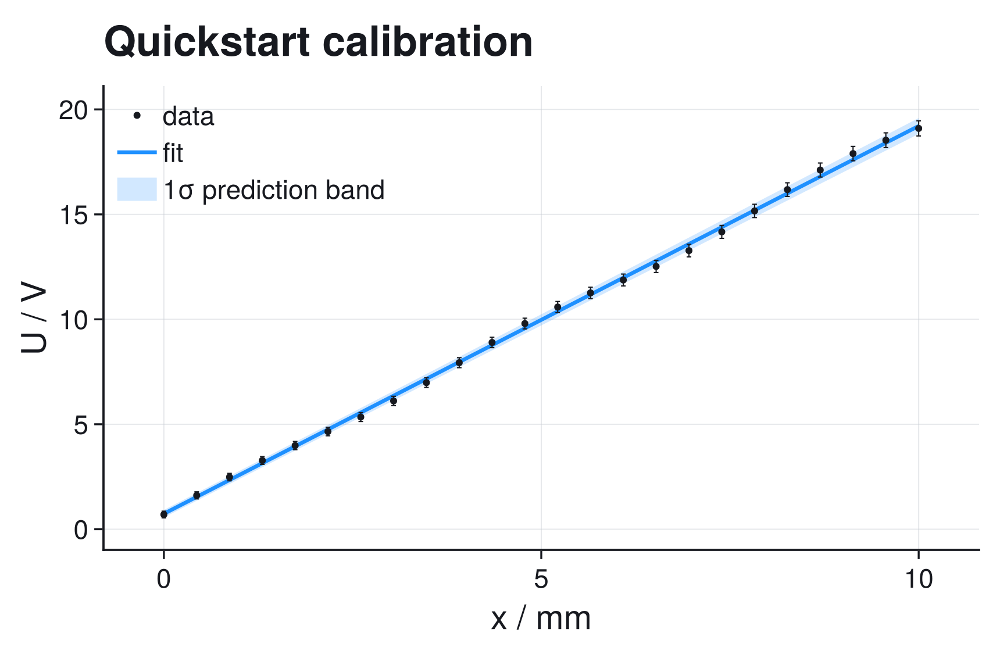
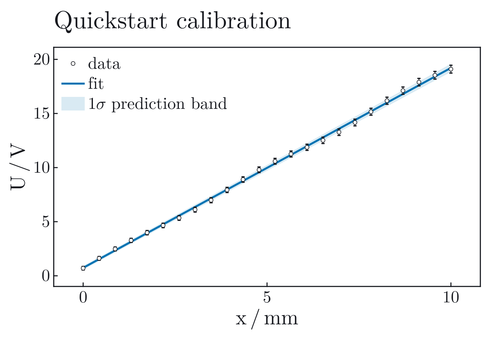

# Plotting And Customization

ScientificFitting's plotting layer is an optional CairoMakie extension:
fitting, reporting, diagnostics, profiles, and contours work without Makie;
loading `CairoMakie` adds the visual interface. A plot reads an existing fit
result and never changes the numerical analysis.

## The Short Path

`fitplot` combines fitting and plotting for notebook work:

```julia
using ScientificFitting
using CairoMakie

out = fitplot(
    model,
    x,
    y;
    p0=[1.0, 0.0],
    sigma_y=sigma_y,
    xlabel="position",
    xunit="mm",
    ylabel="voltage",
    yunit="V",
    show_panel=true,
)

result = out.result
fig = out.figure
```

All `fitplot` methods return the named tuple `(result, figure)`.

When an x-y `FitResult` already exists, `plot_fit(result)` returns a Makie
`Figure` without rerunning the optimizer:

```julia
fig = plot_fit(result; title="Sensor calibration")
```

## Reusable Styles

`FitPlotStyle` collects the visual tokens shared by every plot function. Each
field overrides the corresponding token of the selected `theme` preset;
`nothing` keeps the theme value. One style object works for `plot_fit`,
`fitplot`, and all diagnostic plot functions via their `style` keyword.
Content and layout choices (labels, panels, legends) remain per-function
keywords; Makie-level details go through the `*_kwargs` arguments below.

The tokens are `figure_size`, `panel_gap`, `data_color`, `data_marker`,
`data_markersize`, `data_strokecolor`, `data_strokewidth`, `fit_color`,
`fit_linewidth`, `band_color`, `band_alpha`, `xerr_color`, `yerr_color`,
`error_linewidth`, `error_whiskerwidth`, `secondary_color`,
`reference_color`, `stats_fontsize`, `stats_box_color`, `stats_box_alpha`,
`stats_box_strokecolor`, and `stats_box_strokewidth`.

```julia
project_style = FitPlotStyle(
    fit_color=:firebrick,
    band_alpha=0.25,
    data_markersize=7.0,
)

fig = plot_fit(result; style=project_style)
res_fig = plot_residuals(result; style=project_style)
```

## Reports, Legends, And Panels

Report, panel, and legend are independent switches:

- `show_panel=true` includes the numerical result panel in the figure;
- `print_report=true` prints `report_text(result)` to the terminal;
- `show_legend=true` controls the legend independently.

Both `fitplot` and `plot_fit` default to `show_panel=true`; only `fitplot`
has `print_report`, since `plot_fit` never prints.

```julia
plot_fit(
    result;
    show_panel=true,
    stats_position=:right,   # or :inside
    show_legend=true,
    stats_mode=:compact,     # or :full
)
```

With `stats_position=:right`, the legend sits above the parameter summary in
the same left-aligned panel; with `stats_position=:inside`, `legend_position`
and `inside_stats_position` set the in-axis locations. `show_panel=false`
removes the panel.

The `:sans` theme preset (the default; see Two Visual Styles below) uses a
`(1040, 640)` logical-pixel canvas with a right-side panel and `(860, 560)`
without one; `:tex` uses `(1000, 640)` and `(760, 520)`.
`style=FitPlotStyle(figure_size=(width, height))` requests a minimum logical
canvas: a request too small for the measured legends, labels, and panel
content grows rather than clips, and extra width goes to the flexible data
axis once the panel has its natural width.

`stats_panel_width=:auto` uses that natural width; a value above 1 sets the
preferred wrapping width in logical pixels, and a value in (0, 1] is a
fraction of the figure width, clamped to 300–560 px. Legends and unbreakable
TeX expressions may widen the panel.

## Two Visual Styles

A theme describes visual properties only; it never changes data, fit,
uncertainty band, statistics, or whether a panel is present. Warning labels
on diagnostic figures are controlled separately through the diagnostic plot
functions' `panel_status_mode` keyword (`:issues`, `:all`, or `:none`; see
[the diagnostics API](api_plotting_diagnostics.md)).

- `theme=:sans` is the default: sans-serif type, neutral filled
  observations, a saturated blue fit, visible grid guides, open axes (no top
  or right frame line), and a left-aligned title.
- `theme=:tex` differs from `:sans` only in the following: TeX typography, a
  full axis frame with inward ticks and no grid, hollow observations, and
  the blue/vermillion pair from the Okabe-Ito palette (designed to stay
  distinguishable in print and for color-vision deficiency) when multiple
  curves require color.

```@raw html
<div class="scientificfitting-gallery-grid scientificfitting-style-grid">
<div class="scientificfitting-gallery-item"><div><h3>sans</h3><p>Sans-serif typography, open axes, filled observations, and light grid guides.</p></div></div>
<div class="scientificfitting-gallery-item"><div><h3>tex</h3><p>TeX typography, a full frame, inward ticks, hollow observations, and no grid.</p></div></div>
</div>
```

Color appearance is independent of style:

```julia
plot_fit(result; theme=:sans, appearance=:dark)
```

`appearance=:auto` currently resolves to the light appearance; select
`:light` or `:dark` explicitly when an exported asset must match a document.

LaTeX conversion is also independent:

```julia
using LaTeXStrings

plot_fit(
    result;
    theme=:tex,
    latex_labels=true,
    latex_stats=true,
    model_label=L"U_0(\nu)=h\nu/e-\Phi/e",
    xlabel=L"\nu",
    xunit=L"\mathrm{THz}",
)
```

Under TeX typography alone (`latex_labels=false`), plain strings are passed
through unchanged. With `latex_labels=true`, a plain string containing `\`,
`^`, or `_` is interpreted as TeX math; other strings render as upright
text. Pass a `LaTeXString`, such as `L"\nu"`, whenever a label contains
mathematical symbols, to make the intent explicit.

`latex_stats=true` applies to the structured right-side panel only; the
in-axis text box renders plain text, and combining `latex_stats=true` with
`stats_position=:inside` raises an `ArgumentError`.

Use `:sans` and `:tex` in new code. The former screen-oriented names
`:analysis`, `:presentation`, `:screen`, `:lab`, `:workbench`, `:modern`,
`:clean`, `:minimal`, and `:showcase` resolve to `:sans`; `:article`,
`:publication`, `:paper`, and `:latex` resolve to `:tex`.

## Figure Size Is Not Resolution

Makie interprets `Figure(size=(width, height))` as a logical canvas in
CSS-like pixels: enlarging it for a sharper PNG makes the plot physically
larger, and every label shrinks when a document scales it back down. Keep the
intended display size and set raster density when saving:

```julia
fig = plot_fit(result; style=FitPlotStyle(figure_size=(1200, 600)))
save("fit.png", fig; px_per_unit=2)  # sharper raster, unchanged layout
save("fit.svg", fig)                 # vector output for scalable documents
```

## State What The Band Means

`plot_fit` defaults to a one-sigma confidence band:

- `band=:confidence` propagates the local parameter covariance to the fitted
  mean curve;
- `band=:prediction` adds the observation uncertainty in y and the x
  uncertainty converted to y through the local model slope (contribution
  ``(\sigma_x\,|df/dx|)^2``; see
  [Uncertainty In X](statistics.md#Uncertainty-In-X)), answering where a new
  measurement may land;
- `band=:none` hides the band;
- `nsigma` multiplies the displayed standard-deviation scale.

Both bands are pointwise intervals under approximate normality — at
`nsigma=1`, a 68.27% interval at each x — not simultaneous bands for the
whole curve.

```julia
plot_fit(
    result;
    band=:prediction,
    nsigma=2,
    band_label="2-sigma prediction band",
    show_legend=true,
)
```

The band comes from
[local covariance propagation](statistics.md#Local-Parameter-Covariance), so
the nominal coverage (95.45% at `nsigma=2`) holds only approximately for a
nonlinear, bounded, or non-Gaussian fit; for asymmetric profiles or
non-elliptic contours, report
[profile-based intervals](statistics.md#Profiles-And-Contours) instead.

A matrix-free [`WhiteningOperator`](@ref) (a covariance supplied as an
operator instead of a matrix; see
[Structured Whitening](statistics.md#Structured-Whitening)) must provide
per-point standard deviations via its `marginal_sigma` field before
`band=:prediction` can draw pointwise observation uncertainty; without it,
use `band=:confidence`.

## Model Range And Automatic Limits

`fit_range=:data` (the default) stops the drawn model at the first and last
measured x: extrapolation beyond the data is a statement the analyst makes
explicitly, not a display default. `fit_range=:axis` draws to the padded x
limits, keeping interpolation and modest extrapolation visually continuous
with the axis:

```julia
plot_fit(result; fit_range=:axis)             # extend to the padded axis range
plot_fit(result; xgrid=collect(0.0:0.01:8.0)) # exact requested domain
```

With `auto_limits=true`, the limit calculation includes data, x/y error bars,
the sampled model curve, and the selected band; `limit_padding` controls the
fractional breathing room. With `auto_limits=false` and manual Makie limits
that extend the model domain, pass a matching `xgrid`; the plotting layer
does not infer a new sampling grid from Makie axis attributes.

`plot_aspect` fixes the axis width-to-height ratio (Makie `AxisAspect`;
`plot_aspect=1` gives a square axis). Leave it unset unless equal or
prescribed axis geometry carries scientific meaning.

## Customize Through Makie, Not Around It

The style supplies defaults, explicit ScientificFitting keywords override
them, and each Makie `*_kwargs` container is applied last:

```julia
fig = plot_fit(
    result;
    theme=:sans,
    style=FitPlotStyle(fit_color=:navy),
    axis_kwargs=(
        xgridvisible=false,
        ygridvisible=false,
    ),
    line_kwargs=(
        linestyle=:dash,
        linewidth=3.0,
    ),
    scatter_kwargs=(
        marker=:utriangle,
        markersize=9,
    ),
    band_kwargs=(color=(:steelblue, 0.18),),
)
```

`axis_kwargs`, `line_kwargs`, `scatter_kwargs`, `band_kwargs`,
`xerrorbars_kwargs`, `yerrorbars_kwargs`, and `legend_kwargs` accept a
`NamedTuple` or dictionary of ordinary Makie attributes. `theme_override`
merges a Makie `Theme` into the selected ScientificFitting theme for a
project-wide font or axis convention.

## Add Scientific Objects After Fitting

Retrieve the data axis from a finished figure and add annotations without
recomputing the fit:

```julia
fig = plot_fit(result; theme=:sans, show_legend=false)
ax = fit_axis(fig)
colors = plot_palette(:sans)

add_vband!(ax, 2.8, 3.2; color=(colors.band_color, 0.16), label="accepted range")
add_vline!(ax, 3.0; color=colors.fit_color, linestyle=:dash, label="threshold")
add_curve!(ax, x -> reference_model(x); color=:gray35, label="reference")
add_points!(ax, derived_x, derived_y; marker=:star5, color=:black, label="derived value")

axislegend(ax; position=:rt)
```

`add_curve!` samples a function on an explicit `xgrid`, an `xspan`, or the
axis's current x limits. `add_vband!` and `add_hband!` cover the full
orthogonal axis without enlarging its automatic data limits, so they can be
added before or after the first render. All helpers return the created Makie
plot object and accept ordinary Makie attributes.

A right-side legend created by `plot_fit` reflects the plot objects existing
at construction time; for layers added later, use an in-axis `axislegend` as
above or build a custom panel after all plot objects exist.

## Compose A Custom Multi-Panel Figure

`plot_theme`, `plot_palette`, and `plot_info_panel!` expose the same visual
contract for a figure whose scientific layout is not a single fit axis:

```julia
theme = plot_theme(:sans; appearance=:light)
colors = plot_palette(:sans; appearance=:light)

fig = with_theme(theme) do
    fig = Figure(size=(1200, 720))
    ax = Axis(fig[1, 1]; xlabel="time / s", ylabel="signal / V")
    colsize!(fig.layout, 1, Auto(1)) # optional relative weight during measurement

    data_plot = scatter!(ax, x, y; color=colors.data_color)
    fit_plot = lines!(ax, xgrid, yfit; color=colors.fit_color)

    plot_info_panel!(
        fig[1, 2];
        theme=:sans,
        appearance=:light,
        legend_plots=[data_plot, fit_plot],
        legend_labels=["data", "fit"],
        model_label="damped oscillator",
        parameter_lines=["A = ...", "lambda = ..."],
        statistic_lines=["chi2/ndf = ..."],
    )
    resize_plot_to_layout!(
        fig;
        minimum_axis_size=(420, nothing),
    )
    fig
end
```

The panel reports its natural width and height to Makie's `GridLayout`;
`width=...` wraps plain-text lines, while unbreakable TeX keeps its natural
width. Call `resize_plot_to_layout!` once after adding every layout block: it
treats the current canvas as a minimum and temporarily supplies only missing
intrinsic axis dimensions. Afterwards the first `Auto` column consumes the
remaining width; `flexible_columns=(...)` selects a different top-level graph
column. The `nothing` height above suits stacked plots whose row proportions
already define the vertical hierarchy.

## Diagnostic Figures

Diagnostic plots — `plot_residuals`, `plot_diagnostics`, `plot_profile`,
`plot_contour`, and `plot_profile_matrix` — use the same `theme` and
`appearance` contract; the
[Choose A Figure](api_plotting_diagnostics.md#Choose-A-Figure) table lists
which figure answers which question.

Single-profile and contour legends default to `legend_position=:below`,
keeping the full content width even when confidence labels are descriptive;
set `legend_position=:right` for a bounded side column, or pass
`legend_kwargs` for Makie-level control.

Profile matrices can be computed without Makie in a headless job and rendered
later without repeating any refits:

```julia
matrix = profile_matrix(
    result;
    parameters=[1, 2, 3],
    parameter_names=["A", "lambda", "offset"],
    adaptive=true,
)

using CairoMakie
fig = plot_profile_matrix(matrix; theme=:tex)
```

Diagonal panels compare actual profiles with local parabolas
([why a profile is not a slice](statistics.md#Why-A-Profile-Is-Not-A-Slice));
the lower triangle compares filled one- and two-sigma profile regions with
dashed local covariance ellipses; the upper triangle reports local
correlations. A warning label, skewed profile, open region, clipped contour,
or disagreement with the local overlay marks the parameter pair that needs
closer analysis.

## Export

Pass a filename directly or save the returned figure with Makie:

```julia
plot_fit(result; filename="fit.pdf", theme=:tex)

fig = plot_fit(result; theme=:sans)
save("fit.svg", fig)
save("fit.png", fig; px_per_unit=2)
```

Use PDF or SVG when editable vector geometry is required and PNG for
notebooks or raster publication pipelines.
