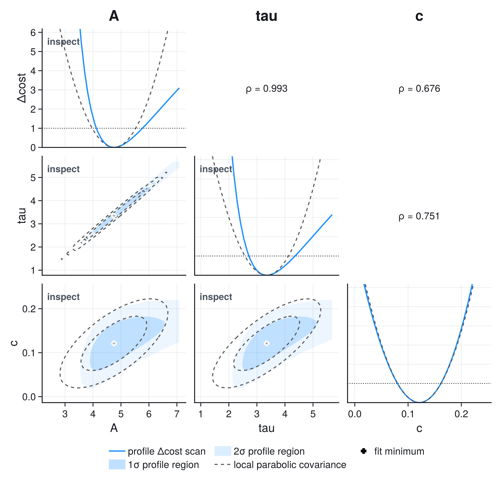
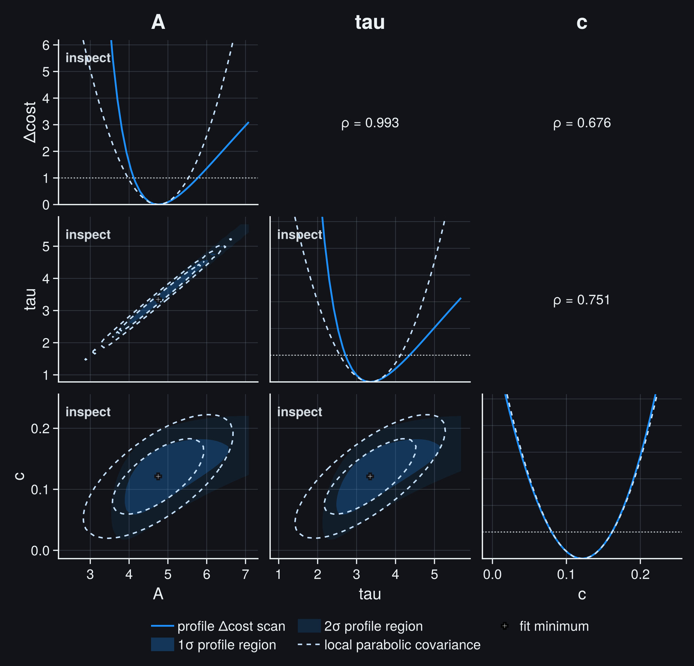
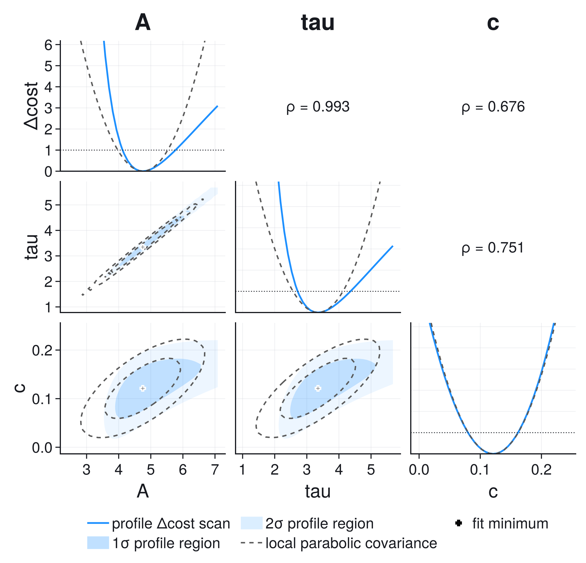
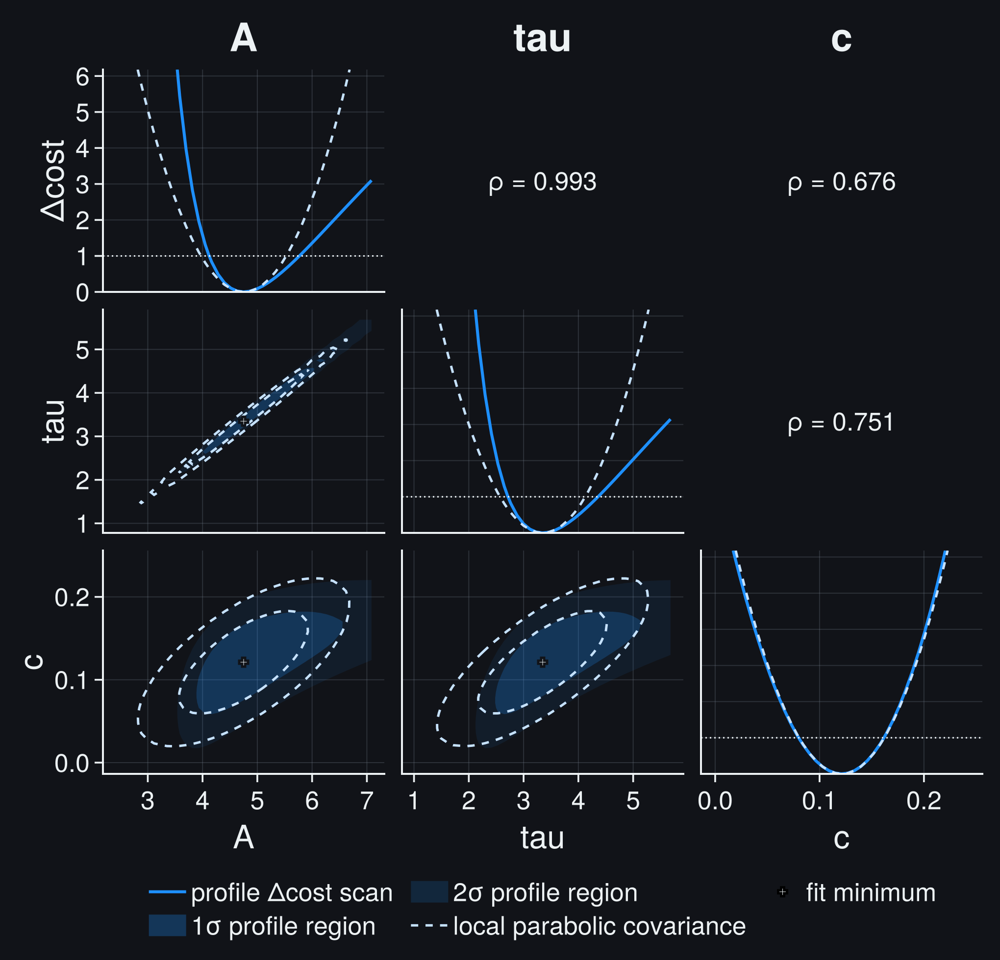
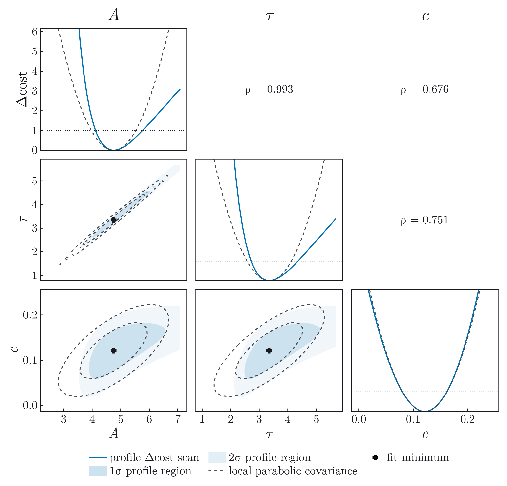
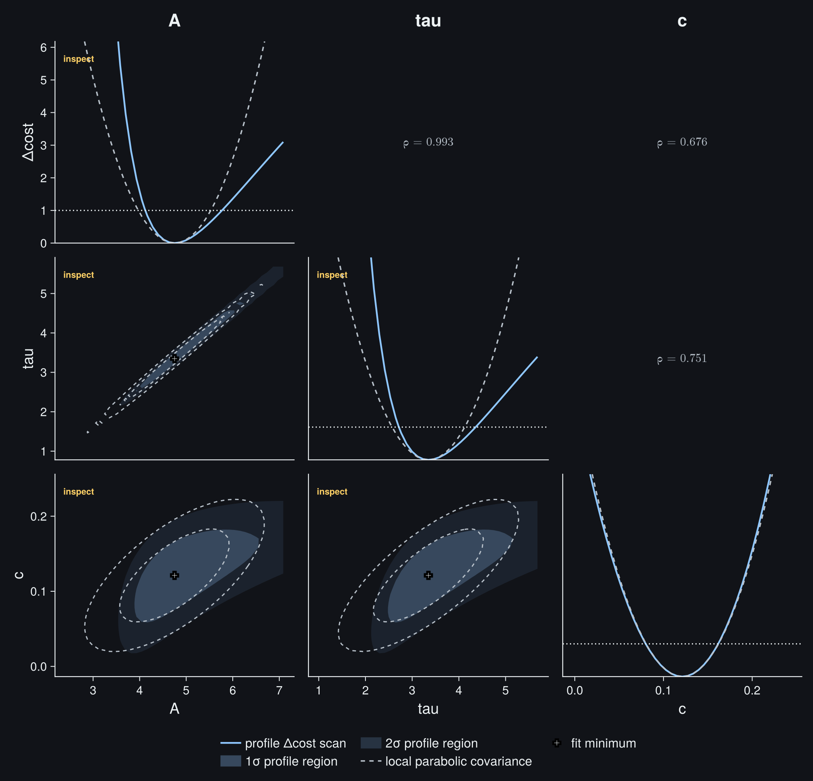

# Profiles And Contours

Local parameter covariance describes the curvature at the fitted minimum. A
profile asks a stronger question: how much worse can the best possible fit
become when one parameter is forced away from that minimum and every nuisance
parameter is allowed to adjust? Contours apply the same construction to two
parameters.

## From A Local Parabola To A Refit

A local covariance assumes a parabolic profile:

```math
\Delta C(\theta_i)
\approx
\left(\frac{\theta_i-\hat\theta_i}{\sigma_i}\right)^2.
```

A profile fixes the parameter of interest and refits every remaining free
parameter:

```math
C_\mathrm{prof}(a)
=
\min_{\theta_{-i}} C(\theta_i=a,\theta_{-i}),
```

```math
\Delta C(a)=C_\mathrm{prof}(a)-C_{\min}.
```

The refit matters. Holding nuisance parameters at their global best-fit values
would produce a slice through the cost surface, usually overstating the
information about ``a``.

### Why A Profile Is Not A Slice

Consider two standardized parameters with a correlated quadratic cost,

```math
\Delta C(a,b)
=
\frac{a^2-2\rho ab+b^2}{1-\rho^2},
\qquad \rho=0.9.
```

The minimum is at ``a=b=0``. Now force ``a=1``. Keeping the nuisance parameter
at its global best-fit value gives the vertical slice

```math
\Delta C(1,0)=\frac{1}{1-0.9^2}=5.26.
```

Profiling instead refits ``b``. The best conditional value is
``b=\rho a=0.9``, giving

```math
\Delta C_\mathrm{prof}(1)=\Delta C(1,0.9)=1.
```

| treatment of ``b`` | conditional value | ``\Delta C`` at ``a=1`` |
| --- | ---: | ---: |
| frozen at the global minimum | ``0`` | ``5.26`` |
| refitted for the forced value of ``a`` | ``0.9`` | ``1.00`` |

The frozen slice would make ``a=1`` look more than two local standard errors
away. The profile correctly recognizes that the correlated nuisance parameter
can move with ``a``. This adjustment is not an optional numerical trick: it is
the definition of uncertainty in ``a`` when ``b`` is unknown.

For this exactly quadratic example, the profiled curve and the local covariance
parabola agree. Their disagreement in a real fit is therefore useful evidence
of nonlinearity, a bound, weak identification, or another failure of the local
quadratic approximation.

For two parameters, a contour fixes both coordinates and profiles all remaining
nuisance parameters. Under Wilks' large-sample regularity conditions, common
thresholds are:

| nominal Gaussian coverage | one profiled parameter | joint region for two parameters |
| --- | ---: | ---: |
| 68.27% (`1 sigma`) | ``\Delta C=1.00`` | ``\Delta C=2.30`` |
| 95.45% (`2 sigma`) | ``\Delta C=4.00`` | ``\Delta C=6.18`` |

The one-parameter and two-parameter thresholds differ because a joint region
has two dimensions. Reading the ``\Delta C=1`` crossing from a two-dimensional
contour would under-cover.

## Read A Profile Matrix

The profile matrix below puts the three local-versus-profile checks in one
view. It is computed from the same constrained saturation fit used in the
[Constraints and Profiles](gallery/constraints_profiles.md) analysis; changing
the selector in the documentation header changes only the rendering style.

```@raw html






<p class="jufitter-figure-note">Diagonal: refitted one-parameter profiles against the local parabolic approximation. Lower triangle: filled one- and two-sigma profiled regions against dashed local covariance ellipses. Upper triangle: local correlation coefficients.</p>
```

Read it in this order:

1. On the diagonal, compare each refitted profile with its local parabola. A
   skewed crossing implies asymmetric profile errors.
2. In the lower triangle, compare the filled profiled region with the dashed
   covariance ellipse. Bending or a displaced boundary means the local ellipse
   is not an adequate uncertainty summary at that coverage.
3. Use the upper-triangle correlation as a pointer, not a verdict. A large
   correlation identifies a pair worth checking; only the profiled geometry
   shows how the cost behaves away from the minimum.

## What To Inspect

Use profile geometry to answer concrete questions:

- Does the profile follow the local parabola near the interval boundary?
- Are the upper and lower errors asymmetric?
- Does a bound clip one side?
- Does the scan reveal a second minimum or a flat direction?
- Do joint contours bend away from the local covariance ellipse?
- Did every nuisance-parameter refit converge and bracket the requested level?

Wilks thresholds are asymptotic, not universal truth. Small samples, discrete
data, parameters on boundaries, unidentified nuisance parameters, and weak
signals can invalidate nominal coverage. In critical analyses, calibrate the
likelihood-ratio statistic with simulation or use a problem-specific exact
construction.

## JuFitter Workflow

Compute profiles and contours from the fitted result so every scan reuses the
same normalized problem:

```julia
interval = profile_interval(result, 1; threshold=1.0)
pair = JuFitter.contour(result, 1, 2; levels=[2.30, 6.18], adaptive=true)
matrix = profile_matrix(result; parameters=[1, 2, 3], adaptive=true)

profile_findings = diagnose(interval.profile_result)
pair_findings = diagnose(pair; local_covariance=result.param_covariance[[1, 2], [1, 2]])
panels_to_review = profile_matrix_triage(matrix)
```

The numerical scan is independent of Makie. Load CairoMakie only when a figure
is needed:

```julia
using CairoMakie

profile_fig = plot_profile(interval.profile_result; local_sigma=result.param_stderr[1])
contour_fig = plot_contour(pair; local_covariance=result.param_covariance[[1, 2], [1, 2]])
matrix_fig = plot_profile_matrix(matrix; theme=:article)
```

The executable [Constraints and Profiles](gallery/constraints_profiles.md)
example shows the complete fit, asymmetric interval, two-parameter contour,
matrix, diagnostics, and interpretation. Return to
[Parameters and Fit Quality](parameter_inference.md) for the local
covariance approximation these scans are testing.
