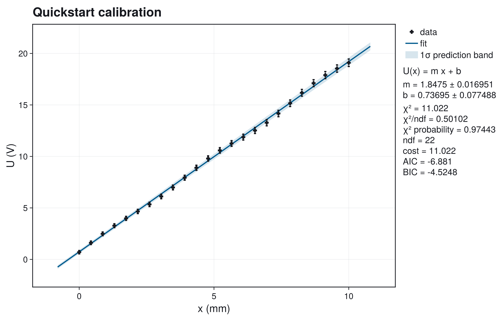
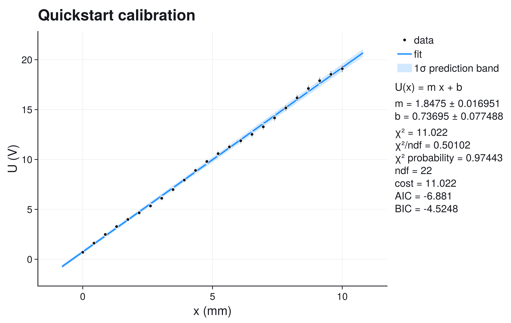
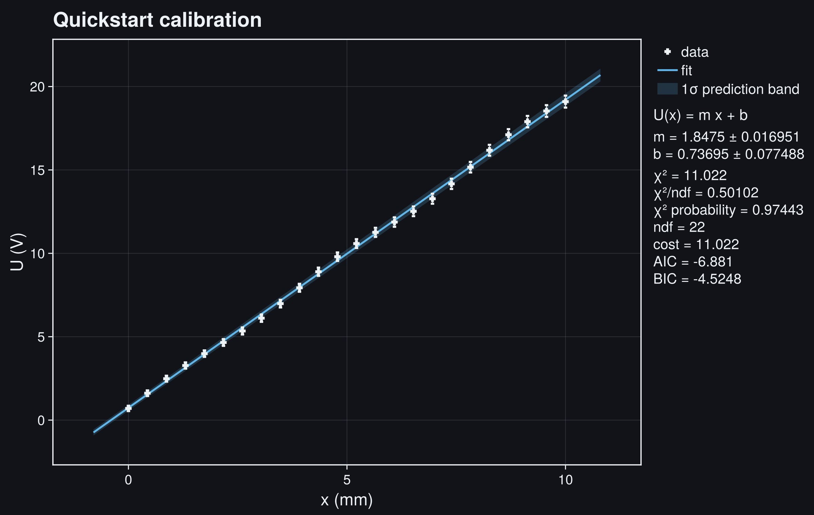
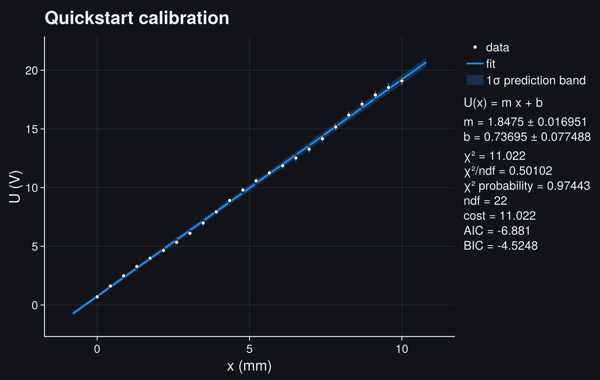
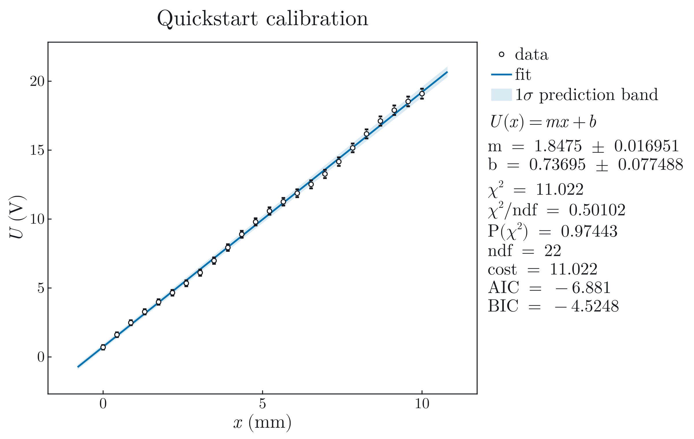
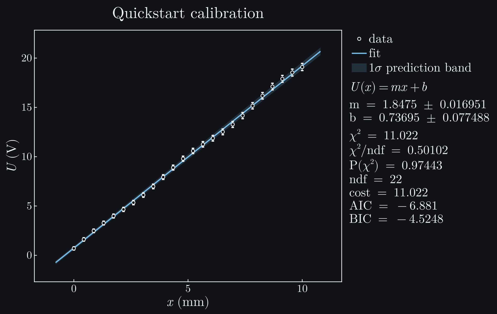

# Quickstart

This page is the first complete JuFitter workflow. It is deliberately small, but
it still follows the same logic as a real analysis:

1. define the measured quantities and uncertainties,
2. choose a model,
3. fit,
4. inspect the result,
5. decide whether the result is trustworthy enough to use.

The data below are controlled rather than archival measurements. Their smooth
residual pattern is intentional: the first fit should teach both the convenient
path and the fact that a good-looking line can still need review. Real workflows
start in the [Gallery](gallery.md).

## Question

A sensor voltage ``U`` should be approximately linear in an input position ``x``.
We want the calibration slope and offset, including uncertainties, and a plot
that already shows whether the fit is plausible.

## Data

We have three arrays:

- `x`: measured input values,
- `y`: measured sensor output,
- `sigma_y`: one-standard-deviation uncertainty of each output value.

The uncertainties are slightly larger at large ``x``. Here they represent
pointwise repeatability of the voltage reading after range-dependent noise has
been characterized. A shared gain uncertainty would instead correlate points
and should not be encoded as independent `sigma_y` values.

## Model

The first model is a straight line:

```math
U(x) = m x + b.
```

For independent Gaussian y uncertainties, JuFitter minimizes

```math
\chi^2(m,b)
=
\sum_i
\left(
\frac{U_i-(m x_i+b)}{\sigma_{U,i}}
\right)^2.
```

This is the standard weighted least-squares model. It is appropriate only if
the uncertainties are meaningful standard deviations and the residuals are
roughly Gaussian and structureless.

## Complete Code

Run this from the repository root or from any Julia project where JuFitter is
available:

```julia
using JuFitter
using CairoMakie

# Measured calibration points. sigma_y is the one-standard-deviation
# uncertainty of each voltage reading.
x = [0.0, 0.4348, 0.8696, 1.3043, 1.7391, 2.1739, 2.6087, 3.0435,
     3.4783, 3.9130, 4.3478, 4.7826, 5.2174, 5.6522, 6.0870, 6.5217,
     6.9565, 7.3913, 7.8261, 8.2609, 8.6957, 9.1304, 9.5652, 10.0]
y = [0.7000, 1.6125, 2.4832, 3.2749, 3.9858, 4.6545, 5.3439, 6.1123,
     6.9838, 7.9338, 8.8975, 9.7983, 10.5849, 11.2581, 11.8738,
     12.5193, 13.2732, 14.1663, 15.1641, 16.1797, 17.1125, 17.8965,
     18.5336, 19.0964]
sigma_y = [0.1600, 0.1687, 0.1774, 0.1861, 0.1948, 0.2035, 0.2122,
           0.2209, 0.2296, 0.2383, 0.2470, 0.2557, 0.2643, 0.2730,
           0.2817, 0.2904, 0.2991, 0.3078, 0.3165, 0.3252, 0.3339,
           0.3426, 0.3513, 0.3600]

fit = fitplot(
    x,
    y;
    sigma_y=sigma_y,
    title="Quickstart calibration",
    model_label="U(x) = m x + b",
    xlabel="x",
    xunit="mm",
    ylabel="U",
    yunit="V",
    parameter_names=["m", "b"],
    band=:prediction,
    nsigma=1,
    band_label="1σ prediction band",
    show_legend=true,
    report=:both,
    filename="quickstart_linear.pdf",
)

result = fit.result

println()
println(diagnostic_dashboard_text(result))
```

```@raw html
<div class="jufitter-cell-output">
<div class="jufitter-cell-output-label">Real output (abridged)</div>
<pre>Fit report
backend = lsqfit
converged = true
iterations = unavailable
message = Converged with LsqFit

Parameters:
  m = 1.84747 +/- 0.0169514
  b = 0.736949 +/- 0.0774882

Statistics:
  cost = chi2
  cost_min = 11.0224
  minus2loglik_min = -10.881
  chi2 = 11.0224
  ndf = 22
  chi2/ndf = 0.501018
  pvalue = 0.974428
  AIC = -6.88096
  BIC = -4.52485

Fit diagnostic dashboard
status = review - inspect diagnostics
critical = 0, warning = 1, info = 0
1 warning(s). Inspect before trusting uncertainties or conclusions.

Next actions:
  1. Use a covariance model, inspect acquisition order/time dependence, or fit a model with the missing systematic component.</pre>
</div>
```

```@raw html






```

`report=:both` puts the numerical summary beside the axes and prints the same
real report to the terminal. Set it to `:plot`, `:console`, or `:none` when only
one output is wanted. The returned `fit.figure` is an ordinary Makie figure.

`fitplot(x, y; sigma_y=...)` uses a straight-line model by default. If you want
to make the model explicit, use:

```julia
model(x, p) = @. p[1] * x + p[2]
result = fit_model(model, x, y; p0=[1.0, 0.0], sigma_y=sigma_y)
```

The explicit form is preferred once the model is not a straight line.

## What The Plot Means

The selected plot style changes typography and visual hierarchy, not the data,
fit, band, or reported numbers. The plot contains:

- measured data points,
- y error bars from `sigma_y`,
- the fitted line,
- a **1σ prediction band**,
- a report panel with fitted parameters and fit statistics.

A prediction band is wider than a confidence band for the mean curve. It asks:
where would a new measurement plausibly land, given the fitted model and the
measurement uncertainty?

If you want only the uncertainty of the fitted mean curve, use
`band=:confidence`.

## Interpreting The Result

The fitted calibration coefficients are

```math
m = (1.8475 \pm 0.0170)\,\mathrm{V\,mm^{-1}},
\qquad
b = (0.7369 \pm 0.0775)\,\mathrm{V}.
```

These are local one-standard-deviation errors from the parameter covariance.
They describe the stated independent-Gaussian model; they do not include an
unmodelled shared calibration uncertainty or residual correlation.

The most important fields are:

- `result.params`: best-fit parameter values.
- `result.param_stderr`: local one-standard-deviation parameter errors.
- `result.param_covariance`: local parameter covariance matrix.
- `result.stats.chi2`: weighted residual sum of squares.
- `result.stats.chi2_ndf`: chi-square divided by degrees of freedom.
- `result.stats.pvalue`: goodness-of-fit probability under the stated Gaussian
  assumptions.

As a rule of thumb, ``\chi^2/\mathrm{ndf}`` should be near one when the model and
uncertainties are both plausible. Much larger values usually mean missing model
structure, underestimated uncertainties, outliers, or wrong correlations. Much
smaller values can mean overestimated uncertainties or non-independent data.

Here ``\chi^2/\mathrm{ndf}=0.50`` and ``p=0.974`` are not evidence of an
exceptionally accurate calibration. Together with the smooth residual pattern,
they suggest that the pointwise errors are conservative, correlated, or both.
The numerical coefficients are useful for continuing the analysis, but the
uncertainty model needs review before they become a final calibration result.

The report also exposes normalized likelihood and information-criterion fields
for later model comparisons. `minus2loglik_min` includes the Gaussian
normalization and may be negative; its absolute value is not a goodness-of-fit
score. AIC and BIC likewise have no useful absolute target. Compare them only
between candidate models fitted to the same observations with the same
likelihood definition.

## First Diagnosis

`diagnostic_dashboard(result)` summarizes the first things to inspect:

```julia
dashboard = diagnostic_dashboard(result)
```

The report prints reader-facing status labels:

- `ok - no immediate issue`: no major issue found by the current checks,
- `review - inspect diagnostics`: warnings exist; inspect before using the
  result,
- `critical - fix before use`: at least one critical issue exists and must be
  fixed before the result is used for conclusions.

For this controlled example, `review - inspect diagnostics` follows directly
from the low chi-square and smooth residual pattern. The next action is therefore
to inspect acquisition order and replace the independent-error model if a shared
or time-correlated component is physically justified.

The dashboard does not prove the model is true. It only catches common failure
modes quickly: bad goodness-of-fit, active bounds, ill-conditioned covariance,
large pulls, structured residuals, strong parameter correlations, and failed
optimizer convergence.

## What Can Go Wrong

A straight-line calibration can look visually acceptable and still be wrong.
Inspect the fit more carefully if:

- residuals curve systematically above and below the line,
- the prediction band is much narrower than the observed scatter,
- ``\chi^2/\mathrm{ndf}`` is far from one,
- the p-value is extremely small or extremely close to one,
- parameters are strongly correlated,
- one or two points dominate the result.

If the model is nonlinear, bounded, or weakly constrained, local symmetric
errors may be misleading. Use profile intervals and contours:

```julia
prof = profile(result, 1; adaptive=true)
interval = profile_interval(result, 1)
cont = contour(result, 1, 2; adaptive=true)
```

## Next Steps

- See [Linear Calibration](gallery/linear_calibration.md) for the same workflow
  as a polished gallery example with generated light/dark plots.
- See [How JuFitter Works](how_jufitter_works.md) for the object flow behind
  the one-line interface.
- See [Fitting for Practitioners](fitting_for_practitioners.md) for practical
  troubleshooting rules.
- See [Statistical Foundations](statistical_foundations.md) for the mathematical
  justification of chi-square, likelihoods, covariance, profiles, and contours.
