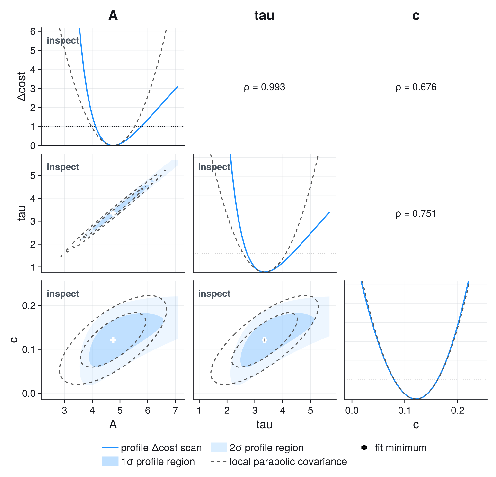
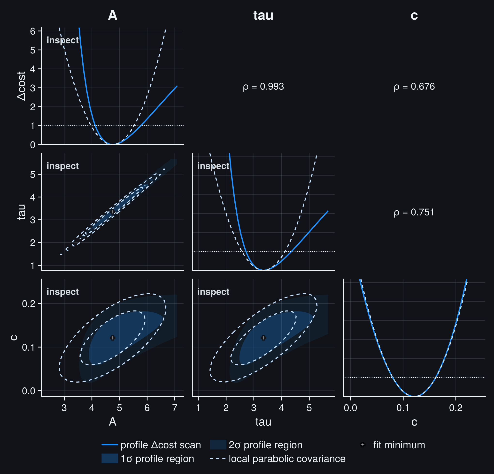

# Statistical Foundations

Fitting is not primarily an optimization problem. The optimizer finds a
minimum; the probability model determines what that minimum means. This chapter
derives the statistical quantities used by JuFitter, states their assumptions,
and explains what should be checked before a result is reported.

## Reading Paths

You do not need every section for every fit.

| Your data | Start here | Continue with |
| --- | --- | --- |
| measured values with known standard uncertainties | [Gaussian least squares](#Gaussian-Least-Squares) | [goodness of fit](#Goodness-Of-Fit) |
| correlated measurements or long time series | [covariance and whitening](#Correlated-Measurements-And-Whitening) | [structured whitening](#Structured-Whitening) |
| uncertainty in both x and y | [x uncertainty](#Uncertainty-In-X) | [parameter-dependent covariance](#Parameter-Dependent-Covariance) |
| detector counts or histogram bins | [Poisson counts](#Poisson-Counts-And-Histograms) | [Poisson deviance](#Poisson-Deviance) |
| individual, unbinned observations | [unbinned likelihoods](#Unbinned-And-Extended-Likelihoods) | [goodness-of-fit limits](#When-A-P-Value-Is-Not-Available) |
| nonlinear or weakly constrained parameters | [local covariance](#Local-Parameter-Covariance) | [profiles and contours](#Profiles-And-Contours) |
| competing models | [AIC and BIC](#Model-Comparison-With-AIC-And-BIC) | residual and scientific checks |

For operational advice, use [Fitting for Practitioners](fitting_for_practitioners.md).
For complete executable analyses, use the [Gallery](gallery.md).

## The Statistical Contract

Every fit combines five distinct objects:

```@raw html
<div class="jufitter-flow">
  <div class="jufitter-flow-step"><strong>Observations</strong><span>What was recorded, and under which sampling process?</span></div>
  <div class="jufitter-flow-step"><strong>Model</strong><span>What mean, density, or event rate does physics predict?</span></div>
  <div class="jufitter-flow-step"><strong>Uncertainty</strong><span>Which fluctuations are independent, correlated, or external?</span></div>
  <div class="jufitter-flow-step"><strong>Cost</strong><span>Which likelihood or quadratic form follows from those assumptions?</span></div>
  <div class="jufitter-flow-step"><strong>Inference</strong><span>Which estimates, intervals, tests, and diagnostics are justified?</span></div>
</div>
```

Changing the optimizer should not change the statistical model. Changing
``\sigma_y`` to a covariance matrix, or a Gaussian cost to a Poisson
likelihood, does.

JuFitter uses the convention

```math
C(\theta) = -2\log L(\theta)
```

for normalized likelihood costs. With this convention, likelihood-ratio
differences, Gaussian chi-square, local curvature, and profile thresholds share
the same scale.

For a static Gaussian covariance, the optimizer may minimize only ``\chi^2``
because the omitted normalization is constant in the parameters. JuFitter keeps
the two quantities separate: `stats.cost_min` is the objective that was
minimized, while `stats.minus2loglik_min` also includes the Gaussian
normalization ``n\log(2\pi)+\log\det V`` and normalized auxiliary terms. They
have the same minimizer only while the covariance is parameter-independent.

## Data, Model, And Residuals

For observations ``d`` and model predictions ``m(\theta)``, the raw residual is

```math
r(\theta)=d-m(\theta).
```

A residual is not yet statistically meaningful. A residual of ``0.2`` may be
tiny for a voltmeter with ``\sigma=1\,\mathrm{V}`` and enormous for one with
``\sigma=1\,\mathrm{mV}``. The uncertainty model supplies that scale.

For independent measurements, the standardized residual or pull is

```math
z_i=\frac{d_i-m_i(\theta)}{\sigma_i}.
```

If the model and uncertainties are correct, these pulls should fluctuate around
zero with a scale near one and no visible structure. At the fitted parameters
they are not independent ``\mathcal N(0,1)`` draws: estimating parameters
projects out fitted directions, and pointwise leverage changes their variance.
A pull plot is therefore a localization tool, not a second chi-square test. A
small total cost cannot replace the pattern check: alternating residuals, long
same-sign runs, or a frequency-dependent drift can reveal model failure even
when one summary number looks acceptable.

## Gaussian Least Squares

Assume each ``d_i`` is an independent Gaussian measurement with known standard
uncertainty ``\sigma_i`` and mean ``m_i(\theta)``. Then

```math
\chi^2(\theta)
=
\sum_{i=1}^{n}
\left(\frac{d_i-m_i(\theta)}{\sigma_i}\right)^2.
```

Each one-sigma residual contributes one unit. For example, pulls
``(1,-1,0.5,-0.5)`` contribute

```math
\chi^2 = 1^2+(-1)^2+0.5^2+(-0.5)^2=2.5.
```

This cost is the right default when:

- the response variable is continuous;
- the quoted uncertainties describe repeated-measurement scatter;
- the Gaussian approximation is reasonable;
- correlations are absent or have already been modeled.

It is not the right default merely because a least-squares solver is
convenient. Sparse counts, censored observations, and strongly non-Gaussian
measurements require a likelihood matching their sampling process.

## Correlated Measurements And Whitening

Let ``V=\operatorname{Cov}(d)`` be the observation covariance. Generalized least
squares uses

```math
\chi^2(\theta)=r(\theta)^T V^{-1}r(\theta).
```

The diagonal entries are variances. Off-diagonal entries describe residual
patterns that tend to move together.

### A Two-Point Example

Take two residuals with equal standard uncertainty ``\sigma`` and correlation
``\rho=0.8``:

```math
V=\sigma^2
\begin{pmatrix}
1 & 0.8\\
0.8 & 1
\end{pmatrix}.
```

Two one-sigma residual patterns then have very different costs:

```math
r_\mathrm{common}=\sigma(1,1)^T,
\qquad
\chi^2_\mathrm{common}=\frac{2}{1+\rho}=1.11,
```

```math
r_\mathrm{opposite}=\sigma(1,-1)^T,
\qquad
\chi^2_\mathrm{opposite}=\frac{2}{1-\rho}=10.
```

A common shift is plausible because the measurements share noise. Opposite
shifts are not. Treating the points as independent would assign ``\chi^2=2`` to
both patterns and therefore misstate both goodness of fit and parameter
uncertainty.

Typical sources of correlation are shared calibration constants, common
background subtraction, baseline drift, and finite-memory electronics. A
global systematic scale uncertainty is often clearer as a nuisance parameter
or external parameter constraint than as an arbitrary short-range covariance.

The representation should follow the mechanism:

| uncertainty source | useful representation |
| --- | --- |
| independent readout scatter | pointwise ``\sigma_i`` |
| repeated samples sharing noise | covariance matrix or whitening operator |
| uncertain calibration constant | fitted nuisance parameter with auxiliary information |
| plausible but unquantified bias | sensitivity analysis, not an invented Gaussian error |

A quantified systematic effect is therefore not automatically an extra number
to attach after the fit. If it moves several observations coherently, encode
that mechanism in the joint model before parameter uncertainties and goodness
of fit are computed. If its size is not probabilistically quantified, vary
defensible alternatives and report the sensitivity instead of hiding a guessed
distribution inside the covariance.

JuFitter never forms ``V^{-1}`` explicitly. Dense covariance is factorized and
applied through triangular solves, which is both more stable and faster than
materializing an inverse.

## Structured Whitening

A whitening operation ``W`` satisfies

```math
W^TW=V^{-1},
\qquad
\chi^2=\lVert Wr\rVert^2.
```

This is the same statistical model in a data structure that can exploit
problem-specific sparsity or recurrences. For an AR(1) residual process with

```math
V_{ij}=\sigma^2\rho^{|i-j|},
```

the interior innovations are proportional to

```math
(Wr)_i=\frac{r_i-\rho r_{i-1}}{\sigma\sqrt{1-\rho^2}}.
```

The operation is ``O(n)`` although the equivalent dense matrix contains
``O(n^2)`` values and its generic factorization costs ``O(n^3)``.

`WhiteningOperator` accepts the whitening operation and ``\log\det V``. The
log determinant does not change a static chi-square minimum, but it is required
for a normalized Gaussian likelihood and comparable information criteria.
The operator represents one complete, static observation covariance. A
parameter-dependent covariance needs a parameter-dependent likelihood path;
one fixed whitening operation and one fixed log determinant cannot describe it.
Before using a custom operator at scale, verify ``\lVert Wr\rVert^2`` and
``\log\det V`` against a small dense reference problem.

## Full Gaussian Likelihood

If

```math
d\sim\mathcal N\!\left(m(\theta),V(\theta)\right),
```

then JuFitter evaluates

```math
C(\theta)
=
n\log(2\pi)
+\log\det V(\theta)
+r(\theta)^T V(\theta)^{-1}r(\theta).
```

If ``V`` is independent of ``\theta``, the first two terms are constant in the
optimization. The full Gaussian ``-2\log L`` cost and chi-square therefore have
the same minimizer, although the normalized likelihood value is needed for
AIC/BIC.

### Parameter-Dependent Covariance

If ``V`` changes with ``\theta``, the determinant term changes the optimum and
must not be dropped. A simple example is a scale model whose uncertainty is
specified as a fraction of its prediction: increasing the prediction increases
both the residual scale and ``\det V``. Keeping only the quadratic residual
term would reward arbitrarily inflated uncertainties.

JuFitter selects `cost=:gaussian_likelihood` for parameter-dependent covariance
when `cost=:auto`. This occurs for effective x-uncertainty propagation and
active model-relative uncertainty components.

## Uncertainty In X

For ``y=f(x,\theta)``, a small perturbation in x changes y by

```math
\delta y \approx \frac{\partial f}{\partial x}\,\delta x.
```

First-order propagation therefore gives

```math
V_\mathrm{eff}(\theta)
=
V_y+J_x(\theta)V_xJ_x(\theta)^T,
```

where ``J_x`` contains ``\partial f(x_i,\theta)/\partial x_i``. For independent
x and y errors,

```math
\sigma_{\mathrm{eff},i}^2(\theta)
=
\sigma_{y,i}^2
+
\left(\frac{\partial f}{\partial x}\right)^2
\sigma_{x,i}^2.
```

JuFitter's pointwise propagation uses the diagonal matrix
``J_x=\operatorname{diag}(\partial f(x_i,\theta)/\partial x_i)``. Correlations
within ``V_x`` are retained, but cross-covariance between measured x and y is
not represented by this approximation.

For a local slope of ``3``, ``\sigma_x=0.2``, and ``\sigma_y=0.4``, the x error
alone contributes ``0.6`` in y units and

```math
\sigma_\mathrm{eff}=\sqrt{0.4^2+0.6^2}=0.72.
```

Because the slope can depend on fitted parameters, so can
``V_\mathrm{eff}``. The full Gaussian likelihood cost is then required.

This method is a local linearization, not a general errors-in-variables model.
It is appropriate for small x errors and smooth, single-valued models. Large x
errors, strong curvature across an error bar, latent true x values, selection
effects, or correlated x-y measurement errors require a more explicit
measurement model.

## External Parameter Information

### Gaussian Parameter Terms

A symmetric Gaussian term centered at ``\mu_j`` with scale ``\tau_j`` adds

```math
\left(\frac{\theta_j-\mu_j}{\tau_j}\right)^2
```

to chi-square. In the normalized ``-2\log L`` convention it contributes

```math
\log(2\pi\tau_j^2)
+
\left(\frac{\theta_j-\mu_j}{\tau_j}\right)^2.
```

`parameter_priors` implements these scalar penalty terms, including a
piecewise scale for asymmetric quoted errors. `parameter_constraints`
implements the correlated multivariate analogue.

For example, an auxiliary calibration ``g=1.00\pm0.05`` contributes

```math
\left(\frac{1.10-1.00}{0.05}\right)^2=4
```

when the joint fit proposes ``g=1.10``. The primary data can still move the
estimate away from the calibration, but they must pay that likelihood cost.
The ``0.05`` is not appended to the final error afterward: ``g`` is fitted
jointly, so its correlation with every scientific parameter propagates through
the fit. If several calibration quantities share a reference, use one
correlated parameter constraint rather than independent scalar terms that count
the common information more than once.

For asymmetric scales ``\tau_-`` and ``\tau_+``, JuFitter uses the continuous,
normalized split-normal cost

```math
C_\mathrm{split}(\theta_j)
=
\log\frac{\pi}{2}
+2\log(\tau_-+\tau_+)
+
\left(\frac{\theta_j-\mu_j}{\tau_{\pm}}\right)^2,
```

where ``\tau_-`` applies below ``\mu_j`` and ``\tau_+`` above it. The shared
normalization is essential: using a different Gaussian normalization on each
side would make the cost discontinuous at the center.

There are two legitimate interpretations, and they should not be mixed
silently:

- **Auxiliary measurement:** a previous calibration measured the parameter.
  The term is part of a joint frequentist likelihood.
- **Prior information:** the term expresses prior belief. The optimum is then a
  penalized or MAP-like estimate, not a pure maximum-likelihood estimate.

JuFitter evaluates the same numerical term in either case; the scientific
interpretation belongs in the analysis. JuFitter does not turn that term into a
full Bayesian posterior or produce Bayesian posterior intervals.

### Fixed Parameters And Bounds

A fixed parameter is removed from the free optimization variables. It is not a
Gaussian term with an extremely small uncertainty. An optional uncertainty on
a `FixedParameter` is report metadata and does not propagate automatically into
the fitted covariance.

A bound defines the allowed parameter space but contributes no smooth penalty.
Local Hessian errors become unreliable near an active bound because the cost
surface is truncated. Use a profile interval and report the bound when it
affects the result.

Nonlinear equality and inequality constraints similarly change the accessible
parameter geometry. They can be scientifically necessary, but standard
unconstrained asymptotic formulas need not remain exact at their boundary.

## Degrees Of Freedom

For a regular Gaussian fit with ``n`` observations, known full-rank covariance,
and ``k`` free parameters,

```math
\mathrm{ndf}=n-k.
```

Fixed parameters do not count toward ``k``. JuFitter treats scalar Gaussian
parameter terms as one auxiliary observation and a correlated constraint on
``q`` parameters as ``q`` auxiliary observations. This is the natural counting
when those terms represent independent calibration measurements. If they are
subjective priors, interpreting the resulting `ndf` as a frequentist degree of
freedom is not justified.

The count ``n-k`` does not by itself prove a chi-square reference distribution.
For a nonlinear model it is the conventional dimension count; the calibration
of ``\chi^2_{\min}`` is generally asymptotic. Rank-deficient covariance,
parameters on boundaries, or a variance model estimated from the same residuals
require a separate derivation or simulation.

For likelihood fits with an explicit goodness-of-fit statistic, Gaussian
auxiliary terms contribute both their quadratic residuals to that statistic and
their dimensions to `ndf`. Counting the calibration observation without its
discrepancy, or vice versa, would produce an internally inconsistent p-value.

When ``\mathrm{ndf}\le 0``, reduced statistics and chi-square p-values are not
meaningful. JuFitter returns `NaN` for them and reports the problem rather than
inventing a number.

## Goodness Of Fit

For a linear Gaussian model with known, full-rank covariance,

```math
\chi^2_{\min} \sim \chi^2_{\mathrm{ndf}}.
```

This result is exact under the linear-model assumptions. For a regular
nonlinear Gaussian model it is an asymptotic approximation. It need not hold
when the covariance was tuned from the same residuals, a bound is active, the
model is weakly identified, or data-dependent filtering changed the sampling
process.

Its mean and standard deviation are

```math
E[\chi^2]=\mathrm{ndf},
\qquad
\operatorname{sd}(\chi^2)=\sqrt{2\,\mathrm{ndf}}.
```

With 28 degrees of freedom, values fluctuate naturally on a scale
``\sqrt{56}=7.5``. The corresponding reduced chi-square has a standard
deviation of about ``\sqrt{2/28}=0.27``. A universal rule such as
``0.9<\chi^2/\mathrm{ndf}<1.1`` would therefore be absurdly strict for a small
dataset and too weak for a very large one.

JuFitter reports the upper-tail p-value

```math
p=P\!\left(\chi^2_{\mathrm{ndf}}\ge\chi^2_\mathrm{observed}\right).
```

It is the probability of obtaining an equal or larger discrepancy under the
stated model and uncertainty assumptions. It is not:

- the probability that the model is true;
- the probability that a parameter lies in an interval;
- a measure of scientific importance;
- proof that residuals are structure-free.

A small p-value can result from a wrong model, underestimated uncertainties,
missing correlation, outliers, or optimizer failure. A very large p-value can
result from overestimated uncertainties, duplicated or correlated data counted
as independent, or data that have been smoothed before fitting. Always inspect
pulls or residuals alongside the scalar test.

## Local Parameter Covariance

For a locally linear least-squares problem with weighted Jacobian ``J_w``,

```math
\operatorname{Cov}(\hat\theta)
\approx
(J_w^T J_w)^{-1}.
```

For a general cost ``C=-2\log L`` with Hessian

```math
H=\nabla^2 C(\hat\theta),
```

the local covariance is

```math
\operatorname{Cov}(\hat\theta)\approx 2H^{-1}.
```

The factor two follows from the ``-2\log L`` convention. These formulas describe
the curvature at one point. They are reliable when the estimator is well
identified, the minimum is interior, and the cost is approximately quadratic
over the reported uncertainty region.

They can fail for weak data, highly nonlinear parameterizations, degeneracies,
multiple minima, active bounds, or asymmetric likelihoods. A negative local
curvature is not an uncertainty. JuFitter marks materially invalid covariance
geometry as critical and returns `NaN` rather than fabricating a zero standard
error.

### Covariance Scaling

When measurement uncertainties are known externally, multiplying the parameter
covariance by ``\chi^2/\mathrm{ndf}`` changes their stated meaning and should not
be automatic. If instead the residual scale is unknown and estimated from the
same data, the classical least-squares estimate includes that factor.

JuFitter makes the policy explicit through
`scale_covariance=:auto | :never | :always`. Report which interpretation was
used; do not rescale merely to make reduced chi-square look closer to one.

## Profiles And Contours

A local covariance assumes a parabolic profile:

```math
\Delta C(\theta_i)
\approx
\left(\frac{\theta_i-\hat\theta_i}{\sigma_i}\right)^2.
```

A profile fixes the parameter of interest and refits every remaining free
parameter:

```math
C_\mathrm{prof}(a)
=
\min_{\theta_{-i}} C(\theta_i=a,\theta_{-i}),
```

```math
\Delta C(a)=C_\mathrm{prof}(a)-C_{\min}.
```

The refit matters. Holding nuisance parameters at their global best-fit values
would produce a slice through the cost surface, usually overstating the
information about ``a``.

For two parameters, a contour fixes both coordinates and profiles all remaining
nuisance parameters. Under Wilks' large-sample regularity conditions, common
thresholds are:

| nominal Gaussian coverage | one profiled parameter | joint region for two parameters |
| --- | ---: | ---: |
| 68.27% (`1 sigma`) | ``\Delta C=1.00`` | ``\Delta C=2.30`` |
| 95.45% (`2 sigma`) | ``\Delta C=4.00`` | ``\Delta C=6.18`` |

The one-parameter and two-parameter thresholds differ because a joint region
has two dimensions. Reading the ``\Delta C=1`` crossing from a two-dimensional
contour would under-cover.

The profile matrix below puts the three local-versus-profile checks in one
view. It is computed from the same constrained saturation fit used in the
[Constraints and Profiles](gallery/constraints_profiles.md) analysis; changing
the selector in the documentation header changes only the rendering style.

```@raw html




<p class="jufitter-figure-note">Diagonal: refitted one-parameter profiles against the local parabolic approximation. Lower triangle: filled one- and two-sigma profiled regions against dashed local covariance ellipses. Upper triangle: local correlation coefficients.</p>
```

Read it in this order:

1. On the diagonal, compare each refitted profile with its local parabola. A
   skewed crossing implies asymmetric profile errors.
2. In the lower triangle, compare the filled profiled region with the dashed
   covariance ellipse. Bending or a displaced boundary means the local ellipse
   is not an adequate uncertainty summary at that coverage.
3. Use the upper-triangle correlation as a pointer, not a verdict. A large
   correlation identifies a pair worth checking; only the profiled geometry
   shows how the cost behaves away from the minimum.

Use profile geometry to answer concrete questions:

- Does the profile follow the local parabola near the interval boundary?
- Are the upper and lower errors asymmetric?
- Does a bound clip one side?
- Does the scan reveal a second minimum or a flat direction?
- Do joint contours bend away from the local covariance ellipse?
- Did every nuisance-parameter refit converge and bracket the requested level?

Wilks thresholds are asymptotic, not universal truth. Small samples, discrete
data, parameters on boundaries, unidentified nuisance parameters, and weak
signals can invalidate nominal coverage. In critical analyses, calibrate the
likelihood-ratio statistic with simulation or use a problem-specific exact
construction.

## Poisson Counts And Histograms

For an observed non-negative integer count ``n_i`` with expected count
``\mu_i(\theta)>0``, the sampling model is

```math
P(n_i\mid\mu_i)
=
e^{-\mu_i}\frac{\mu_i^{n_i}}{n_i!}.
```

JuFitter minimizes the normalized cost

```math
C(\theta)
=
2\sum_i
\left[
\mu_i(\theta)-n_i\log\mu_i(\theta)+\log\Gamma(n_i+1)
\right].
```

The factorial term is constant for optimization but keeps likelihood values and
information criteria on a defined scale.

A zero-count bin is not a zero-uncertainty measurement. If ``n=0`` and
``\mu=0.5``, the bin contributes a finite likelihood cost and a Poisson deviance
of ``1``. The common Gaussian shortcut ``\sigma=\sqrt n`` would instead assign
zero uncertainty and break exactly where the Poisson model is most needed.

For histogram fits, the model must predict the expected count in each bin. A
density should be integrated across the bin:

```math
\mu_i(\theta)
=
N\int_{b_i}^{b_{i+1}} f(x\mid\theta)\,dx.
```

Evaluating a curved density only at the bin center can bias wide or uneven
bins. `fit_histogram_density` performs the bin integrations; use
`fit_histogram_model` when the supplied model already returns expected bin
counts.

### Poisson Deviance

The likelihood-ratio goodness-of-fit statistic against a saturated count model
is

```math
D(\theta)
=
2\sum_i
\left[
\mu_i-n_i+n_i\log\frac{n_i}{\mu_i}
\right],
```

with the logarithmic term defined as zero for ``n_i=0``. JuFitter stores this
deviance in the chi-square-like statistics fields for Poisson and histogram
fits.

Its chi-square calibration is asymptotic. With many very small expected counts,
the reported p-value can be inaccurate even though the Poisson likelihood used
for parameter estimation is correct. Combine sparse bins only when scientifically
defensible, or calibrate the deviance distribution with simulation.

## Unbinned And Extended Likelihoods

For independent observations ``x_1,\ldots,x_n`` from a normalized density
``f(x\mid\theta)``, the unbinned cost is

```math
C(\theta)
=
-2\sum_{i=1}^{n}\log f(x_i\mid\theta).
```

The density must be positive and normalized over the sampling domain. An
unbinned fit preserves positions within bins, but it is not automatically more
correct: detector acceptance, truncation, resolution, and selection must still
appear in ``f``.

If the expected event count also carries information, describe the data as a
Poisson point process with intensity ``\lambda(x\mid\theta)`` and integrated
rate

```math
\Lambda(\theta)=\int_\Omega \lambda(x\mid\theta)\,dx.
```

The extended cost is

```math
C_\mathrm{ext}(\theta)
=
2\Lambda(\theta)
-2\sum_{i=1}^{n}\log\lambda(x_i\mid\theta).
```

`fit_unbinned_model` uses a normalized density. `fit_extended_unbinned_model`
uses an event intensity and numerically integrates it over the declared domain.

### When A P-Value Is Not Available

An unbinned likelihood value is not, by itself, a universal goodness-of-fit
statistic. Its absolute scale depends on the density and measurement units.
JuFitter therefore returns `NaN` rather than inventing chi-square, reduced
chi-square, or a p-value for generic unbinned and extended fits.

Goodness of fit then needs a separate statistic appropriate to the scientific
question: an empirical-CDF test in one dimension, probability-integral-transform
diagnostics, multidimensional simulation checks, or a likelihood-ratio test
against a specified alternative. Parameter estimation and goodness of fit are
related tasks, not the same calculation.

## Model Comparison With AIC And BIC

For ``k`` fitted parameters and maximized normalized likelihood ``L_{\max}``,

```math
\mathrm{AIC}=2k-2\log L_{\max},
```

```math
\mathrm{BIC}=k\log n-2\log L_{\max}.
```

Smaller is preferred within a valid comparison. AIC estimates relative
out-of-sample predictive information loss under its regularity assumptions.
BIC is a large-sample approximation with a stronger complexity penalty and
additional assumptions. Neither is a p-value, proof of a model, or a substitute
for residual inspection.

JuFitter uses its stored observation count `nobs` in the BIC arithmetic;
Gaussian auxiliary dimensions are included in that count. For strongly
correlated data there may be no unique iid-like effective sample size, so a BIC
number can be algebraically defined without having the usual model-selection
interpretation. State what ``n`` means before using BIC as evidence.

Only compare values when all candidates use:

- the same observations and event-selection domain;
- the same likelihood normalization and uncertainty model;
- the same treatment of auxiliary parameter information;
- comparable definitions of ``n`` and free-parameter count ``k``.

Do not compare AIC from a Gaussian fit to AIC from an unnormalized custom cost,
or models fitted to different subsets of data. When Gaussian parameter terms
are interpreted as priors rather than auxiliary observations, ordinary AIC/BIC
no longer have their standard maximum-likelihood interpretation. JuFitter still
reports the arithmetic values from its normalized joint cost; the analyst must
not overstate them.

A lower criterion means only that one candidate is preferred relative to the
others considered. A physically missing model is not rescued because it has the
best AIC in a poor candidate set.

## What JuFitter Reports

The result fields follow these conventions:

| field | meaning |
| --- | --- |
| `stats.cost_min` | minimized selected objective: usually ``\chi^2`` for static Gaussian least squares and ``-2\log L`` for likelihood wrappers |
| `stats.minus2loglik_min` | normalized Gaussian ``-2\log L`` for an x-y `FitResult`; for likelihood/custom results it equals the stored objective and has likelihood meaning only when that objective follows the documented normalization |
| `stats.chi2` | Gaussian chi-square or Poisson deviance; `NaN` when no generic statistic exists |
| `stats.chi2_ndf` | chi-square-like statistic divided by positive ndf |
| `stats.pvalue` | upper-tail chi-square approximation where defined |
| `stats.aic`, `stats.bic` | information criteria from the normalized cost and free-parameter count |
| `param_covariance` | local Jacobian/Hessian approximation |
| `param_stderr` | square roots of valid covariance diagonal entries |

Use `diagnose(result)` or `diagnostic_dashboard(result)` before reporting.
Use `profile`, `profile_interval`, `contour`, or `profile_matrix` when local
quadratic errors are scientifically doubtful.

## Reporting Checklist

A reproducible result should state:

1. The observations, units, and selection or binning rules.
2. The model and physical meaning of every fitted parameter.
3. The uncertainty or likelihood model, including correlations and auxiliary
   parameter information.
4. The minimized cost, number of free parameters, and goodness-of-fit statistic
   only where its reference distribution is justified.
5. Whether covariance errors or profile intervals were reported.
6. Residual, pull, profile, or simulation checks relevant to the model.
7. Active bounds, fixed parameters, failed scans, or approximations that limit
   interpretation.

## Further Reading

- [Particle Data Group: Statistics review](https://pdg.lbl.gov/2025/reviews/rpp2025-rev-statistics.pdf) for likelihood, goodness-of-fit, confidence intervals, nuisance parameters, and asymptotic limits.
- [Baker and Cousins, *Clarification of the use of chi-square and likelihood functions in fits to histograms*](https://doi.org/10.1016/0167-5087(84)90016-4) for Poisson likelihood-ratio fitting.
- [Wilks, *The Large-Sample Distribution of the Likelihood Ratio*](https://doi.org/10.1214/aoms/1177732360) for the theorem behind common profile thresholds.
- [Akaike, *A new look at the statistical model identification*](https://doi.org/10.1109/TAC.1974.1100705) for the information criterion and its predictive interpretation.

Continue with [Fitting for Practitioners](fitting_for_practitioners.md) for a
decision workflow or [Constraints and Profiles](gallery/constraints_profiles.md)
for an executable nonlinear example.
