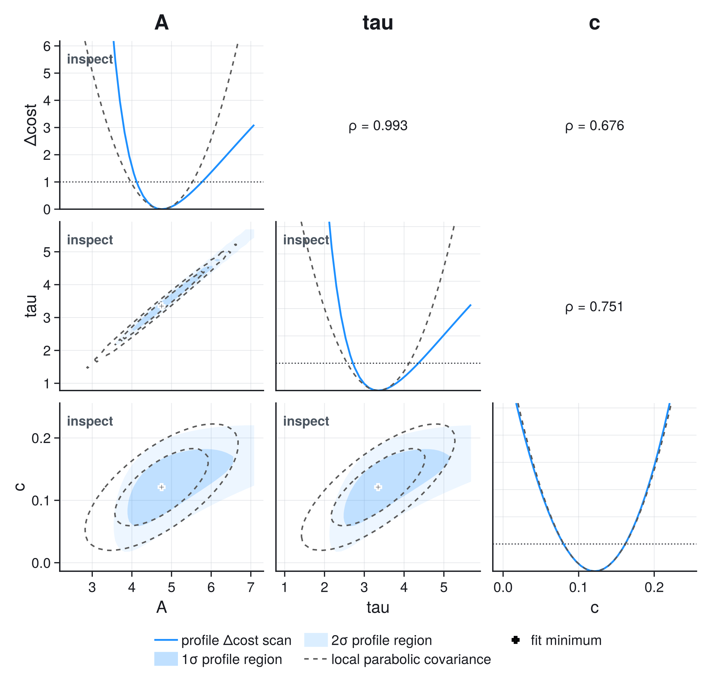

# Statistics Reference

This appendix derives every statistical quantity ScientificFitting computes,
each exactly once, in the order a fit uses them: cost, residuals, Gaussian
models, covariance and whitening, x uncertainty, external parameter
information, degrees of freedom, goodness of fit, local covariance, profiles,
observation likelihoods, and model comparison. Operational advice lives in
[Assessing a Fit](fitting_for_practitioners.md); executable analyses live in
the [Gallery](gallery.md).

## The Cost Convention

ScientificFitting uses

```math
C(\theta) = -2\log L(\theta)
```

for normalized likelihood costs, so likelihood-ratio differences, Gaussian
chi-square, local curvature, and profile thresholds share one scale.

For a static Gaussian covariance the optimizer may minimize only ``\chi^2``,
because the omitted normalization is constant in the parameters. The two
quantities stay separate in the result: `stats.cost_min` is the objective that
was minimized, while `stats.minus2loglik_min` also includes the Gaussian
normalization ``n\log(2\pi)+\log\det V`` and normalized auxiliary terms. They
have the same minimizer only while the covariance is parameter-independent.

## Residuals And Pulls

For observations ``d`` and model predictions ``m(\theta)``, the raw residual is

```math
r(\theta)=d-m(\theta).
```

A residual of ``0.2`` may be tiny for a voltmeter with ``\sigma=1\,\mathrm{V}``
and enormous for one with ``\sigma=1\,\mathrm{mV}``; the uncertainty model
supplies the scale. For independent measurements the standardized residual or
pull is

```math
z_i=\frac{d_i-m_i(\theta)}{\sigma_i}.
```

Under a correct model these fluctuate around zero with scale near one and no
visible structure. At the fitted parameters they are not independent
``\mathcal N(0,1)`` draws: estimating parameters projects out fitted
directions, and pointwise leverage changes their variance. Use pull plots to
localize problems; the goodness-of-fit test is separate. With a non-diagonal
covariance, whitened residual components no longer correspond to individual
data points, so the order- and position-based residual diagnostics apply only
to diagonal covariance.

## Gaussian Least Squares

Start from the measurement equation:

```math
d_i=m_i(\theta)+\epsilon_i,
\qquad
\epsilon_i\sim\mathcal N(0,\sigma_i^2).
```

For independent observations the dataset density is the product of one-point
densities,

```math
L(\theta)
=
\prod_{i=1}^{n}
\frac{1}{\sqrt{2\pi}\,\sigma_i}
\exp\!\left[
-\frac{1}{2}
\left(\frac{d_i-m_i(\theta)}{\sigma_i}\right)^2
\right],
```

and taking ``-2\log`` turns the product into a sum:

```math
-2\log L(\theta)
=
\sum_i \log(2\pi\sigma_i^2)
+
\sum_i
\left(\frac{d_i-m_i(\theta)}{\sigma_i}\right)^2.
```

When the quoted ``\sigma_i`` are known and parameter-independent, the first sum
is constant, so maximizing the likelihood is equivalent to minimizing

```math
\chi^2(\theta)
=
\sum_{i=1}^{n}
\left(\frac{d_i-m_i(\theta)}{\sigma_i}\right)^2.
```

Each one-sigma residual contributes one unit: pulls ``(1,-1,0.5,-0.5)``
contribute ``\chi^2 = 1+1+0.25+0.25=2.5``. Use this cost when the response is
continuous, the quoted uncertainties describe repeated-measurement scatter, the
Gaussian approximation is reasonable, and correlations are absent or already
modeled. Sparse counts, censored observations, and strongly non-Gaussian
measurements need a likelihood matching their sampling process instead.

### Unknown Residual Scale

Without observation uncertainties, ``\sigma`` is itself unknown. ScientificFitting
then profiles it out of the Gaussian likelihood: with
``\hat\sigma^2=\mathrm{RSS}/n``,

```math
-2\log L_{\max}
=
n\left[\log\!\left(2\pi\,\tfrac{\mathrm{RSS}}{n}\right)+1\right],
```

and AIC/BIC count ``\hat\sigma`` as one additional estimated parameter. This
makes model comparison invariant under a change of y units. The parameter
covariance is scaled by ``\chi^2/\mathrm{ndf}`` in the same situation (see
[Covariance Scaling](@ref)).

## Correlated Measurements And Whitening

Let ``V=\operatorname{Cov}(d)``. Generalized least squares uses

```math
\chi^2(\theta)=r(\theta)^T V^{-1}r(\theta).
```

### A Two-Point Example

Two residuals with equal standard uncertainty ``\sigma`` and correlation
``\rho=0.8``:

```math
V=\sigma^2
\begin{pmatrix}
1 & 0.8\\
0.8 & 1
\end{pmatrix},
\qquad
r_\mathrm{common}=\sigma(1,1)^T,\ \
\chi^2_\mathrm{common}=\frac{2}{1+\rho}=1.11,
```

```math
r_\mathrm{opposite}=\sigma(1,-1)^T,
\qquad
\chi^2_\mathrm{opposite}=\frac{2}{1-\rho}=10.
```

A common shift is plausible because the measurements share noise; opposite
shifts are not. Treating the points as independent would assign ``\chi^2=2`` to
both patterns and misstate both goodness of fit and parameter uncertainty.

Choose the representation from the mechanism:

| uncertainty source | useful representation |
| --- | --- |
| independent readout scatter | pointwise ``\sigma_i`` |
| repeated samples sharing noise | covariance matrix or whitening operator |
| uncertain calibration constant | fitted nuisance parameter with auxiliary information |
| plausible but unquantified bias | sensitivity analysis, not an invented Gaussian error |

ScientificFitting never forms ``V^{-1}`` explicitly. For a Cholesky
factorization ``V=LL^T``, define ``z=L^{-1}r``; then

```math
r^T V^{-1}r
=r^T L^{-T}L^{-1}r
=z^Tz.
```

This transformation is **whitening**: it re-expresses the correlated residual
vector in coordinates where, under a correct model, ``z`` has covariance ``I``
and ordinary squared pulls can be summed.

### Structured Whitening

Any operator ``W`` with

```math
W^TW=V^{-1},
\qquad
\chi^2=\lVert Wr\rVert^2
```

implements the same statistical model while exploiting structure. For an AR(1)
residual process with ``V_{ij}=\sigma^2\rho^{|i-j|}``, the interior innovations
are

```math
(Wr)_i=\frac{r_i-\rho r_{i-1}}{\sigma\sqrt{1-\rho^2}},
```

an ``O(n)`` operation although the dense matrix holds ``O(n^2)`` values and its
generic factorization costs ``O(n^3)``. `WhiteningOperator` accepts the
whitening operation and ``\log\det V``; the log determinant does not change a
static chi-square minimum, but a normalized likelihood and comparable
information criteria require it. One fixed operator represents one complete,
static observation covariance; a parameter-dependent covariance needs the
likelihood path below. Verify ``\lVert Wr\rVert^2`` and ``\log\det V`` against
a small dense reference before using a custom operator at scale.

## Full Gaussian Likelihood

If ``d\sim\mathcal N\!\left(m(\theta),V(\theta)\right)``, ScientificFitting
evaluates

```math
C(\theta)
=
n\log(2\pi)
+\log\det V(\theta)
+r(\theta)^T V(\theta)^{-1}r(\theta).
```

If ``V`` is parameter-independent, the first two terms are constant and the
minimizer coincides with least squares. If ``V`` changes with ``\theta``, the
determinant term changes the optimum and must not be dropped: a model whose
uncertainty is a fraction of its prediction would otherwise be rewarded for
inflating its own error bars. `cost=:auto` selects `:gaussian_likelihood`
exactly when the covariance is parameter-dependent — effective x-uncertainty
propagation and active model-relative uncertainty components.

## Uncertainty In X

For ``y=f(x,\theta)``, first-order propagation of x uncertainty gives

```math
V_\mathrm{eff}(\theta)
=
V_y+J_x(\theta)V_xJ_x(\theta)^T,
\qquad
(J_x)_{ii}=\frac{\partial f(x_i,\theta)}{\partial x_i},
```

and for independent x and y errors

```math
\sigma_{\mathrm{eff},i}^2(\theta)
=
\sigma_{y,i}^2
+
\left(\frac{\partial f}{\partial x}\right)^2
\sigma_{x,i}^2.
```

For a local slope of ``3``, ``\sigma_x=0.2``, and ``\sigma_y=0.4``, the x error
alone contributes ``0.6`` in y units and
``\sigma_\mathrm{eff}=\sqrt{0.4^2+0.6^2}=0.72``. Because the slope depends on
fitted parameters, so does ``V_\mathrm{eff}``, and the full Gaussian
likelihood cost applies. Correlations within ``V_x`` are retained;
cross-covariance between measured x and y is not represented.

This is a local linearization for small x errors and smooth, single-valued
models. Large x errors, strong curvature across an error bar, latent true x
values, selection effects, or correlated x-y errors need an explicit
errors-in-variables model.

### Relation To ODR And The York Method

Classical effective-variance fitting (York, Orear, `scipy.odr`, kafe2)
minimizes only the quadratic form and omits the ``\log\det V_\mathrm{eff}``
term. ScientificFitting keeps it, because the effective covariance depends on
the parameters. The two conventions therefore give reproducibly different —
though close — results: in a Monte-Carlo check on ``y=A e^{-x/\tau}``
(``n=25``, ``\sigma_x=0.15``, 3000 replications) both estimators stayed within
1% bias of the truth, with neither systematically better, and the exact
errors-in-variables profile likelihood between them. With ``\sigma_x`` but no
``\sigma_y``, the determinant term is required: without it the objective is
scale-invariant in the slope and the problem is unbounded. Expect small,
reproducible differences when cross-checking against ODR-convention tools; see
[Migrating](migration.md).

## External Parameter Information

### Gaussian Parameter Terms

A symmetric Gaussian term centered at ``\mu_j`` with scale ``\tau_j`` adds
``\left((\theta_j-\mu_j)/\tau_j\right)^2`` to chi-square and, in the
normalized convention,

```math
\log(2\pi\tau_j^2)
+
\left(\frac{\theta_j-\mu_j}{\tau_j}\right)^2.
```

`parameter_priors` implements the scalar terms;
`parameter_constraints` the correlated multivariate analogue. An auxiliary
calibration ``g=1.00\pm0.05`` contributes
``\left((1.10-1.00)/0.05\right)^2=4`` when the joint fit proposes ``g=1.10``:
the primary data may pull the estimate away, but they pay that cost, and the
correlation of ``g`` with every scientific parameter propagates through the
joint fit. If several calibration quantities share a reference, use one
correlated constraint rather than scalar terms that count the shared
information more than once.

For asymmetric scales ``\tau_-,\tau_+``, ScientificFitting uses the continuous,
normalized split-normal cost

```math
C_\mathrm{split}(\theta_j)
=
\log\frac{\pi}{2}
+2\log(\tau_-+\tau_+)
+
\left(\frac{\theta_j-\mu_j}{\tau_{\pm}}\right)^2,
```

with ``\tau_-`` below ``\mu_j`` and ``\tau_+`` above it; the shared
normalization keeps the cost continuous at the center.

Two interpretations exist and should not be mixed silently: as an **auxiliary
measurement** the term is part of a joint frequentist likelihood; as **prior
information** the optimum is a penalized (MAP-like) estimate. ScientificFitting
evaluates the same number either way and does not produce Bayesian posterior
intervals.

### Fixed Parameters And Bounds

A fixed parameter is removed from the free optimization variables; an optional
uncertainty on a `FixedParameter` is report metadata and does not propagate
into the fitted covariance. A bound defines the allowed parameter space
without a smooth penalty; local Hessian errors become unreliable near an
active bound because the cost surface is truncated — use a profile interval
and report the bound. Nonlinear constraints likewise change the accessible
geometry, and unconstrained asymptotic formulas need not remain exact at their
boundary.

## Degrees Of Freedom

For a regular Gaussian fit with ``n`` observations, known full-rank
covariance, and ``k`` free parameters,

```math
\mathrm{ndf}=n-k.
```

Fixed parameters do not count toward ``k``. A scalar Gaussian parameter term
counts as one auxiliary observation, a correlated constraint on ``q``
parameters as ``q`` — the natural counting when they represent calibration
measurements; for subjective priors the frequentist reading of `ndf` is not
justified. For likelihood fits with a goodness-of-fit statistic, auxiliary
terms contribute both their quadratic residuals and their dimensions, keeping
the p-value internally consistent. When ``\mathrm{ndf}\le 0``, reduced
statistics, p-values, and information criteria are `NaN`.

## Goodness Of Fit

For a linear Gaussian model with known full-rank covariance,
``\chi^2_{\min} \sim \chi^2_{\mathrm{ndf}}`` exactly; for a regular nonlinear
model, asymptotically. It can fail when the covariance was tuned from the same
residuals, a bound is active, the model is weakly identified, or
data-dependent selection changed the sampling process.

Since ``E[\chi^2]=\mathrm{ndf}`` and
``\operatorname{sd}(\chi^2)=\sqrt{2\,\mathrm{ndf}}``, natural fluctuations at
28 degrees of freedom are of order ``\sqrt{56}=7.5``, and the reduced
chi-square fluctuates by about ``\sqrt{2/28}=0.27``. There is no universal
acceptable interval for ``\chi^2/\mathrm{ndf}``; the sample-size-aware
statement is the upper-tail p-value

```math
p=P\!\left(\chi^2_{\mathrm{ndf}}\ge\chi^2_\mathrm{observed}\right),
```

the probability of an equal or larger discrepancy under the stated model. It
is not the probability that the model is true, nor that a parameter lies in an
interval. A small p-value can come from a wrong model, underestimated
uncertainties, missing correlation, outliers, or optimizer failure; a very
large one from overestimated uncertainties, dependent data counted as
independent, or pre-smoothed data. Inspect pulls alongside the scalar test.

## Local Parameter Covariance

For one parameter and a smooth cost ``C=-2\log L``, expanding around the
minimum ``\hat\theta`` gives, at an interior minimum with
``C'(\hat\theta)=0``,

```math
C(\hat\theta+\delta)
\approx
C(\hat\theta)
+\frac{1}{2}C''(\hat\theta)\delta^2
\quad\Rightarrow\quad
\sigma_\theta^2
\approx
\frac{2}{C''(\hat\theta)}.
```

For several Gaussian-fit parameters, let ``W`` whiten the observations and
define the weighted model Jacobian
``(J_w)_{ij}=\left[W\,\partial m/\partial\theta_j\right]_i``. Near the
solution ``z(\hat\theta+\delta)\approx z(\hat\theta)-J_w\delta``, so

```math
\Delta\chi^2
\approx
-2z(\hat\theta)^T J_w\delta
+\delta^T J_w^T J_w\delta,
```

the linear term vanishes at the optimum, and comparison with
``\Delta\chi^2\approx\delta^T\operatorname{Cov}(\hat\theta)^{-1}\delta`` gives

```math
\operatorname{Cov}(\hat\theta)
\approx
(J_w^T J_w)^{-1}.
```

For a general cost with Hessian ``H=\nabla^2 C(\hat\theta)``,

```math
\operatorname{Cov}(\hat\theta)\approx 2H^{-1};
```

the factor two follows from the ``-2\log L`` convention. Both forms describe
the curvature at one point and are reliable when the estimator is well
identified, the minimum is interior, and the cost is approximately quadratic
over the reported region. They can fail for weak data, strong nonlinearity,
degeneracies, multiple minima, active bounds, or asymmetric likelihoods; an
invalid covariance geometry is reported as `NaN` with a critical finding, not
as a fabricated zero error.

### Covariance Scaling

When measurement uncertainties are known externally, multiplying the parameter
covariance by ``\chi^2/\mathrm{ndf}`` changes their stated meaning and is not
automatic. When the residual scale is unknown and estimated from the same
data, the classical least-squares estimate includes that factor. The policy is
explicit: `scale_covariance=:auto | :never | :always`, where `:auto` scales
exactly when no observation uncertainty was supplied. `:always` is rejected
for `cost=:gaussian_likelihood`, whose covariance comes from the cost Hessian.

**One scale for everything derived.** When scaling was applied, profiles and
contours divide their reported ``\Delta C`` by the same ``\chi^2/\mathrm{ndf}``
factor, so `threshold=1` and the contour levels 2.30/6.18 always agree with
`param_stderr`, and the parabola and ellipse comparisons in `diagnose` test
shape, not scale. Raw objective values remain available as `cost_values`.

## Profiles And Contours

A local covariance assumes a parabolic profile
``\Delta C(\theta_i)\approx\left((\theta_i-\hat\theta_i)/\sigma_i\right)^2``.
A profile fixes the parameter of interest and refits every remaining free
parameter:

```math
C_\mathrm{prof}(a)
=
\min_{\theta_{-i}} C(\theta_i=a,\theta_{-i}),
\qquad
\Delta C(a)=C_\mathrm{prof}(a)-C_{\min}.
```

### Why A Profile Is Not A Slice

Two standardized parameters with correlated quadratic cost

```math
\Delta C(a,b)
=
\frac{a^2-2\rho ab+b^2}{1-\rho^2},
\qquad \rho=0.9,
```

have their minimum at ``a=b=0``. Forcing ``a=1`` while freezing ``b=0`` gives
the slice ``\Delta C(1,0)=1/(1-0.81)=5.26``; profiling refits ``b`` to its
conditional optimum ``b=\rho a=0.9`` and gives
``\Delta C_\mathrm{prof}(1)=1``.

| treatment of ``b`` | conditional value | ``\Delta C`` at ``a=1`` |
| --- | ---: | ---: |
| frozen at the global minimum | ``0`` | ``5.26`` |
| refitted for the forced ``a`` | ``0.9`` | ``1.00`` |

The refit is the definition of uncertainty in ``a`` when ``b`` is unknown. For
this exactly quadratic example the profile and the local parabola agree, so
their disagreement in a real fit is evidence of nonlinearity, a bound, or weak
identification.

Under Wilks' large-sample regularity conditions, the standard thresholds on
the reported ``\Delta C`` scale are:

| nominal Gaussian coverage | one profiled parameter | joint region, two parameters |
| --- | ---: | ---: |
| 68.27% (1 sigma) | ``\Delta C=1.00`` | ``\Delta C=2.30`` |
| 95.45% (2 sigma) | ``\Delta C=4.00`` | ``\Delta C=6.18`` |

The thresholds differ because a joint region has two dimensions; reading the
``\Delta C=1`` crossing from a two-dimensional contour would under-cover.
Wilks thresholds are asymptotic: small samples, discrete data, parameters on
boundaries, and weak signals can break nominal coverage, and critical analyses
should calibrate with simulation.

### The Profile Matrix

```@raw html

<p class="scientificfitting-figure-note">Diagonal: refitted one-parameter profiles against the local parabolic approximation. Lower triangle: filled one- and two-sigma profiled regions against dashed local covariance ellipses. Upper triangle: local correlation coefficients.</p>
```

Read the diagonal for skewed crossings (asymmetric errors), the lower triangle
for bending or displaced region boundaries (the local ellipse is inadequate),
and the upper-triangle correlation as a pointer to pairs worth checking.

```julia
interval = profile_interval(result, 1; threshold=1.0)
pair = ScientificFitting.contour(result, 1, 2; levels=[2.30, 6.18], adaptive=true)
matrix = profile_matrix(result; parameters=[1, 2, 3], adaptive=true)

profile_findings = diagnose(interval.profile_result)
pair_findings = diagnose(pair; local_covariance=result.param_covariance[[1, 2], [1, 2]])
panels_to_review = filter(p -> last(p) != :ok, matrix.panel_status)
```

The scans are Makie-free; load CairoMakie only to render them. The
[Constraints and Profiles](gallery/constraints_profiles.md) example shows the
complete workflow.

## Observation Likelihoods

Counts, histogram bins, and individual events carry their own sampling
process. For independent observations with normalized density or mass
``q_i(y_i\mid f(x_i,p),p)``, the cost is

```math
C(p)=-2\sum_i\log q_i(y_i\mid f(x_i,p),p).
```

`fit_likelihood_model` takes the log probabilities as one vectorized callback;
dependent observations need a joint likelihood via `fit_custom`.

Laplace errors of known scale ``b`` have
``q(y\mid\mu)=\exp(-|y-\mu|/b)/(2b)``, so
``C(\mu)=2\sum_i|y_i-\mu|/b+2n\log(2b)``: the optimum is a sample median, and
the cost has corners rather than quadratic curvature:

```@example laplace_measurements
using ScientificFitting

y = [-1.2, -0.1, 0.2, 0.4, 0.8, 1.3, 5.0]
location(x, p) = fill(p[1], length(x))
# Known scale b = 1; retain the normalizing constant.
logprob(y, mu, p) = -abs.(y .- mu) .- log(2.0)
result = fit_likelihood_model(location, collect(eachindex(y)), y;
    logprob, p0=[0.1], solver=:nelder_mead)
(location=round(only(result.params); digits=6), local_error=only(result.param_stderr))
```

Nelder-Mead does not differentiate this cost; its default
`parameter_covariance=:none` leaves the local error unavailable rather than
fabricated. Profiles still evaluate the actual cost over explicit `values`.

### A Moving Support Boundary

For a trigger time ``\mu`` followed by exponential delays of known scale
``b`` (``Y_i=\mu+E_i``), the likelihood is zero for ``\mu>\min_i y_i`` and
within its support

```math
\hat\mu=\min_i y_i,\qquad
\Delta C(\mu)=\frac{2n}{b}(\hat\mu-\mu),\quad\mu\le\hat\mu.
```

There is no parabolic minimum, and ``\hat\mu-\mu`` is exponential with rate
``n/b``: the interval ``[\hat\mu-db/(2n),\hat\mu]`` covers with probability
``1-e^{-d/2}``, so the usual ``d=1`` threshold covers only **39.3%**. For
68.3% use ``d=-2\log(1-0.683)``. This is a property of the sampling model;
non-regular likelihoods need their own calibration.

## Poisson Counts And Histograms

For an observed count ``n_i`` with expectation ``\mu_i(\theta)>0``,

```math
P(n_i\mid\mu_i)
=
e^{-\mu_i}\frac{\mu_i^{n_i}}{n_i!},
\qquad
C(\theta)
=
2\sum_i
\left[
\mu_i(\theta)-n_i\log\mu_i(\theta)+\log\Gamma(n_i+1)
\right].
```

The factorial term is constant for optimization but keeps likelihood values
and information criteria on a defined scale. A zero-count bin is not a
zero-uncertainty measurement: with ``n=0`` and ``\mu=0.5`` it contributes a
finite cost and a deviance of ``1``, where the Gaussian shortcut
``\sigma=\sqrt n`` breaks down. For histogram fits, integrate the density over
each bin,

```math
\mu_i(\theta)
=
N\int_{b_i}^{b_{i+1}} f(x\mid\theta)\,dx
```

(`fit_histogram_density` integrates; `fit_histogram_model` takes expected
counts directly). The likelihood-ratio statistic against the saturated model
is the Poisson deviance

```math
D(\theta)
=
2\sum_i
\left[
\mu_i-n_i+n_i\log\frac{n_i}{\mu_i}
\right],
```

with the logarithm term zero for ``n_i=0``; it fills the chi-square fields for
count fits. Its chi-square calibration is asymptotic and degrades with many
very small expected counts.

## Unbinned And Extended Likelihoods

For independent observations from a normalized density ``f(x\mid\theta)``,

```math
C(\theta)
=
-2\sum_{i=1}^{n}\log f(x_i\mid\theta).
```

If the expected event count carries information, use a Poisson point process
with intensity ``\lambda(x\mid\theta)`` and integrated rate
``\Lambda(\theta)=\int_\Omega \lambda\,dx``:

```math
C_\mathrm{ext}(\theta)
=
2\Lambda(\theta)
-2\sum_{i=1}^{n}\log\lambda(x_i\mid\theta).
```

`fit_unbinned_model` uses the density; `fit_extended_unbinned_model`
integrates the intensity over the declared domain. Acceptance, truncation,
resolution, and selection must appear in ``f`` or ``\lambda``.

An unbinned likelihood value is not a goodness-of-fit statistic — its absolute
scale depends on density and units — so chi-square fields are `NaN` for
generic unbinned fits. Use an empirical-CDF test, probability-integral
transforms, simulation, or a likelihood ratio against a specified alternative.

## Model Comparison With AIC And BIC

For ``k`` fitted parameters and maximized normalized likelihood ``L_{\max}``,

```math
\mathrm{AIC}=2k-2\log L_{\max},
\qquad
\mathrm{BIC}=k\log n-2\log L_{\max}.
```

Smaller is preferred within a valid comparison. Without observation
uncertainties, the profiled ``\hat\sigma`` counts toward ``k`` (see
[Unknown Residual Scale](@ref)). `nobs` supplies ``n``, including Gaussian
auxiliary dimensions; for strongly correlated data there may be no unique
effective sample size, so state what ``n`` means before using BIC as
evidence. Compare only candidates that share the observations, the likelihood
normalization, the treatment of auxiliary information, and the definitions of
``n`` and ``k``. When Gaussian terms are read as priors, ordinary AIC/BIC lose
their maximum-likelihood interpretation. A lower criterion prefers one
candidate relative to the others considered — no more.

## Reporting Checklist

A reproducible result states:

1. observations, units, and selection or binning rules;
2. the model and the physical meaning of every parameter;
3. the uncertainty or likelihood model, including correlations and auxiliary
   information;
4. the minimized cost, free-parameter count, and goodness-of-fit statistic
   where its reference distribution is justified;
5. whether covariance errors or profile intervals were reported, and the
   covariance-scaling policy;
6. residual, pull, profile, or simulation checks relevant to the model;
7. active bounds, fixed parameters, failed scans, or approximations limiting
   interpretation.

## Further Reading

- [Particle Data Group: Statistics review](https://pdg.lbl.gov/2025/reviews/rpp2025-rev-statistics.pdf) — likelihood, goodness of fit, confidence intervals, nuisance parameters, asymptotics.
- [Baker and Cousins](https://doi.org/10.1016/0167-5087(84)90016-4) — chi-square and likelihood functions for histogram fits.
- [Wilks](https://doi.org/10.1214/aoms/1177732360) — the theorem behind the profile thresholds.
- [Akaike](https://doi.org/10.1109/TAC.1974.1100705) — the information criterion.
- [York](https://doi.org/10.1016/0012-821X(66)90056-6) — the classical effective-variance line fit this package generalizes.
